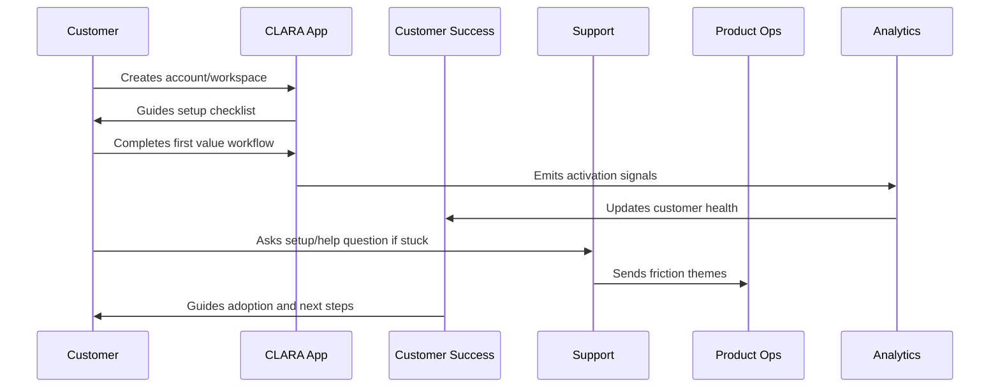
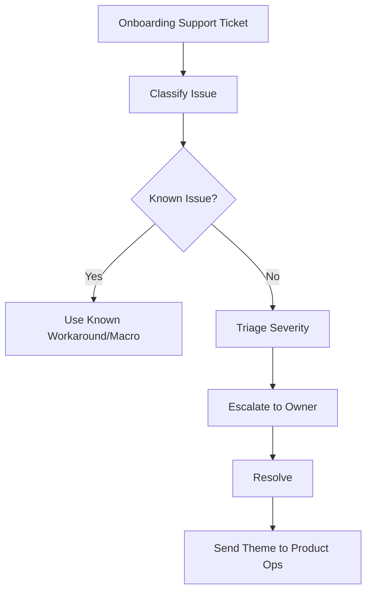

# Onboarding Support Workflow

> *"Defines support workflow for onboarding questions, setup issues, integration issues, permission problems, AI confusion, and customer escalation."*

---

# Purpose

Defines support workflow for onboarding questions, setup issues, integration issues, permission problems, AI confusion, and customer escalation.

---

# Onboarding Problem

Onboarding support failures damage trust at the moment customers are forming their first impression.

---

# Onboarding Decision

## Decision

CLARA support should be prepared with onboarding-specific workflows, macros, escalation paths, and known issue tracking.

## Status

Accepted.

---

# Customer Success Rule

Every CLARA onboarding workflow should connect:

```text
Customer Goal -> Setup Step -> First Value Signal -> Success Owner -> Support Path -> Metric -> Feedback Loop
```

An onboarding process is not mature if it cannot answer:

```text
what the customer is trying to achieve
what setup is required
what secure default is applied
what first value moment proves progress
who owns customer follow-up
how support handles friction
what metric detects success or risk
what feedback goes back to product
```

---

# Recommended Onboarding Flow



---

# Production-Ready Checklist

- [ ] Setup flow is clear.
- [ ] Secure defaults are applied.
- [ ] Roles and permissions are understandable.
- [ ] First value moment is defined.
- [ ] Activation checklist exists.
- [ ] Customer success playbook exists.
- [ ] Support workflow exists.
- [ ] Onboarding metrics are tracked.
- [ ] Feedback loop to product exists.
- [ ] Documentation is maintained.

---

# Acceptance Criteria

- [ ] Customer can complete setup without hidden tribal knowledge.
- [ ] Customer reaches first value.
- [ ] Support can troubleshoot onboarding issues.
- [ ] Success team can identify stuck customers.
- [ ] Product team can see onboarding friction.
- [ ] Security and privacy are preserved.
- [ ] AI coding assistants can apply this safely.

---

# Anti-patterns

Avoid:

- Treating signup as activation.
- Asking customers to configure everything before seeing value.
- Insecure default permissions.
- Confusing role names.
- No workspace owner concept.
- No onboarding checklist.
- No support escalation path.
- No onboarding metrics.
- No feedback loop from onboarding issues.
- Generic success follow-up with no customer context.

---

# Related Documents

- ../PART-01-Product-Operations-Foundation/README.md
- ../../BOOK-02-Product-and-Domain/
- ../../BOOK-06-Security-Governance-and-Compliance/
- ../../BOOK-07-Operations-Observability-and-Reliability/
- ../../BOOK-08-Implementation-Delivery-and-Production-Launch/

---

# Navigation

**Previous:** `19-Customer-Health-Scoring.md`

**Next:** `21-Product-Education-and-Documentation.md`

---

# Onboarding Support Categories

Support should handle:

```text
account/login issue
workspace setup confusion
role/permission confusion
integration setup failure
webhook/channel issue
AI feature confusion
billing/trial question
data/import question
performance/error during setup
documentation gap
```

---

# Support Escalation

Escalate to:

```text
engineering for product defect
security for auth/privacy/access issue
integration owner for provider issue
AI owner for unsafe/low-quality output
customer success for adoption risk
billing owner for payment/package issue
```

---

# Support Workflow



---

# Support Rule

Every repeated onboarding support issue should become either product improvement, documentation improvement, or known issue.
