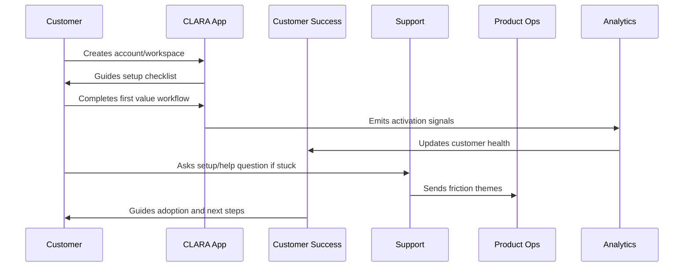

# Product Education and Documentation

> *"Defines onboarding education content, quickstart guides, product tours, tooltips, help center content, examples, and safe AI-assisted guidance."*

---

# Purpose

Defines onboarding education content, quickstart guides, product tours, tooltips, help center content, examples, and safe AI-assisted guidance.

---

# Onboarding Problem

Too much documentation can overwhelm new users; too little leaves them stuck.

---

# Onboarding Decision

## Decision

CLARA product education should reduce time-to-value by teaching customers the smallest useful path first, then progressively revealing advanced features.

## Status

Accepted.

---

# Customer Success Rule

Every CLARA onboarding workflow should connect:

```text
Customer Goal -> Setup Step -> First Value Signal -> Success Owner -> Support Path -> Metric -> Feedback Loop
```

An onboarding process is not mature if it cannot answer:

```text
what the customer is trying to achieve
what setup is required
what secure default is applied
what first value moment proves progress
who owns customer follow-up
how support handles friction
what metric detects success or risk
what feedback goes back to product
```

---

# Recommended Onboarding Flow



---

# Production-Ready Checklist

- [ ] Setup flow is clear.
- [ ] Secure defaults are applied.
- [ ] Roles and permissions are understandable.
- [ ] First value moment is defined.
- [ ] Activation checklist exists.
- [ ] Customer success playbook exists.
- [ ] Support workflow exists.
- [ ] Onboarding metrics are tracked.
- [ ] Feedback loop to product exists.
- [ ] Documentation is maintained.

---

# Acceptance Criteria

- [ ] Customer can complete setup without hidden tribal knowledge.
- [ ] Customer reaches first value.
- [ ] Support can troubleshoot onboarding issues.
- [ ] Success team can identify stuck customers.
- [ ] Product team can see onboarding friction.
- [ ] Security and privacy are preserved.
- [ ] AI coding assistants can apply this safely.

---

# Anti-patterns

Avoid:

- Treating signup as activation.
- Asking customers to configure everything before seeing value.
- Insecure default permissions.
- Confusing role names.
- No workspace owner concept.
- No onboarding checklist.
- No support escalation path.
- No onboarding metrics.
- No feedback loop from onboarding issues.
- Generic success follow-up with no customer context.

---

# Related Documents

- ../PART-01-Product-Operations-Foundation/README.md
- ../../BOOK-02-Product-and-Domain/
- ../../BOOK-06-Security-Governance-and-Compliance/
- ../../BOOK-07-Operations-Observability-and-Reliability/
- ../../BOOK-08-Implementation-Delivery-and-Production-Launch/

---

# Navigation

**Previous:** `20-Onboarding-Support-Workflow.md`

**Next:** `22-Onboarding-Metrics.md`

---

# Education Content Types

Provide:

```text
quickstart guide
setup checklist
short product tour
role/permission explanation
integration setup guide
AI review guide
security/privacy notes
FAQ
troubleshooting guide
video/demo script if useful
```

---

# Progressive Education

Use layers:

```text
first value guide
basic workflow guide
advanced setup guide
admin/security guide
integration troubleshooting guide
success best practices
```

---

# Documentation Quality Checklist

- [ ] Clear target user.
- [ ] Clear outcome.
- [ ] Step-by-step instructions.
- [ ] Screens/labels match product.
- [ ] Security notes included.
- [ ] Troubleshooting included.
- [ ] Last updated date.
- [ ] Owner assigned.

---

# Education Rule

Teach the next useful action, not the entire system at once.
