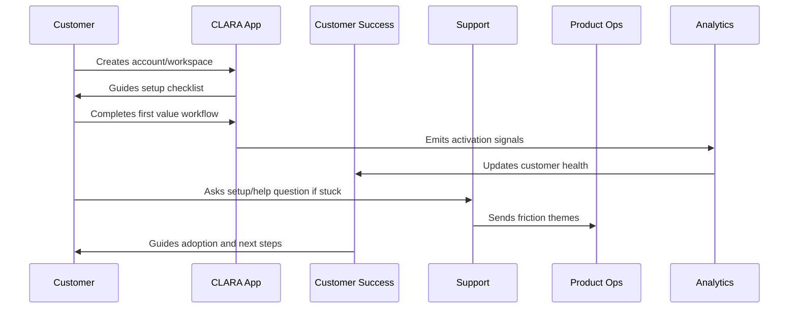

# Onboarding Metrics

> *"Defines metrics for signup completion, setup completion, activation, first value, time-to-value, invite completion, integration success, support friction, trial conversion, and early retention."*

---

# Purpose

Defines metrics for signup completion, setup completion, activation, first value, time-to-value, invite completion, integration success, support friction, trial conversion, and early retention.

---

# Onboarding Problem

Without onboarding metrics, teams cannot tell whether onboarding actually works.

---

# Onboarding Decision

## Decision

CLARA onboarding metrics should show whether customers are reaching value, where they are stuck, and which improvements increase successful adoption.

## Status

Accepted.

---

# Customer Success Rule

Every CLARA onboarding workflow should connect:

```text
Customer Goal -> Setup Step -> First Value Signal -> Success Owner -> Support Path -> Metric -> Feedback Loop
```

An onboarding process is not mature if it cannot answer:

```text
what the customer is trying to achieve
what setup is required
what secure default is applied
what first value moment proves progress
who owns customer follow-up
how support handles friction
what metric detects success or risk
what feedback goes back to product
```

---

# Recommended Onboarding Flow



---

# Production-Ready Checklist

- [ ] Setup flow is clear.
- [ ] Secure defaults are applied.
- [ ] Roles and permissions are understandable.
- [ ] First value moment is defined.
- [ ] Activation checklist exists.
- [ ] Customer success playbook exists.
- [ ] Support workflow exists.
- [ ] Onboarding metrics are tracked.
- [ ] Feedback loop to product exists.
- [ ] Documentation is maintained.

---

# Acceptance Criteria

- [ ] Customer can complete setup without hidden tribal knowledge.
- [ ] Customer reaches first value.
- [ ] Support can troubleshoot onboarding issues.
- [ ] Success team can identify stuck customers.
- [ ] Product team can see onboarding friction.
- [ ] Security and privacy are preserved.
- [ ] AI coding assistants can apply this safely.

---

# Anti-patterns

Avoid:

- Treating signup as activation.
- Asking customers to configure everything before seeing value.
- Insecure default permissions.
- Confusing role names.
- No workspace owner concept.
- No onboarding checklist.
- No support escalation path.
- No onboarding metrics.
- No feedback loop from onboarding issues.
- Generic success follow-up with no customer context.

---

# Related Documents

- ../PART-01-Product-Operations-Foundation/README.md
- ../../BOOK-02-Product-and-Domain/
- ../../BOOK-06-Security-Governance-and-Compliance/
- ../../BOOK-07-Operations-Observability-and-Reliability/
- ../../BOOK-08-Implementation-Delivery-and-Production-Launch/

---

# Navigation

**Previous:** `21-Product-Education-and-Documentation.md`

**Next:** `23-Onboarding-Anti-Patterns.md`

---

# Onboarding Metrics

Track:

```text
signup completion rate
workspace creation rate
team invite completion rate
integration setup success rate
first value completion rate
time to first value
activation completion rate
trial conversion rate
onboarding support ticket rate
setup error rate
early retention rate
customer health score movement
```

---

# Guardrail Metrics

Also watch:

```text
support burden
security/privacy issues
permission mistakes
integration failure rate
AI rejection rate
billing confusion
customer frustration sentiment
```

---

# Onboarding Funnel


---

# Metrics Rule

If a metric cannot trigger a decision or improvement, reconsider whether it is worth tracking.
