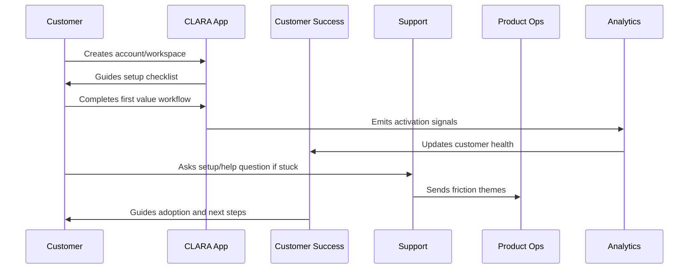

# Onboarding Anti-Patterns

> *"Defines onboarding anti-patterns such as too many setup steps, insecure defaults, unclear roles, hidden activation criteria, generic success follow-up, and no first value focus."*

---

# Purpose

Defines onboarding anti-patterns such as too many setup steps, insecure defaults, unclear roles, hidden activation criteria, generic success follow-up, and no first value focus.

---

# Onboarding Problem

Bad onboarding can make a good product feel broken.

---

# Onboarding Decision

## Decision

CLARA should actively avoid onboarding patterns that create friction, confusion, security risk, and weak adoption.

## Status

Accepted.

---

# Customer Success Rule

Every CLARA onboarding workflow should connect:

```text
Customer Goal -> Setup Step -> First Value Signal -> Success Owner -> Support Path -> Metric -> Feedback Loop
```

An onboarding process is not mature if it cannot answer:

```text
what the customer is trying to achieve
what setup is required
what secure default is applied
what first value moment proves progress
who owns customer follow-up
how support handles friction
what metric detects success or risk
what feedback goes back to product
```

---

# Recommended Onboarding Flow



---

# Production-Ready Checklist

- [ ] Setup flow is clear.
- [ ] Secure defaults are applied.
- [ ] Roles and permissions are understandable.
- [ ] First value moment is defined.
- [ ] Activation checklist exists.
- [ ] Customer success playbook exists.
- [ ] Support workflow exists.
- [ ] Onboarding metrics are tracked.
- [ ] Feedback loop to product exists.
- [ ] Documentation is maintained.

---

# Acceptance Criteria

- [ ] Customer can complete setup without hidden tribal knowledge.
- [ ] Customer reaches first value.
- [ ] Support can troubleshoot onboarding issues.
- [ ] Success team can identify stuck customers.
- [ ] Product team can see onboarding friction.
- [ ] Security and privacy are preserved.
- [ ] AI coding assistants can apply this safely.

---

# Anti-patterns

Avoid:

- Treating signup as activation.
- Asking customers to configure everything before seeing value.
- Insecure default permissions.
- Confusing role names.
- No workspace owner concept.
- No onboarding checklist.
- No support escalation path.
- No onboarding metrics.
- No feedback loop from onboarding issues.
- Generic success follow-up with no customer context.

---

# Related Documents

- ../PART-01-Product-Operations-Foundation/README.md
- ../../BOOK-02-Product-and-Domain/
- ../../BOOK-06-Security-Governance-and-Compliance/
- ../../BOOK-07-Operations-Observability-and-Reliability/
- ../../BOOK-08-Implementation-Delivery-and-Production-Launch/

---

# Navigation

**Previous:** `22-Onboarding-Metrics.md`

**Next:** `24-Part-02-Summary.md`

---

# Common Anti-Patterns

Avoid:

```text
signup treated as success
too many setup steps before value
unclear role permissions
insecure default admin access
integration setup with no troubleshooting path
AI features enabled before trust explanation
no first value definition
no activation checklist
no health scoring
no trial conversion signals
support feedback not reaching product
documentation written only for power users
```

---

# Warning Signs

Watch for:

```text
many signups but low activation
high setup support tickets
customers invite no teammates
integrations fail silently
trial users ask what to do next
AI feature is ignored or distrusted
customers churn before first value
```

---

# Recovery Actions

```text
shorten setup path
define first value
add guided checklist
improve docs
add support macros
fix integration setup friction
improve permission explanations
add customer success follow-up
measure time-to-value
```

---

# Anti-Pattern Rule

Good onboarding reduces uncertainty, not just clicks.
