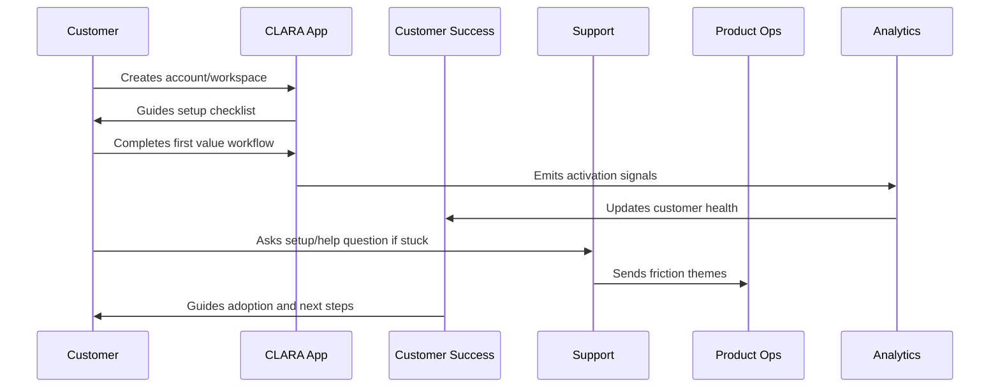

# Part 02 Summary

> *"Summarizes Customer Onboarding and Success and prepares for Book IX Part 03."*

---

# Purpose

Summarizes Customer Onboarding and Success and prepares for Book IX Part 03.

---

# Onboarding Problem

Support Operations and Knowledge Loop comes next because onboarding issues and customer questions must feed reusable support knowledge and product improvement.

---

# Onboarding Decision

## Decision

CLARA should proceed to Support Operations and Knowledge Loop after defining onboarding overview, setup flow, first value, activation checklist, success playbooks, trial-to-paid lifecycle, health scoring, support workflow, education, metrics, and anti-patterns.

## Status

Accepted.

---

# Customer Success Rule

Every CLARA onboarding workflow should connect:

```text
Customer Goal -> Setup Step -> First Value Signal -> Success Owner -> Support Path -> Metric -> Feedback Loop
```

An onboarding process is not mature if it cannot answer:

```text
what the customer is trying to achieve
what setup is required
what secure default is applied
what first value moment proves progress
who owns customer follow-up
how support handles friction
what metric detects success or risk
what feedback goes back to product
```

---

# Recommended Onboarding Flow



---

# Production-Ready Checklist

- [ ] Setup flow is clear.
- [ ] Secure defaults are applied.
- [ ] Roles and permissions are understandable.
- [ ] First value moment is defined.
- [ ] Activation checklist exists.
- [ ] Customer success playbook exists.
- [ ] Support workflow exists.
- [ ] Onboarding metrics are tracked.
- [ ] Feedback loop to product exists.
- [ ] Documentation is maintained.

---

# Acceptance Criteria

- [ ] Customer can complete setup without hidden tribal knowledge.
- [ ] Customer reaches first value.
- [ ] Support can troubleshoot onboarding issues.
- [ ] Success team can identify stuck customers.
- [ ] Product team can see onboarding friction.
- [ ] Security and privacy are preserved.
- [ ] AI coding assistants can apply this safely.

---

# Anti-patterns

Avoid:

- Treating signup as activation.
- Asking customers to configure everything before seeing value.
- Insecure default permissions.
- Confusing role names.
- No workspace owner concept.
- No onboarding checklist.
- No support escalation path.
- No onboarding metrics.
- No feedback loop from onboarding issues.
- Generic success follow-up with no customer context.

---

# Related Documents

- ../PART-01-Product-Operations-Foundation/README.md
- ../../BOOK-02-Product-and-Domain/
- ../../BOOK-06-Security-Governance-and-Compliance/
- ../../BOOK-07-Operations-Observability-and-Reliability/
- ../../BOOK-08-Implementation-Delivery-and-Production-Launch/

---

# Navigation

**Previous:** `23-Onboarding-Anti-Patterns.md`

**Next:** `../PART-03-Support-Operations-and-Knowledge-Loop/README.md`

---

# Part 02 Completion

Part 02 establishes:

- Customer onboarding and success overview.
- Account and workspace setup flow.
- First value moment.
- Activation checklist.
- Customer success playbooks.
- Trial-to-paid lifecycle.
- Customer health scoring.
- Onboarding support workflow.
- Product education and documentation.
- Onboarding metrics.
- Onboarding anti-patterns.

---

# Ready for Part 03

The next part should be:

```text
BOOK IX — PART 03: Support Operations and Knowledge Loop
```

It should define:

- Support operations overview.
- Support intake and triage.
- Support severity model.
- Support macros and response standards.
- Knowledge base lifecycle.
- Known issue management.
- Escalation to engineering/product/security.
- Support analytics and themes.
- Customer communication standards.
- Support-to-roadmap feedback loop.
- Support anti-patterns.
- Part 03 summary.
