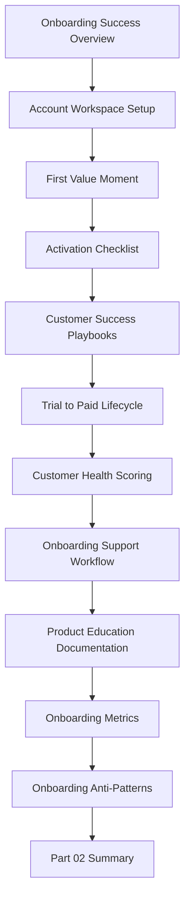

# PART-02 — Customer Onboarding and Success

> *"A customer is not onboarded when the account is created. A customer is onboarded when they reach value and know how to continue."*

---

# Purpose

Part 02 defines CLARA's customer onboarding and success standards.

It covers:

- Customer Onboarding and Success Overview.
- Account and Workspace Setup Flow.
- First Value Moment.
- Activation Checklist.
- Customer Success Playbooks.
- Trial-to-Paid Lifecycle.
- Customer Health Scoring.
- Onboarding Support Workflow.
- Product Education and Documentation.
- Onboarding Metrics.
- Onboarding Anti-Patterns.
- Part 02 Summary.

---

# Chapter Map

| Chapter | Title |
|---:|---|
| 13 | Customer Onboarding and Success Overview |
| 14 | Account and Workspace Setup Flow |
| 15 | First Value Moment |
| 16 | Activation Checklist |
| 17 | Customer Success Playbooks |
| 18 | Trial-to-Paid Lifecycle |
| 19 | Customer Health Scoring |
| 20 | Onboarding Support Workflow |
| 21 | Product Education and Documentation |
| 22 | Onboarding Metrics |
| 23 | Onboarding Anti-Patterns |
| 24 | Part 02 Summary |

---

# Onboarding and Success Map



---

# Customer Onboarding Non-Negotiables

CLARA onboarding must enforce:

```text
secure account setup
clear workspace ownership
role and permission clarity
fast path to first value
visible activation checklist
integration/channel setup guidance
support escalation path
customer success ownership
health scoring
time-to-value measurement
product education
privacy-safe onboarding analytics
feedback loop to product roadmap
```

---

# Relationship to Previous Part

Part 01 defines product operations foundation.

Part 02 applies that foundation to the customer onboarding and success lifecycle.

---

# Navigation

**Previous:** `../PART-01-Product-Operations-Foundation/12-Part-01-Summary.md`

**Next:** `13-Customer-Onboarding-and-Success-Overview.md`
