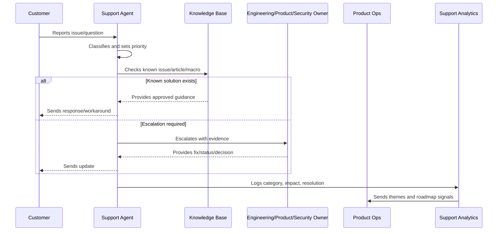
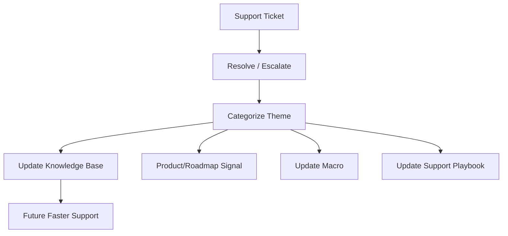

# Support Operations and Knowledge Loop Overview

> *"Introduces CLARA's support operations and knowledge loop model for turning customer questions, incidents, defects, and feedback into reusable knowledge and product improvement."*

---

# Purpose

Introduces CLARA's support operations and knowledge loop model for turning customer questions, incidents, defects, and feedback into reusable knowledge and product improvement.

---

# Support Operations Problem

Support becomes expensive and inconsistent when repeated issues are solved manually without improving product knowledge or product behavior.

---

# Support Operations Decision

## Decision

CLARA should treat support as a product intelligence system that captures issues, resolves customer pain, updates knowledge, escalates correctly, and feeds roadmap decisions.

## Status

Accepted.

---

# Support Operations Rule

Every CLARA support workflow should connect:

```text
Customer Issue -> Intake -> Classification -> Severity/Priority -> Response -> Resolution/Escalation -> Knowledge Update -> Product Feedback
```

A support operation is not mature if it cannot answer:

```text
what customer issue was reported
what impact and urgency it has
who owns the response
what evidence was captured
what safe response should be sent
whether escalation is required
whether a known issue or knowledge article exists
what product/support improvement follows
```

---

# Recommended Support Flow



---

# Production-Ready Checklist

- [ ] Intake channel is defined.
- [ ] Ticket fields capture useful context.
- [ ] Severity and priority model exists.
- [ ] Response standards are documented.
- [ ] Macros are reviewed.
- [ ] Knowledge base ownership is clear.
- [ ] Known issues are tracked.
- [ ] Escalation paths are defined.
- [ ] Customer communication cadence exists.
- [ ] Support analytics feed product decisions.
- [ ] Security/privacy troubleshooting rules exist.

---

# Acceptance Criteria

- [ ] Support can classify issues consistently.
- [ ] Customers receive safe, useful responses.
- [ ] Repeated issues become knowledge or product work.
- [ ] Escalations include enough evidence.
- [ ] Known issues have owner/status/workaround.
- [ ] Product team reviews support themes.
- [ ] AI coding assistants can apply this safely.

---

# Anti-patterns

Avoid:

- Ticket ping-pong with no owner.
- Overpromising timelines.
- Asking customers for secrets.
- Troubleshooting with unsafe production access.
- Macros that are outdated or inaccurate.
- Closing tickets without resolution or next step.
- Support themes not reviewed by product.
- Known issues without workaround/status.
- Engineering escalations with vague context.
- Customer silence during active issues.

---

# Related Documents

- ../PART-01-Product-Operations-Foundation/README.md
- ../PART-02-Customer-Onboarding-and-Success/README.md
- ../../BOOK-06-Security-Governance-and-Compliance/
- ../../BOOK-07-Operations-Observability-and-Reliability/
- ../../BOOK-08-Implementation-Delivery-and-Production-Launch/

---

# Navigation

**Previous:** `../PART-02-Customer-Onboarding-and-Success/24-Part-02-Summary.md`

**Next:** `26-Support-Intake-and-Triage.md`

---

# Support Operations Scope

CLARA support operations covers:

```text
customer questions
onboarding friction
bug reports
integration issues
AI quality complaints
permission/access issues
billing questions
incident-related tickets
known issue communication
knowledge base updates
support-to-product feedback
```

---

# Knowledge Loop



---

# Guiding Question

```text
What did this support interaction teach us that should reduce future customer friction?
```
