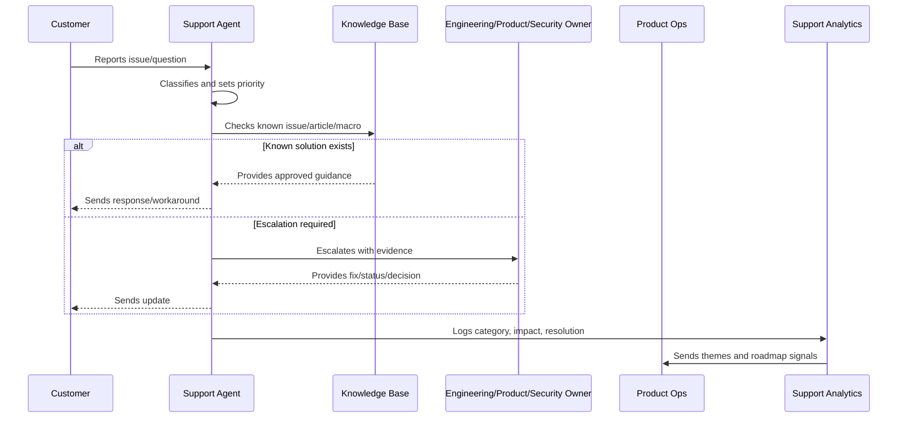

# Support Intake and Triage

> *"Defines support intake channels, ticket creation, classification, ownership, prioritization, routing, and initial response standards."*

---

# Purpose

Defines support intake channels, ticket creation, classification, ownership, prioritization, routing, and initial response standards.

---

# Support Operations Problem

Poor intake creates slow response, wrong routing, duplicated work, and weak customer trust.

---

# Support Operations Decision

## Decision

CLARA support intake should capture customer context, classify issue type, assign owner, and route work based on impact, urgency, and expertise.

## Status

Accepted.

---

# Support Operations Rule

Every CLARA support workflow should connect:

```text
Customer Issue -> Intake -> Classification -> Severity/Priority -> Response -> Resolution/Escalation -> Knowledge Update -> Product Feedback
```

A support operation is not mature if it cannot answer:

```text
what customer issue was reported
what impact and urgency it has
who owns the response
what evidence was captured
what safe response should be sent
whether escalation is required
whether a known issue or knowledge article exists
what product/support improvement follows
```

---

# Recommended Support Flow



---

# Production-Ready Checklist

- [ ] Intake channel is defined.
- [ ] Ticket fields capture useful context.
- [ ] Severity and priority model exists.
- [ ] Response standards are documented.
- [ ] Macros are reviewed.
- [ ] Knowledge base ownership is clear.
- [ ] Known issues are tracked.
- [ ] Escalation paths are defined.
- [ ] Customer communication cadence exists.
- [ ] Support analytics feed product decisions.
- [ ] Security/privacy troubleshooting rules exist.

---

# Acceptance Criteria

- [ ] Support can classify issues consistently.
- [ ] Customers receive safe, useful responses.
- [ ] Repeated issues become knowledge or product work.
- [ ] Escalations include enough evidence.
- [ ] Known issues have owner/status/workaround.
- [ ] Product team reviews support themes.
- [ ] AI coding assistants can apply this safely.

---

# Anti-patterns

Avoid:

- Ticket ping-pong with no owner.
- Overpromising timelines.
- Asking customers for secrets.
- Troubleshooting with unsafe production access.
- Macros that are outdated or inaccurate.
- Closing tickets without resolution or next step.
- Support themes not reviewed by product.
- Known issues without workaround/status.
- Engineering escalations with vague context.
- Customer silence during active issues.

---

# Related Documents

- ../PART-01-Product-Operations-Foundation/README.md
- ../PART-02-Customer-Onboarding-and-Success/README.md
- ../../BOOK-06-Security-Governance-and-Compliance/
- ../../BOOK-07-Operations-Observability-and-Reliability/
- ../../BOOK-08-Implementation-Delivery-and-Production-Launch/

---

# Navigation

**Previous:** `25-Support-Operations-and-Knowledge-Loop-Overview.md`

**Next:** `27-Support-Severity-and-Priority-Model.md`

---

# Intake Channels

Support intake may include:

```text
in-app live chat
email support
help center form
customer success handoff
incident/status page contact
internal escalation
integration provider escalation
```

---

# Required Ticket Fields

Capture:

```text
customer/workspace
requester
issue category
affected workflow
severity
priority
environment/browser/device where relevant
error message/screenshot where safe
correlation/request id where available
customer impact
security/privacy sensitivity
```

---

# Triage Categories

```text
question
bug
billing
onboarding
integration
AI quality
permission/access
performance
incident-related
feature request
documentation gap
security/privacy concern
```

---

# Intake Rule

Do not ask customers to provide passwords, API keys, tokens, or full sensitive data during troubleshooting.
