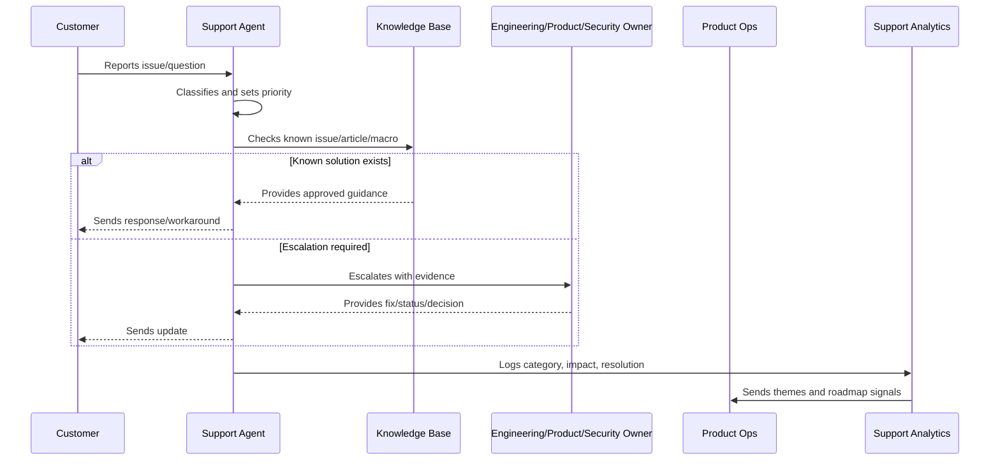

# Support Severity and Priority Model

> *"Defines support severity, priority, customer impact, urgency, SLA/SLO alignment, escalation thresholds, and incident linkage."*

---

# Purpose

Defines support severity, priority, customer impact, urgency, SLA/SLO alignment, escalation thresholds, and incident linkage.

---

# Support Operations Problem

Without severity alignment, teams overreact to low-risk issues and underreact to high-impact customer problems.

---

# Support Operations Decision

## Decision

CLARA should use a clear severity and priority model so support, engineering, operations, and leadership respond consistently.

## Status

Accepted.

---

# Support Operations Rule

Every CLARA support workflow should connect:

```text
Customer Issue -> Intake -> Classification -> Severity/Priority -> Response -> Resolution/Escalation -> Knowledge Update -> Product Feedback
```

A support operation is not mature if it cannot answer:

```text
what customer issue was reported
what impact and urgency it has
who owns the response
what evidence was captured
what safe response should be sent
whether escalation is required
whether a known issue or knowledge article exists
what product/support improvement follows
```

---

# Recommended Support Flow



---

# Production-Ready Checklist

- [ ] Intake channel is defined.
- [ ] Ticket fields capture useful context.
- [ ] Severity and priority model exists.
- [ ] Response standards are documented.
- [ ] Macros are reviewed.
- [ ] Knowledge base ownership is clear.
- [ ] Known issues are tracked.
- [ ] Escalation paths are defined.
- [ ] Customer communication cadence exists.
- [ ] Support analytics feed product decisions.
- [ ] Security/privacy troubleshooting rules exist.

---

# Acceptance Criteria

- [ ] Support can classify issues consistently.
- [ ] Customers receive safe, useful responses.
- [ ] Repeated issues become knowledge or product work.
- [ ] Escalations include enough evidence.
- [ ] Known issues have owner/status/workaround.
- [ ] Product team reviews support themes.
- [ ] AI coding assistants can apply this safely.

---

# Anti-patterns

Avoid:

- Ticket ping-pong with no owner.
- Overpromising timelines.
- Asking customers for secrets.
- Troubleshooting with unsafe production access.
- Macros that are outdated or inaccurate.
- Closing tickets without resolution or next step.
- Support themes not reviewed by product.
- Known issues without workaround/status.
- Engineering escalations with vague context.
- Customer silence during active issues.

---

# Related Documents

- ../PART-01-Product-Operations-Foundation/README.md
- ../PART-02-Customer-Onboarding-and-Success/README.md
- ../../BOOK-06-Security-Governance-and-Compliance/
- ../../BOOK-07-Operations-Observability-and-Reliability/
- ../../BOOK-08-Implementation-Delivery-and-Production-Launch/

---

# Navigation

**Previous:** `26-Support-Intake-and-Triage.md`

**Next:** `28-Support-Macros-and-Response-Standards.md`

---

# Severity Model

Recommended support severity:

```text
SEV-1: critical outage or severe customer/data/security impact
SEV-2: major workflow broken for important segment/customer
SEV-3: degraded or limited-impact issue with workaround
SEV-4: minor issue, question, cosmetic problem, low urgency
SEV-5: feature request or documentation improvement
```

---

# Priority Inputs

Priority should consider:

```text
customer impact
number of affected customers
security/privacy risk
revenue/contract risk
availability of workaround
onboarding/trial impact
strategic customer impact
regression status
```

---

# Severity to Response Expectation

| Severity | Response Expectation |
|---|---|
| SEV-1 | Immediate escalation, incident workflow |
| SEV-2 | Fast owner assignment and frequent updates |
| SEV-3 | Normal triage with workaround/update |
| SEV-4 | Standard support response |
| SEV-5 | Product feedback/backlog routing |

---

# Severity Rule

Severity describes impact. Priority describes handling order.
