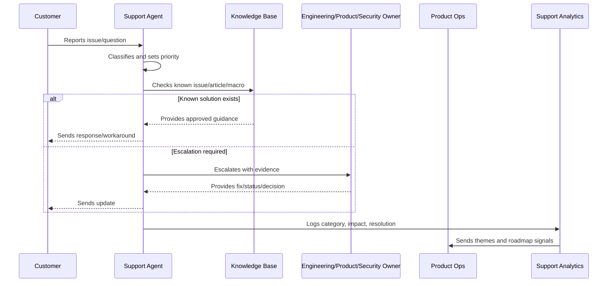

# Support Macros and Response Standards

> *"Defines support response quality, macros, tone, security-safe communication, escalation language, workaround instructions, and update cadence."*

---

# Purpose

Defines support response quality, macros, tone, security-safe communication, escalation language, workaround instructions, and update cadence.

---

# Support Operations Problem

Bad support communication can make a technical issue feel like a trust failure.

---

# Support Operations Decision

## Decision

CLARA support responses should be accurate, empathetic, secure, actionable, and consistent while still allowing context-aware customization.

## Status

Accepted.

---

# Support Operations Rule

Every CLARA support workflow should connect:

```text
Customer Issue -> Intake -> Classification -> Severity/Priority -> Response -> Resolution/Escalation -> Knowledge Update -> Product Feedback
```

A support operation is not mature if it cannot answer:

```text
what customer issue was reported
what impact and urgency it has
who owns the response
what evidence was captured
what safe response should be sent
whether escalation is required
whether a known issue or knowledge article exists
what product/support improvement follows
```

---

# Recommended Support Flow



---

# Production-Ready Checklist

- [ ] Intake channel is defined.
- [ ] Ticket fields capture useful context.
- [ ] Severity and priority model exists.
- [ ] Response standards are documented.
- [ ] Macros are reviewed.
- [ ] Knowledge base ownership is clear.
- [ ] Known issues are tracked.
- [ ] Escalation paths are defined.
- [ ] Customer communication cadence exists.
- [ ] Support analytics feed product decisions.
- [ ] Security/privacy troubleshooting rules exist.

---

# Acceptance Criteria

- [ ] Support can classify issues consistently.
- [ ] Customers receive safe, useful responses.
- [ ] Repeated issues become knowledge or product work.
- [ ] Escalations include enough evidence.
- [ ] Known issues have owner/status/workaround.
- [ ] Product team reviews support themes.
- [ ] AI coding assistants can apply this safely.

---

# Anti-patterns

Avoid:

- Ticket ping-pong with no owner.
- Overpromising timelines.
- Asking customers for secrets.
- Troubleshooting with unsafe production access.
- Macros that are outdated or inaccurate.
- Closing tickets without resolution or next step.
- Support themes not reviewed by product.
- Known issues without workaround/status.
- Engineering escalations with vague context.
- Customer silence during active issues.

---

# Related Documents

- ../PART-01-Product-Operations-Foundation/README.md
- ../PART-02-Customer-Onboarding-and-Success/README.md
- ../../BOOK-06-Security-Governance-and-Compliance/
- ../../BOOK-07-Operations-Observability-and-Reliability/
- ../../BOOK-08-Implementation-Delivery-and-Production-Launch/

---

# Navigation

**Previous:** `27-Support-Severity-and-Priority-Model.md`

**Next:** `29-Knowledge-Base-Lifecycle.md`

---

# Response Standards

Support responses should be:

```text
empathetic
clear
fact-based
actionable
privacy-safe
honest about uncertainty
specific about next step
specific about next update time when unresolved
```

---

# Macro Requirements

Each macro should define:

```text
use case
target issue category
customer-facing response
required customization fields
security warnings
when not to use
owner
last reviewed date
```

---

# Unsafe Response Examples

Avoid:

```text
asking for passwords/tokens
promising exact fix time without confirmation
sharing internal blame/speculation
exposing other customer data
giving risky workaround without approval
using overly technical jargon for non-technical users
```

---

# Response Rule

A support macro is a starting point, not a substitute for understanding customer context.
