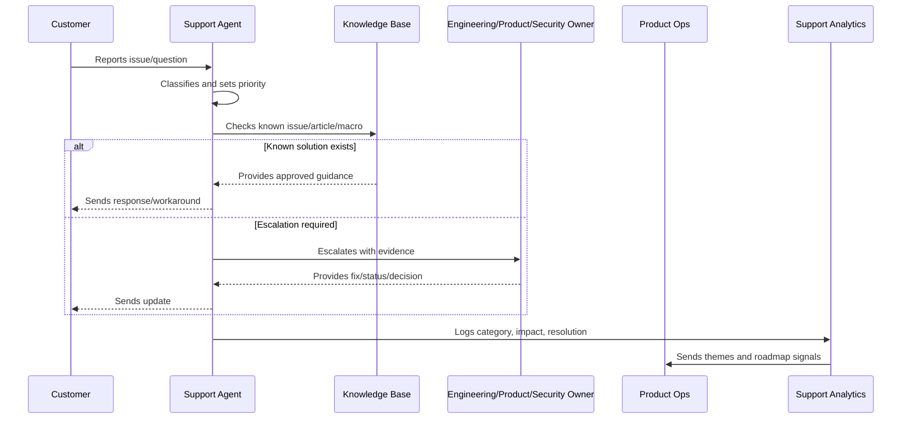
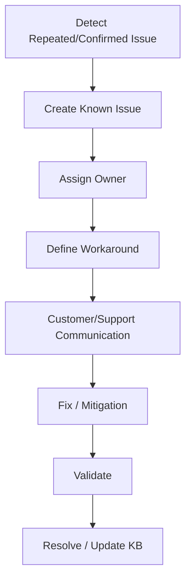

# Known Issue Management

> *"Defines known issue intake, classification, workaround, customer communication, ownership, fix tracking, and closure."*

---

# Purpose

Defines known issue intake, classification, workaround, customer communication, ownership, fix tracking, and closure.

---

# Support Operations Problem

Known issues become trust problems when support cannot explain status, workaround, or expected resolution.

---

# Support Operations Decision

## Decision

CLARA should manage known issues as operational records with customer impact, workaround, owner, status, and product/engineering follow-up.

## Status

Accepted.

---

# Support Operations Rule

Every CLARA support workflow should connect:

```text
Customer Issue -> Intake -> Classification -> Severity/Priority -> Response -> Resolution/Escalation -> Knowledge Update -> Product Feedback
```

A support operation is not mature if it cannot answer:

```text
what customer issue was reported
what impact and urgency it has
who owns the response
what evidence was captured
what safe response should be sent
whether escalation is required
whether a known issue or knowledge article exists
what product/support improvement follows
```

---

# Recommended Support Flow



---

# Production-Ready Checklist

- [ ] Intake channel is defined.
- [ ] Ticket fields capture useful context.
- [ ] Severity and priority model exists.
- [ ] Response standards are documented.
- [ ] Macros are reviewed.
- [ ] Knowledge base ownership is clear.
- [ ] Known issues are tracked.
- [ ] Escalation paths are defined.
- [ ] Customer communication cadence exists.
- [ ] Support analytics feed product decisions.
- [ ] Security/privacy troubleshooting rules exist.

---

# Acceptance Criteria

- [ ] Support can classify issues consistently.
- [ ] Customers receive safe, useful responses.
- [ ] Repeated issues become knowledge or product work.
- [ ] Escalations include enough evidence.
- [ ] Known issues have owner/status/workaround.
- [ ] Product team reviews support themes.
- [ ] AI coding assistants can apply this safely.

---

# Anti-patterns

Avoid:

- Ticket ping-pong with no owner.
- Overpromising timelines.
- Asking customers for secrets.
- Troubleshooting with unsafe production access.
- Macros that are outdated or inaccurate.
- Closing tickets without resolution or next step.
- Support themes not reviewed by product.
- Known issues without workaround/status.
- Engineering escalations with vague context.
- Customer silence during active issues.

---

# Related Documents

- ../PART-01-Product-Operations-Foundation/README.md
- ../PART-02-Customer-Onboarding-and-Success/README.md
- ../../BOOK-06-Security-Governance-and-Compliance/
- ../../BOOK-07-Operations-Observability-and-Reliability/
- ../../BOOK-08-Implementation-Delivery-and-Production-Launch/

---

# Navigation

**Previous:** `29-Knowledge-Base-Lifecycle.md`

**Next:** `31-Escalation-to-Engineering-Product-and-Security.md`

---

# Known Issue Record

Track:

```text
issue id
title
status
affected customers/segments
severity/priority
first detected
owner
customer impact
workaround
root cause if known
ETA if approved
linked tickets
linked incident/bug
customer communication notes
```

---

# Known Issue Status

Use:

```text
investigating
workaround_available
fix_in_progress
fix_released
monitoring
resolved
wont_fix
```

---

# Known Issue Flow



---

# Known Issue Rule

A known issue must have owner, status, customer impact, and next step.
