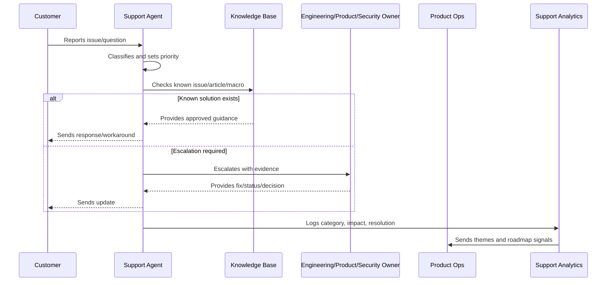
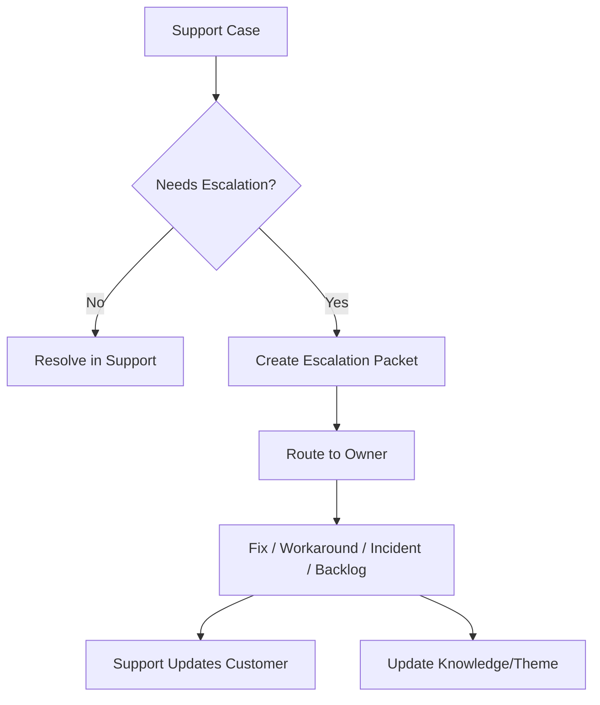

# Escalation to Engineering Product and Security

> *"Defines escalation workflow from support to engineering, product, security, operations, integration owners, AI owners, and leadership."*

---

# Purpose

Defines escalation workflow from support to engineering, product, security, operations, integration owners, AI owners, and leadership.

---

# Support Operations Problem

Escalations fail when support sends vague messages and receiving teams lack enough context to act.

---

# Support Operations Decision

## Decision

CLARA support escalation should be structured, evidence-backed, severity-aware, and routed to the correct owner.

## Status

Accepted.

---

# Support Operations Rule

Every CLARA support workflow should connect:

```text
Customer Issue -> Intake -> Classification -> Severity/Priority -> Response -> Resolution/Escalation -> Knowledge Update -> Product Feedback
```

A support operation is not mature if it cannot answer:

```text
what customer issue was reported
what impact and urgency it has
who owns the response
what evidence was captured
what safe response should be sent
whether escalation is required
whether a known issue or knowledge article exists
what product/support improvement follows
```

---

# Recommended Support Flow



---

# Production-Ready Checklist

- [ ] Intake channel is defined.
- [ ] Ticket fields capture useful context.
- [ ] Severity and priority model exists.
- [ ] Response standards are documented.
- [ ] Macros are reviewed.
- [ ] Knowledge base ownership is clear.
- [ ] Known issues are tracked.
- [ ] Escalation paths are defined.
- [ ] Customer communication cadence exists.
- [ ] Support analytics feed product decisions.
- [ ] Security/privacy troubleshooting rules exist.

---

# Acceptance Criteria

- [ ] Support can classify issues consistently.
- [ ] Customers receive safe, useful responses.
- [ ] Repeated issues become knowledge or product work.
- [ ] Escalations include enough evidence.
- [ ] Known issues have owner/status/workaround.
- [ ] Product team reviews support themes.
- [ ] AI coding assistants can apply this safely.

---

# Anti-patterns

Avoid:

- Ticket ping-pong with no owner.
- Overpromising timelines.
- Asking customers for secrets.
- Troubleshooting with unsafe production access.
- Macros that are outdated or inaccurate.
- Closing tickets without resolution or next step.
- Support themes not reviewed by product.
- Known issues without workaround/status.
- Engineering escalations with vague context.
- Customer silence during active issues.

---

# Related Documents

- ../PART-01-Product-Operations-Foundation/README.md
- ../PART-02-Customer-Onboarding-and-Success/README.md
- ../../BOOK-06-Security-Governance-and-Compliance/
- ../../BOOK-07-Operations-Observability-and-Reliability/
- ../../BOOK-08-Implementation-Delivery-and-Production-Launch/

---

# Navigation

**Previous:** `30-Known-Issue-Management.md`

**Next:** `32-Support-Analytics-and-Themes.md`

---

# Escalation Targets

Escalate to:

```text
engineering owner
product owner
security owner
operations/on-call
integration owner
AI quality owner
billing owner
customer success owner
leadership/incident commander
```

---

# Escalation Packet

Include:

```text
summary
customer/workspace impact
severity/priority
steps to reproduce
expected vs actual behavior
logs/request id/screenshots where safe
recent changes if known
workaround attempted
customer communication status
requested decision/action
```

---

# Escalation Flow



---

# Escalation Rule

Escalation without evidence creates delay. Evidence-backed escalation creates action.
