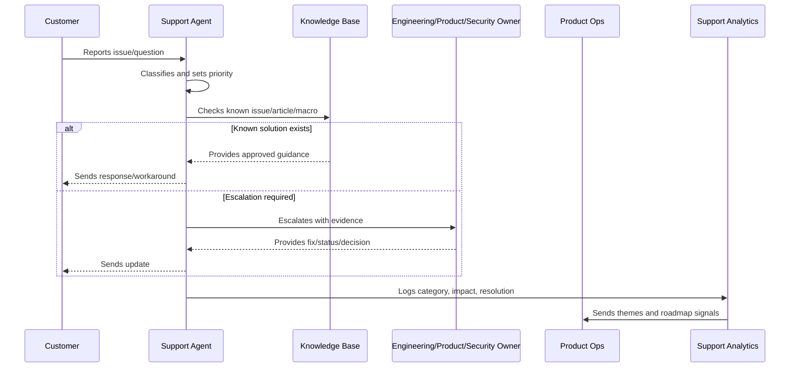
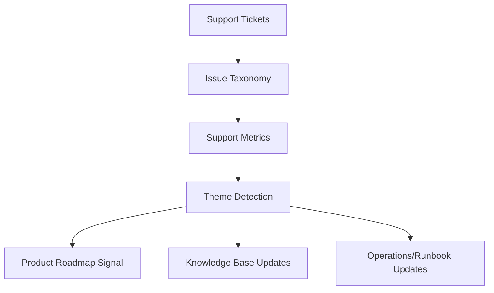

# Support Analytics and Themes

> *"Defines support analytics, issue taxonomy, theme detection, trend reporting, customer impact analysis, and product insight extraction."*

---

# Purpose

Defines support analytics, issue taxonomy, theme detection, trend reporting, customer impact analysis, and product insight extraction.

---

# Support Operations Problem

Support data loses strategic value when it is not categorized and reviewed.

---

# Support Operations Decision

## Decision

CLARA support analytics should convert tickets and conversations into measurable product, reliability, security, onboarding, and UX insights.

## Status

Accepted.

---

# Support Operations Rule

Every CLARA support workflow should connect:

```text
Customer Issue -> Intake -> Classification -> Severity/Priority -> Response -> Resolution/Escalation -> Knowledge Update -> Product Feedback
```

A support operation is not mature if it cannot answer:

```text
what customer issue was reported
what impact and urgency it has
who owns the response
what evidence was captured
what safe response should be sent
whether escalation is required
whether a known issue or knowledge article exists
what product/support improvement follows
```

---

# Recommended Support Flow



---

# Production-Ready Checklist

- [ ] Intake channel is defined.
- [ ] Ticket fields capture useful context.
- [ ] Severity and priority model exists.
- [ ] Response standards are documented.
- [ ] Macros are reviewed.
- [ ] Knowledge base ownership is clear.
- [ ] Known issues are tracked.
- [ ] Escalation paths are defined.
- [ ] Customer communication cadence exists.
- [ ] Support analytics feed product decisions.
- [ ] Security/privacy troubleshooting rules exist.

---

# Acceptance Criteria

- [ ] Support can classify issues consistently.
- [ ] Customers receive safe, useful responses.
- [ ] Repeated issues become knowledge or product work.
- [ ] Escalations include enough evidence.
- [ ] Known issues have owner/status/workaround.
- [ ] Product team reviews support themes.
- [ ] AI coding assistants can apply this safely.

---

# Anti-patterns

Avoid:

- Ticket ping-pong with no owner.
- Overpromising timelines.
- Asking customers for secrets.
- Troubleshooting with unsafe production access.
- Macros that are outdated or inaccurate.
- Closing tickets without resolution or next step.
- Support themes not reviewed by product.
- Known issues without workaround/status.
- Engineering escalations with vague context.
- Customer silence during active issues.

---

# Related Documents

- ../PART-01-Product-Operations-Foundation/README.md
- ../PART-02-Customer-Onboarding-and-Success/README.md
- ../../BOOK-06-Security-Governance-and-Compliance/
- ../../BOOK-07-Operations-Observability-and-Reliability/
- ../../BOOK-08-Implementation-Delivery-and-Production-Launch/

---

# Navigation

**Previous:** `31-Escalation-to-Engineering-Product-and-Security.md`

**Next:** `33-Customer-Communication-Standards.md`

---

# Support Analytics Dimensions

Track:

```text
ticket volume
category distribution
severity distribution
first response time
time to resolution
reopen rate
escalation rate
known issue volume
top customer pain themes
onboarding friction themes
integration issue themes
AI quality themes
documentation gaps
```

---

# Theme Detection

Themes should identify:

```text
repeated confusion
repeated setup failure
repeated integration error
repeated permission issue
repeated AI complaint
high-support workflow
high-impact bug cluster
```

---

# Support Analytics Map



---

# Analytics Rule

Support analytics should tell product what customers struggle with, not only how many tickets support closed.
