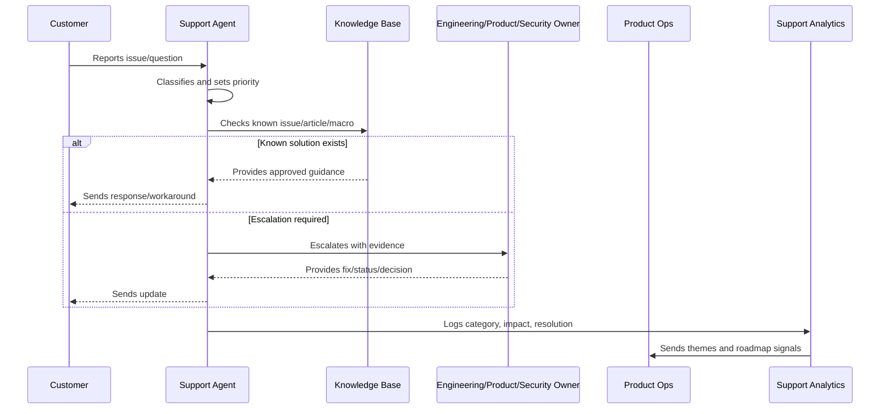

# Customer Communication Standards

> *"Defines customer communication standards for support replies, incident updates, known issue updates, sensitive issues, bug status, and post-resolution follow-up."*

---

# Purpose

Defines customer communication standards for support replies, incident updates, known issue updates, sensitive issues, bug status, and post-resolution follow-up.

---

# Support Operations Problem

Customers can tolerate issues better than uncertainty, silence, or misleading updates.

---

# Support Operations Decision

## Decision

CLARA customer communication should be factual, timely, empathetic, privacy-safe, and clear about next steps.

## Status

Accepted.

---

# Support Operations Rule

Every CLARA support workflow should connect:

```text
Customer Issue -> Intake -> Classification -> Severity/Priority -> Response -> Resolution/Escalation -> Knowledge Update -> Product Feedback
```

A support operation is not mature if it cannot answer:

```text
what customer issue was reported
what impact and urgency it has
who owns the response
what evidence was captured
what safe response should be sent
whether escalation is required
whether a known issue or knowledge article exists
what product/support improvement follows
```

---

# Recommended Support Flow



---

# Production-Ready Checklist

- [ ] Intake channel is defined.
- [ ] Ticket fields capture useful context.
- [ ] Severity and priority model exists.
- [ ] Response standards are documented.
- [ ] Macros are reviewed.
- [ ] Knowledge base ownership is clear.
- [ ] Known issues are tracked.
- [ ] Escalation paths are defined.
- [ ] Customer communication cadence exists.
- [ ] Support analytics feed product decisions.
- [ ] Security/privacy troubleshooting rules exist.

---

# Acceptance Criteria

- [ ] Support can classify issues consistently.
- [ ] Customers receive safe, useful responses.
- [ ] Repeated issues become knowledge or product work.
- [ ] Escalations include enough evidence.
- [ ] Known issues have owner/status/workaround.
- [ ] Product team reviews support themes.
- [ ] AI coding assistants can apply this safely.

---

# Anti-patterns

Avoid:

- Ticket ping-pong with no owner.
- Overpromising timelines.
- Asking customers for secrets.
- Troubleshooting with unsafe production access.
- Macros that are outdated or inaccurate.
- Closing tickets without resolution or next step.
- Support themes not reviewed by product.
- Known issues without workaround/status.
- Engineering escalations with vague context.
- Customer silence during active issues.

---

# Related Documents

- ../PART-01-Product-Operations-Foundation/README.md
- ../PART-02-Customer-Onboarding-and-Success/README.md
- ../../BOOK-06-Security-Governance-and-Compliance/
- ../../BOOK-07-Operations-Observability-and-Reliability/
- ../../BOOK-08-Implementation-Delivery-and-Production-Launch/

---

# Navigation

**Previous:** `32-Support-Analytics-and-Themes.md`

**Next:** `34-Support-to-Roadmap-Feedback-Loop.md`

---

# Communication Standards

Customer updates should include:

```text
what happened or what is known
customer impact
current status
available workaround
next action
next update time when unresolved
what customer needs to do, if anything
```

---

# Sensitive Issue Communication

For security/privacy-sensitive issues:

```text
do not speculate
do not disclose unrelated customer data
coordinate with security owner
use approved wording
record communication evidence
escalate quickly
```

---

# Communication Cadence

For unresolved issues:

```text
SEV-1: frequent updates through incident process
SEV-2: scheduled updates until mitigation/resolution
SEV-3: update when status changes or by agreed interval
SEV-4/5: standard support follow-up
```

---

# Communication Rule

It is better to say “we are investigating and will update by X” than to stay silent.
