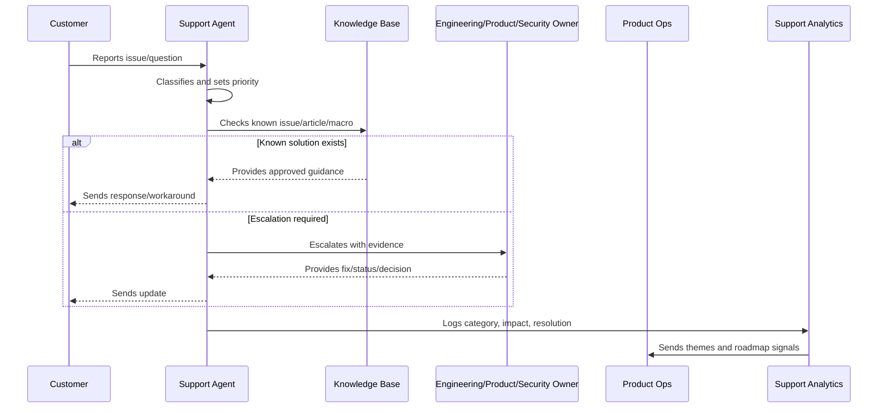

# Support to Roadmap Feedback Loop

> *"Defines how support themes, repeated tickets, customer pain, defect trends, known issues, and workaround burden feed product roadmap prioritization."*

---

# Purpose

Defines how support themes, repeated tickets, customer pain, defect trends, known issues, and workaround burden feed product roadmap prioritization.

---

# Support Operations Problem

If repeated support problems never change the product, support becomes a permanent workaround engine.

---

# Support Operations Decision

## Decision

CLARA should convert repeated support signals into roadmap candidates, documentation updates, product fixes, and success playbooks.

## Status

Accepted.

---

# Support Operations Rule

Every CLARA support workflow should connect:

```text
Customer Issue -> Intake -> Classification -> Severity/Priority -> Response -> Resolution/Escalation -> Knowledge Update -> Product Feedback
```

A support operation is not mature if it cannot answer:

```text
what customer issue was reported
what impact and urgency it has
who owns the response
what evidence was captured
what safe response should be sent
whether escalation is required
whether a known issue or knowledge article exists
what product/support improvement follows
```

---

# Recommended Support Flow



---

# Production-Ready Checklist

- [ ] Intake channel is defined.
- [ ] Ticket fields capture useful context.
- [ ] Severity and priority model exists.
- [ ] Response standards are documented.
- [ ] Macros are reviewed.
- [ ] Knowledge base ownership is clear.
- [ ] Known issues are tracked.
- [ ] Escalation paths are defined.
- [ ] Customer communication cadence exists.
- [ ] Support analytics feed product decisions.
- [ ] Security/privacy troubleshooting rules exist.

---

# Acceptance Criteria

- [ ] Support can classify issues consistently.
- [ ] Customers receive safe, useful responses.
- [ ] Repeated issues become knowledge or product work.
- [ ] Escalations include enough evidence.
- [ ] Known issues have owner/status/workaround.
- [ ] Product team reviews support themes.
- [ ] AI coding assistants can apply this safely.

---

# Anti-patterns

Avoid:

- Ticket ping-pong with no owner.
- Overpromising timelines.
- Asking customers for secrets.
- Troubleshooting with unsafe production access.
- Macros that are outdated or inaccurate.
- Closing tickets without resolution or next step.
- Support themes not reviewed by product.
- Known issues without workaround/status.
- Engineering escalations with vague context.
- Customer silence during active issues.

---

# Related Documents

- ../PART-01-Product-Operations-Foundation/README.md
- ../PART-02-Customer-Onboarding-and-Success/README.md
- ../../BOOK-06-Security-Governance-and-Compliance/
- ../../BOOK-07-Operations-Observability-and-Reliability/
- ../../BOOK-08-Implementation-Delivery-and-Production-Launch/

---

# Navigation

**Previous:** `33-Customer-Communication-Standards.md`

**Next:** `35-Support-Anti-Patterns.md`

---

# Roadmap Feedback Inputs

Use support signals such as:

```text
repeated tickets
high severity defects
high support burden workflow
common onboarding blocker
documentation gap
known issue frequency
feature request volume
customer churn reason
security/privacy support concern
AI quality complaint
integration failure pattern
```

---

# Feedback Routing

Route to:

```text
bug backlog
product roadmap
documentation backlog
support playbook update
security hardening backlog
reliability hardening backlog
AI quality backlog
integration improvement backlog
```

---

# Feedback Review Cadence

Review support themes:

```text
weekly for active launch/onboarding phase
biweekly for product operations
monthly for roadmap prioritization
after major incidents
after major releases
```

---

# Roadmap Rule

A repeated support pain point is product evidence, not support noise.
