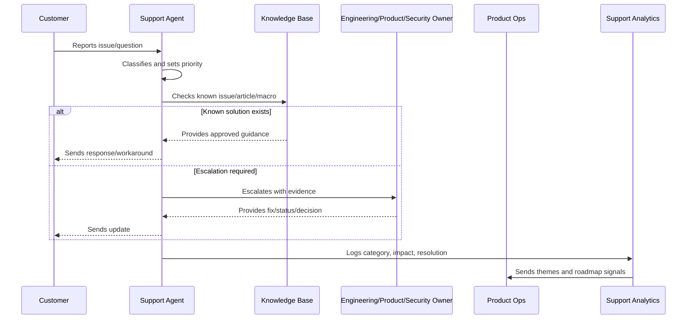

# Support Anti-Patterns

> *"Defines support operation anti-patterns such as ticket ping-pong, no owner, overpromising, unsafe troubleshooting, stale macros, ignored themes, and no escalation evidence."*

---

# Purpose

Defines support operation anti-patterns such as ticket ping-pong, no owner, overpromising, unsafe troubleshooting, stale macros, ignored themes, and no escalation evidence.

---

# Support Operations Problem

Support anti-patterns are early warning signs that product operations are not learning.

---

# Support Operations Decision

## Decision

CLARA should actively avoid support anti-patterns that reduce trust, increase toil, and hide product problems.

## Status

Accepted.

---

# Support Operations Rule

Every CLARA support workflow should connect:

```text
Customer Issue -> Intake -> Classification -> Severity/Priority -> Response -> Resolution/Escalation -> Knowledge Update -> Product Feedback
```

A support operation is not mature if it cannot answer:

```text
what customer issue was reported
what impact and urgency it has
who owns the response
what evidence was captured
what safe response should be sent
whether escalation is required
whether a known issue or knowledge article exists
what product/support improvement follows
```

---

# Recommended Support Flow



---

# Production-Ready Checklist

- [ ] Intake channel is defined.
- [ ] Ticket fields capture useful context.
- [ ] Severity and priority model exists.
- [ ] Response standards are documented.
- [ ] Macros are reviewed.
- [ ] Knowledge base ownership is clear.
- [ ] Known issues are tracked.
- [ ] Escalation paths are defined.
- [ ] Customer communication cadence exists.
- [ ] Support analytics feed product decisions.
- [ ] Security/privacy troubleshooting rules exist.

---

# Acceptance Criteria

- [ ] Support can classify issues consistently.
- [ ] Customers receive safe, useful responses.
- [ ] Repeated issues become knowledge or product work.
- [ ] Escalations include enough evidence.
- [ ] Known issues have owner/status/workaround.
- [ ] Product team reviews support themes.
- [ ] AI coding assistants can apply this safely.

---

# Anti-patterns

Avoid:

- Ticket ping-pong with no owner.
- Overpromising timelines.
- Asking customers for secrets.
- Troubleshooting with unsafe production access.
- Macros that are outdated or inaccurate.
- Closing tickets without resolution or next step.
- Support themes not reviewed by product.
- Known issues without workaround/status.
- Engineering escalations with vague context.
- Customer silence during active issues.

---

# Related Documents

- ../PART-01-Product-Operations-Foundation/README.md
- ../PART-02-Customer-Onboarding-and-Success/README.md
- ../../BOOK-06-Security-Governance-and-Compliance/
- ../../BOOK-07-Operations-Observability-and-Reliability/
- ../../BOOK-08-Implementation-Delivery-and-Production-Launch/

---

# Navigation

**Previous:** `34-Support-to-Roadmap-Feedback-Loop.md`

**Next:** `36-Part-03-Summary.md`

---

# Support Anti-Patterns

Avoid:

```text
ticket ping-pong
unclear owner
closing without customer confirmation or next step
overpromising fix dates
asking for secrets
unsafe production troubleshooting
support agents inventing technical explanations
outdated macros
known issues with no status
support themes ignored by roadmap
no escalation evidence
no customer update cadence
```

---

# Warning Signs

Watch for:

```text
same question answered manually many times
customers repeatedly confused by same workflow
support escalations lacking context
engineering says cannot reproduce often
macros contradict product behavior
known issues live only in chat
support volume rises after releases
```

---

# Recovery Actions

```text
create or update macro
write knowledge base article
create known issue record
improve product UI copy
add telemetry or error code
create engineering bug
schedule product review
add support training
```

---

# Anti-Pattern Rule

Support toil should be treated as product debt.
