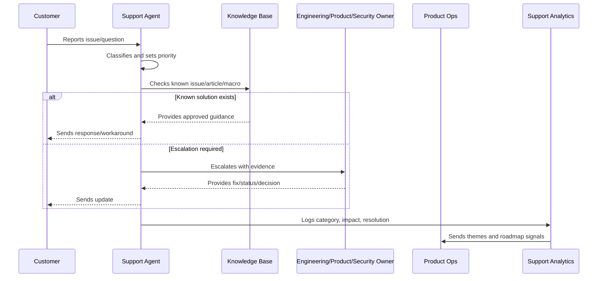

# Part 03 Summary

> *"Summarizes Support Operations and Knowledge Loop and prepares for Book IX Part 04."*

---

# Purpose

Summarizes Support Operations and Knowledge Loop and prepares for Book IX Part 04.

---

# Support Operations Problem

Growth Experiments and Activation comes next because support knowledge and onboarding evidence should inform safe growth experiments.

---

# Support Operations Decision

## Decision

CLARA should proceed to Growth Experiments and Activation after defining support intake, severity, response standards, knowledge lifecycle, known issues, escalation, analytics, communication, roadmap feedback, and anti-patterns.

## Status

Accepted.

---

# Support Operations Rule

Every CLARA support workflow should connect:

```text
Customer Issue -> Intake -> Classification -> Severity/Priority -> Response -> Resolution/Escalation -> Knowledge Update -> Product Feedback
```

A support operation is not mature if it cannot answer:

```text
what customer issue was reported
what impact and urgency it has
who owns the response
what evidence was captured
what safe response should be sent
whether escalation is required
whether a known issue or knowledge article exists
what product/support improvement follows
```

---

# Recommended Support Flow



---

# Production-Ready Checklist

- [ ] Intake channel is defined.
- [ ] Ticket fields capture useful context.
- [ ] Severity and priority model exists.
- [ ] Response standards are documented.
- [ ] Macros are reviewed.
- [ ] Knowledge base ownership is clear.
- [ ] Known issues are tracked.
- [ ] Escalation paths are defined.
- [ ] Customer communication cadence exists.
- [ ] Support analytics feed product decisions.
- [ ] Security/privacy troubleshooting rules exist.

---

# Acceptance Criteria

- [ ] Support can classify issues consistently.
- [ ] Customers receive safe, useful responses.
- [ ] Repeated issues become knowledge or product work.
- [ ] Escalations include enough evidence.
- [ ] Known issues have owner/status/workaround.
- [ ] Product team reviews support themes.
- [ ] AI coding assistants can apply this safely.

---

# Anti-patterns

Avoid:

- Ticket ping-pong with no owner.
- Overpromising timelines.
- Asking customers for secrets.
- Troubleshooting with unsafe production access.
- Macros that are outdated or inaccurate.
- Closing tickets without resolution or next step.
- Support themes not reviewed by product.
- Known issues without workaround/status.
- Engineering escalations with vague context.
- Customer silence during active issues.

---

# Related Documents

- ../PART-01-Product-Operations-Foundation/README.md
- ../PART-02-Customer-Onboarding-and-Success/README.md
- ../../BOOK-06-Security-Governance-and-Compliance/
- ../../BOOK-07-Operations-Observability-and-Reliability/
- ../../BOOK-08-Implementation-Delivery-and-Production-Launch/

---

# Navigation

**Previous:** `35-Support-Anti-Patterns.md`

**Next:** `../PART-04-Growth-Experiments-and-Activation/README.md`

---

# Part 03 Completion

Part 03 establishes:

- Support operations and knowledge loop overview.
- Support intake and triage.
- Support severity and priority model.
- Support macros and response standards.
- Knowledge base lifecycle.
- Known issue management.
- Escalation to engineering, product, and security.
- Support analytics and themes.
- Customer communication standards.
- Support to roadmap feedback loop.
- Support anti-patterns.

---

# Ready for Part 04

The next part should be:

```text
BOOK IX — PART 04: Growth Experiments and Activation
```

It should define:

- Growth experiments overview.
- Activation growth model.
- Experiment hypothesis and design.
- Segmentation and targeting.
- Experiment guardrails.
- Funnel instrumentation.
- A/B and cohort analysis.
- Growth experiment review.
- Growth risk management.
- Experiment-to-roadmap loop.
- Growth anti-patterns.
- Part 04 summary.
