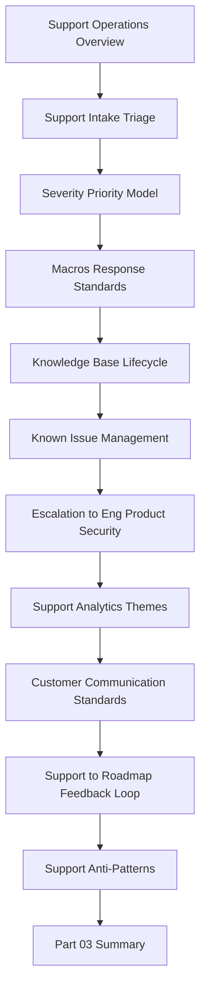

# PART-03 — Support Operations and Knowledge Loop

> *"Support is not only a service function. Support is where customer pain becomes product knowledge."*

---

# Purpose

Part 03 defines CLARA's support operations and knowledge loop standards.

It covers:

- Support Operations and Knowledge Loop Overview.
- Support Intake and Triage.
- Support Severity and Priority Model.
- Support Macros and Response Standards.
- Knowledge Base Lifecycle.
- Known Issue Management.
- Escalation to Engineering, Product, and Security.
- Support Analytics and Themes.
- Customer Communication Standards.
- Support to Roadmap Feedback Loop.
- Support Anti-Patterns.
- Part 03 Summary.

---

# Chapter Map

| Chapter | Title |
|---:|---|
| 25 | Support Operations and Knowledge Loop Overview |
| 26 | Support Intake and Triage |
| 27 | Support Severity and Priority Model |
| 28 | Support Macros and Response Standards |
| 29 | Knowledge Base Lifecycle |
| 30 | Known Issue Management |
| 31 | Escalation to Engineering Product and Security |
| 32 | Support Analytics and Themes |
| 33 | Customer Communication Standards |
| 34 | Support to Roadmap Feedback Loop |
| 35 | Support Anti-Patterns |
| 36 | Part 03 Summary |

---

# Support Knowledge Loop Map



---

# Support Operations Non-Negotiables

CLARA support operations must enforce:

```text
clear intake channels
ticket classification
severity and priority model
customer impact assessment
secure response standards
approved macros
known issue tracking
knowledge base lifecycle
escalation with evidence
support analytics
customer communication cadence
support-to-roadmap feedback loop
privacy-safe troubleshooting
```

---

# Relationship to Previous Part

Part 02 defines onboarding and customer success.

Part 03 defines how customer questions, onboarding friction, defects, incidents, and repeated issues become reusable support knowledge and product improvement.

---

# Navigation

**Previous:** `../PART-02-Customer-Onboarding-and-Success/24-Part-02-Summary.md`

**Next:** `25-Support-Operations-and-Knowledge-Loop-Overview.md`
