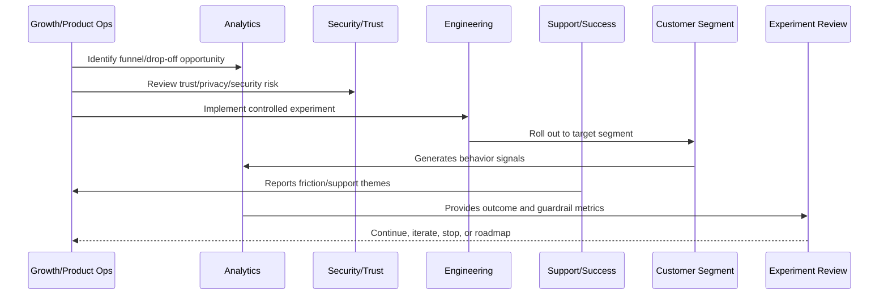
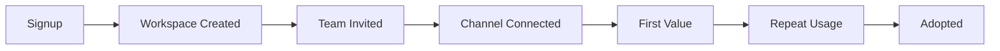

# Activation Growth Model

> *"Defines CLARA's activation growth model, activation events, first value, adoption milestones, activation segments, and activation bottlenecks."*

---

# Purpose

Defines CLARA's activation growth model, activation events, first value, adoption milestones, activation segments, and activation bottlenecks.

---

# Growth Problem

A product can have many signups but weak growth if customers do not reach activation and repeat usage.

---

# Growth Decision

## Decision

CLARA activation growth should focus on helping customers complete meaningful workflows faster and with less friction.

## Status

Accepted.

---

# Growth Experiment Rule

Every CLARA growth experiment should connect:

```text
Customer Problem -> Hypothesis -> Segment -> Metric -> Guardrail -> Rollout -> Analysis -> Decision -> Roadmap/Knowledge Update
```

A growth experiment is not mature if it cannot answer:

```text
what customer behavior should change
why the change should improve customer value
who is included and excluded
what primary metric should move
what guardrail metrics must not get worse
how privacy and trust are protected
how the experiment can be stopped
how results will be interpreted
what decision will be made after review
```

---

# Recommended Growth Experiment Flow



---

# Production-Ready Checklist

- [ ] Customer problem is defined.
- [ ] Hypothesis is written.
- [ ] Target segment is defined.
- [ ] Primary metric is defined.
- [ ] Guardrail metrics are defined.
- [ ] Privacy/security review is completed where needed.
- [ ] Rollout and stop criteria exist.
- [ ] Instrumentation is validated.
- [ ] Support impact is considered.
- [ ] Review date is scheduled.
- [ ] Decision record will be created.

---

# Acceptance Criteria

- [ ] Experiment is measurable.
- [ ] Experiment is reversible.
- [ ] Experiment protects customer trust.
- [ ] Results can be interpreted.
- [ ] Learnings feed roadmap or documentation.
- [ ] AI coding assistants can apply this safely.

---

# Anti-patterns

Avoid:

- Vanity metric experiments.
- Growth changes with no hypothesis.
- Experiments without guardrails.
- Dark patterns.
- Misleading trials or pricing.
- Collecting unnecessary personal data.
- Running experiments on sensitive workflows without review.
- Changing onboarding for all users without measurement.
- Ignoring support burden.
- Declaring victory from weak sample/noisy data.

---

# Related Documents

- ../PART-01-Product-Operations-Foundation/README.md
- ../PART-02-Customer-Onboarding-and-Success/README.md
- ../PART-03-Support-Operations-and-Knowledge-Loop/README.md
- ../../BOOK-06-Security-Governance-and-Compliance/
- ../../BOOK-08-Implementation-Delivery-and-Production-Launch/

---

# Navigation

**Previous:** `37-Growth-Experiments-and-Activation-Overview.md`

**Next:** `39-Experiment-Hypothesis-and-Design.md`

---

# Activation Events

Possible CLARA activation events:

```text
workspace created
team member invited
primary channel connected
first conversation imported
first ticket created
first reply sent
first AI draft reviewed
first knowledge article used
first integration event processed
repeat workflow completed
```

---

# Activation Funnel



---

# Bottleneck Analysis

For each funnel step, ask:

```text
where do users drop
what user segment drops
what error/support theme appears
what permission/security issue appears
what education is missing
what product change could reduce friction
```

---

# Activation Rule

Activation metrics should represent meaningful product value, not just UI clicks.
