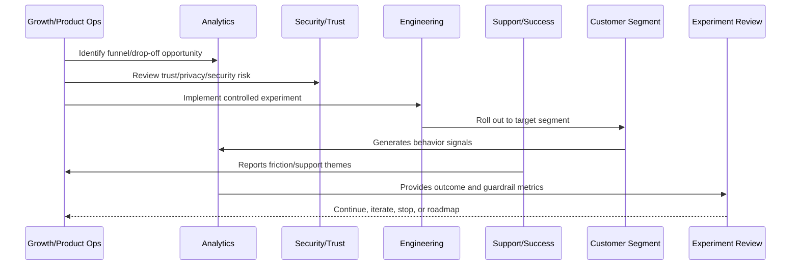

# Experiment Hypothesis and Design

> *"Defines experiment hypothesis, problem statement, expected behavior change, metrics, guardrails, duration, sample, rollout, and decision rules."*

---

# Purpose

Defines experiment hypothesis, problem statement, expected behavior change, metrics, guardrails, duration, sample, rollout, and decision rules.

---

# Growth Problem

Experiments without hypotheses become random changes that are hard to learn from.

---

# Growth Decision

## Decision

CLARA experiments should begin with a clear hypothesis and end with a decision based on evidence.

## Status

Accepted.

---

# Growth Experiment Rule

Every CLARA growth experiment should connect:

```text
Customer Problem -> Hypothesis -> Segment -> Metric -> Guardrail -> Rollout -> Analysis -> Decision -> Roadmap/Knowledge Update
```

A growth experiment is not mature if it cannot answer:

```text
what customer behavior should change
why the change should improve customer value
who is included and excluded
what primary metric should move
what guardrail metrics must not get worse
how privacy and trust are protected
how the experiment can be stopped
how results will be interpreted
what decision will be made after review
```

---

# Recommended Growth Experiment Flow



---

# Production-Ready Checklist

- [ ] Customer problem is defined.
- [ ] Hypothesis is written.
- [ ] Target segment is defined.
- [ ] Primary metric is defined.
- [ ] Guardrail metrics are defined.
- [ ] Privacy/security review is completed where needed.
- [ ] Rollout and stop criteria exist.
- [ ] Instrumentation is validated.
- [ ] Support impact is considered.
- [ ] Review date is scheduled.
- [ ] Decision record will be created.

---

# Acceptance Criteria

- [ ] Experiment is measurable.
- [ ] Experiment is reversible.
- [ ] Experiment protects customer trust.
- [ ] Results can be interpreted.
- [ ] Learnings feed roadmap or documentation.
- [ ] AI coding assistants can apply this safely.

---

# Anti-patterns

Avoid:

- Vanity metric experiments.
- Growth changes with no hypothesis.
- Experiments without guardrails.
- Dark patterns.
- Misleading trials or pricing.
- Collecting unnecessary personal data.
- Running experiments on sensitive workflows without review.
- Changing onboarding for all users without measurement.
- Ignoring support burden.
- Declaring victory from weak sample/noisy data.

---

# Related Documents

- ../PART-01-Product-Operations-Foundation/README.md
- ../PART-02-Customer-Onboarding-and-Success/README.md
- ../PART-03-Support-Operations-and-Knowledge-Loop/README.md
- ../../BOOK-06-Security-Governance-and-Compliance/
- ../../BOOK-08-Implementation-Delivery-and-Production-Launch/

---

# Navigation

**Previous:** `38-Activation-Growth-Model.md`

**Next:** `40-Segmentation-and-Targeting.md`

---

# Hypothesis Template

```markdown
# Experiment Hypothesis

Problem:
Target segment:
Hypothesis:
Expected behavior change:
Primary metric:
Guardrail metrics:
Risk level:
Rollout plan:
Stop criteria:
Review date:
Owner:
```

---

# Experiment Design Checklist

- [ ] Problem is specific.
- [ ] Target segment is justified.
- [ ] Expected behavior is observable.
- [ ] Instrumentation exists.
- [ ] Guardrails exist.
- [ ] Rollout can be stopped.
- [ ] Support knows the change.
- [ ] Result interpretation rule is defined.

---

# Decision Outcomes

Use:

```text
ship
iterate
stop
extend experiment
segment-specific rollout
convert to roadmap item
convert to support/docs update
```

---

# Hypothesis Rule

If the team cannot state what it expects to learn, it is not an experiment.
