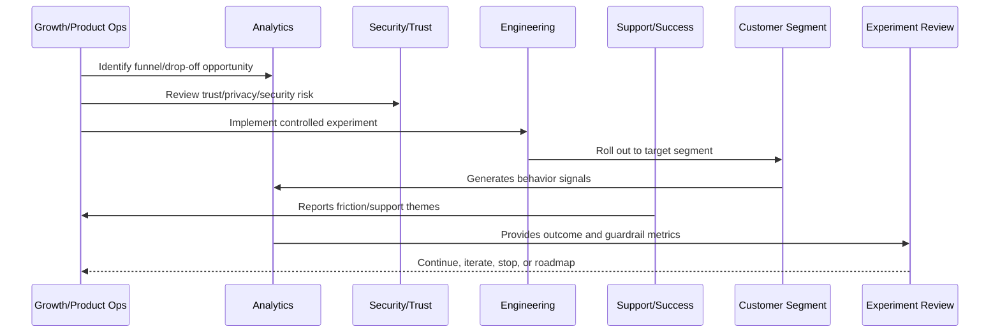

# Segmentation and Targeting

> *"Defines customer segmentation, workspace targeting, cohort design, persona-based activation, feature eligibility, and ethical targeting boundaries."*

---

# Purpose

Defines customer segmentation, workspace targeting, cohort design, persona-based activation, feature eligibility, and ethical targeting boundaries.

---

# Growth Problem

Bad segmentation can produce misleading results or expose the wrong users to risky changes.

---

# Growth Decision

## Decision

CLARA growth experiments should target appropriate customer segments while respecting privacy, fairness, customer trust, and product fit.

## Status

Accepted.

---

# Growth Experiment Rule

Every CLARA growth experiment should connect:

```text
Customer Problem -> Hypothesis -> Segment -> Metric -> Guardrail -> Rollout -> Analysis -> Decision -> Roadmap/Knowledge Update
```

A growth experiment is not mature if it cannot answer:

```text
what customer behavior should change
why the change should improve customer value
who is included and excluded
what primary metric should move
what guardrail metrics must not get worse
how privacy and trust are protected
how the experiment can be stopped
how results will be interpreted
what decision will be made after review
```

---

# Recommended Growth Experiment Flow



---

# Production-Ready Checklist

- [ ] Customer problem is defined.
- [ ] Hypothesis is written.
- [ ] Target segment is defined.
- [ ] Primary metric is defined.
- [ ] Guardrail metrics are defined.
- [ ] Privacy/security review is completed where needed.
- [ ] Rollout and stop criteria exist.
- [ ] Instrumentation is validated.
- [ ] Support impact is considered.
- [ ] Review date is scheduled.
- [ ] Decision record will be created.

---

# Acceptance Criteria

- [ ] Experiment is measurable.
- [ ] Experiment is reversible.
- [ ] Experiment protects customer trust.
- [ ] Results can be interpreted.
- [ ] Learnings feed roadmap or documentation.
- [ ] AI coding assistants can apply this safely.

---

# Anti-patterns

Avoid:

- Vanity metric experiments.
- Growth changes with no hypothesis.
- Experiments without guardrails.
- Dark patterns.
- Misleading trials or pricing.
- Collecting unnecessary personal data.
- Running experiments on sensitive workflows without review.
- Changing onboarding for all users without measurement.
- Ignoring support burden.
- Declaring victory from weak sample/noisy data.

---

# Related Documents

- ../PART-01-Product-Operations-Foundation/README.md
- ../PART-02-Customer-Onboarding-and-Success/README.md
- ../PART-03-Support-Operations-and-Knowledge-Loop/README.md
- ../../BOOK-06-Security-Governance-and-Compliance/
- ../../BOOK-08-Implementation-Delivery-and-Production-Launch/

---

# Navigation

**Previous:** `39-Experiment-Hypothesis-and-Design.md`

**Next:** `41-Experiment-Guardrails.md`

---

# Segmentation Dimensions

Segment by:

```text
customer lifecycle stage
workspace size
role/persona
use case
industry/vertical if known
trial vs paid
new vs existing customer
integration type
AI enabled vs disabled
support history
activation status
```

---

# Targeting Controls

Experiments should define:

```text
included segment
excluded segment
eligibility rule
risk level
rollout percentage
workspace/customer allowlist
kill switch
owner
```

---

# Ethical Targeting Boundaries

Avoid:

```text
manipulative targeting
discriminatory targeting
exposing vulnerable users to risky flows
hiding material pricing limitations
using sensitive attributes without approval
```

---

# Segmentation Rule

A segment should help answer a product question, not just slice data endlessly.
