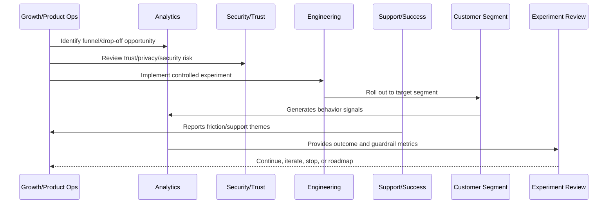
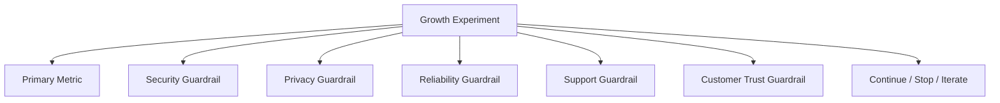

# Experiment Guardrails

> *"Defines guardrails for security, privacy, reliability, support burden, billing clarity, AI safety, customer trust, and user experience."*

---

# Purpose

Defines guardrails for security, privacy, reliability, support burden, billing clarity, AI safety, customer trust, and user experience.

---

# Growth Problem

A successful growth metric is not a success if it increases security incidents, churn risk, support burden, or customer confusion.

---

# Growth Decision

## Decision

CLARA experiments should include guardrail metrics and stop conditions so growth improvements do not create unacceptable risk.

## Status

Accepted.

---

# Growth Experiment Rule

Every CLARA growth experiment should connect:

```text
Customer Problem -> Hypothesis -> Segment -> Metric -> Guardrail -> Rollout -> Analysis -> Decision -> Roadmap/Knowledge Update
```

A growth experiment is not mature if it cannot answer:

```text
what customer behavior should change
why the change should improve customer value
who is included and excluded
what primary metric should move
what guardrail metrics must not get worse
how privacy and trust are protected
how the experiment can be stopped
how results will be interpreted
what decision will be made after review
```

---

# Recommended Growth Experiment Flow



---

# Production-Ready Checklist

- [ ] Customer problem is defined.
- [ ] Hypothesis is written.
- [ ] Target segment is defined.
- [ ] Primary metric is defined.
- [ ] Guardrail metrics are defined.
- [ ] Privacy/security review is completed where needed.
- [ ] Rollout and stop criteria exist.
- [ ] Instrumentation is validated.
- [ ] Support impact is considered.
- [ ] Review date is scheduled.
- [ ] Decision record will be created.

---

# Acceptance Criteria

- [ ] Experiment is measurable.
- [ ] Experiment is reversible.
- [ ] Experiment protects customer trust.
- [ ] Results can be interpreted.
- [ ] Learnings feed roadmap or documentation.
- [ ] AI coding assistants can apply this safely.

---

# Anti-patterns

Avoid:

- Vanity metric experiments.
- Growth changes with no hypothesis.
- Experiments without guardrails.
- Dark patterns.
- Misleading trials or pricing.
- Collecting unnecessary personal data.
- Running experiments on sensitive workflows without review.
- Changing onboarding for all users without measurement.
- Ignoring support burden.
- Declaring victory from weak sample/noisy data.

---

# Related Documents

- ../PART-01-Product-Operations-Foundation/README.md
- ../PART-02-Customer-Onboarding-and-Success/README.md
- ../PART-03-Support-Operations-and-Knowledge-Loop/README.md
- ../../BOOK-06-Security-Governance-and-Compliance/
- ../../BOOK-08-Implementation-Delivery-and-Production-Launch/

---

# Navigation

**Previous:** `40-Segmentation-and-Targeting.md`

**Next:** `42-Funnel-Instrumentation.md`

---

# Guardrail Categories

Guardrails should include:

```text
security incidents
privacy complaints
support ticket volume
onboarding confusion
error rate
latency
integration failure rate
AI rejection/safety block rate
billing confusion
churn/early drop-off
customer sentiment
```

---

# Stop Criteria Examples

Stop experiment if:

```text
security/privacy issue is detected
support ticket volume spikes above threshold
error rate increases materially
AI unsafe output increases
integration setup failure increases
billing confusion increases
activation metric improves but retention worsens
customer trust signal worsens
```

---

# Guardrail Map



---

# Guardrail Rule

A growth win that violates guardrails is not a win.
