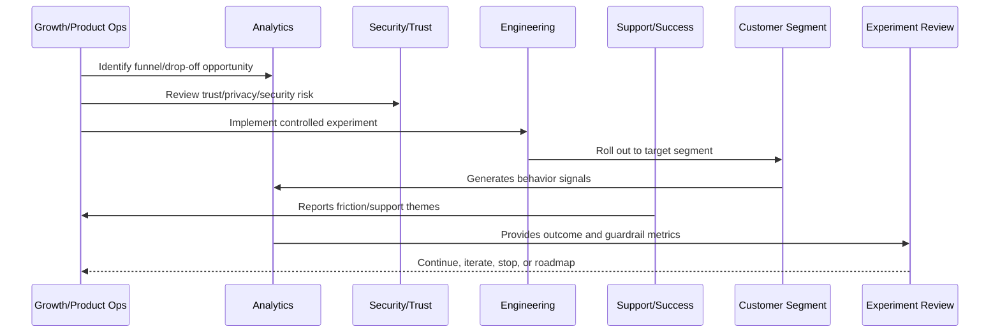

# Funnel Instrumentation

> *"Defines event tracking, funnel steps, analytics instrumentation, event naming, identity rules, privacy constraints, and data quality checks."*

---

# Purpose

Defines event tracking, funnel steps, analytics instrumentation, event naming, identity rules, privacy constraints, and data quality checks.

---

# Growth Problem

Growth decisions become unreliable when instrumentation is incomplete, inconsistent, or privacy-invasive.

---

# Growth Decision

## Decision

CLARA funnel instrumentation should produce reliable, privacy-safe product data that explains where users progress, drop off, or struggle.

## Status

Accepted.

---

# Growth Experiment Rule

Every CLARA growth experiment should connect:

```text
Customer Problem -> Hypothesis -> Segment -> Metric -> Guardrail -> Rollout -> Analysis -> Decision -> Roadmap/Knowledge Update
```

A growth experiment is not mature if it cannot answer:

```text
what customer behavior should change
why the change should improve customer value
who is included and excluded
what primary metric should move
what guardrail metrics must not get worse
how privacy and trust are protected
how the experiment can be stopped
how results will be interpreted
what decision will be made after review
```

---

# Recommended Growth Experiment Flow



---

# Production-Ready Checklist

- [ ] Customer problem is defined.
- [ ] Hypothesis is written.
- [ ] Target segment is defined.
- [ ] Primary metric is defined.
- [ ] Guardrail metrics are defined.
- [ ] Privacy/security review is completed where needed.
- [ ] Rollout and stop criteria exist.
- [ ] Instrumentation is validated.
- [ ] Support impact is considered.
- [ ] Review date is scheduled.
- [ ] Decision record will be created.

---

# Acceptance Criteria

- [ ] Experiment is measurable.
- [ ] Experiment is reversible.
- [ ] Experiment protects customer trust.
- [ ] Results can be interpreted.
- [ ] Learnings feed roadmap or documentation.
- [ ] AI coding assistants can apply this safely.

---

# Anti-patterns

Avoid:

- Vanity metric experiments.
- Growth changes with no hypothesis.
- Experiments without guardrails.
- Dark patterns.
- Misleading trials or pricing.
- Collecting unnecessary personal data.
- Running experiments on sensitive workflows without review.
- Changing onboarding for all users without measurement.
- Ignoring support burden.
- Declaring victory from weak sample/noisy data.

---

# Related Documents

- ../PART-01-Product-Operations-Foundation/README.md
- ../PART-02-Customer-Onboarding-and-Success/README.md
- ../PART-03-Support-Operations-and-Knowledge-Loop/README.md
- ../../BOOK-06-Security-Governance-and-Compliance/
- ../../BOOK-08-Implementation-Delivery-and-Production-Launch/

---

# Navigation

**Previous:** `41-Experiment-Guardrails.md`

**Next:** `43-AB-and-Cohort-Analysis.md`

---

# Funnel Event Naming

Use consistent event names:

```text
signup_completed
workspace_created
team_invite_sent
team_invite_accepted
integration_connected
conversation_imported
ticket_created
ai_draft_generated
ai_draft_approved
reply_sent
activation_completed
```

---

# Event Properties

Include privacy-safe properties:

```text
workspace_id_hash
organization_id_hash
actor_role
plan_type
feature_flag_state
integration_type
timestamp
environment
result
error_code where relevant
```

Avoid:

```text
raw customer message content
secrets
tokens
full email/body data where unnecessary
sensitive personal data
```

---

# Data Quality Checks

Validate:

```text
event fires once per intended action
event has required properties
event respects consent/privacy policy
event maps to funnel step
event is documented
event works in staging before launch
```

---

# Instrumentation Rule

Do not make growth decisions from events that are not documented and validated.
