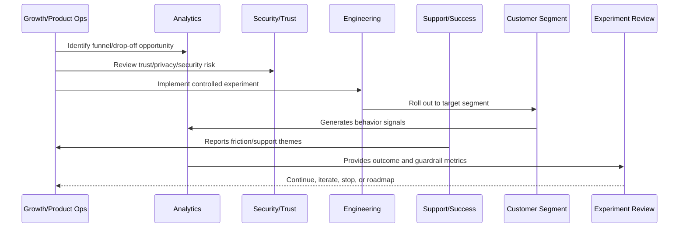

# A/B and Cohort Analysis

> *"Defines A/B testing, cohort analysis, conversion comparison, retention analysis, statistical caution, sample quality, and interpretation rules."*

---

# Purpose

Defines A/B testing, cohort analysis, conversion comparison, retention analysis, statistical caution, sample quality, and interpretation rules.

---

# Growth Problem

Teams can make bad growth decisions when they treat noisy or biased metrics as proof.

---

# Growth Decision

## Decision

CLARA should use A/B and cohort analysis to understand experiment impact without overclaiming weak or biased results.

## Status

Accepted.

---

# Growth Experiment Rule

Every CLARA growth experiment should connect:

```text
Customer Problem -> Hypothesis -> Segment -> Metric -> Guardrail -> Rollout -> Analysis -> Decision -> Roadmap/Knowledge Update
```

A growth experiment is not mature if it cannot answer:

```text
what customer behavior should change
why the change should improve customer value
who is included and excluded
what primary metric should move
what guardrail metrics must not get worse
how privacy and trust are protected
how the experiment can be stopped
how results will be interpreted
what decision will be made after review
```

---

# Recommended Growth Experiment Flow



---

# Production-Ready Checklist

- [ ] Customer problem is defined.
- [ ] Hypothesis is written.
- [ ] Target segment is defined.
- [ ] Primary metric is defined.
- [ ] Guardrail metrics are defined.
- [ ] Privacy/security review is completed where needed.
- [ ] Rollout and stop criteria exist.
- [ ] Instrumentation is validated.
- [ ] Support impact is considered.
- [ ] Review date is scheduled.
- [ ] Decision record will be created.

---

# Acceptance Criteria

- [ ] Experiment is measurable.
- [ ] Experiment is reversible.
- [ ] Experiment protects customer trust.
- [ ] Results can be interpreted.
- [ ] Learnings feed roadmap or documentation.
- [ ] AI coding assistants can apply this safely.

---

# Anti-patterns

Avoid:

- Vanity metric experiments.
- Growth changes with no hypothesis.
- Experiments without guardrails.
- Dark patterns.
- Misleading trials or pricing.
- Collecting unnecessary personal data.
- Running experiments on sensitive workflows without review.
- Changing onboarding for all users without measurement.
- Ignoring support burden.
- Declaring victory from weak sample/noisy data.

---

# Related Documents

- ../PART-01-Product-Operations-Foundation/README.md
- ../PART-02-Customer-Onboarding-and-Success/README.md
- ../PART-03-Support-Operations-and-Knowledge-Loop/README.md
- ../../BOOK-06-Security-Governance-and-Compliance/
- ../../BOOK-08-Implementation-Delivery-and-Production-Launch/

---

# Navigation

**Previous:** `42-Funnel-Instrumentation.md`

**Next:** `44-Growth-Experiment-Review.md`

---

# A/B Test Requirements

A/B tests should define:

```text
control
variant
target segment
primary metric
guardrail metrics
duration
minimum sample expectation
assignment method
exclusion rules
analysis plan
```

---

# Cohort Analysis Use Cases

Use cohorts for:

```text
activation by signup week
retention by onboarding version
trial conversion by integration type
AI adoption by workspace size
support burden by customer segment
feature adoption after release
```

---

# Interpretation Warnings

Be careful with:

```text
small samples
seasonality
novelty effects
survivorship bias
customer mix changes
parallel experiments
one large customer dominating data
short-term activation hurting retention
```

---

# Analysis Rule

Treat experiment data as evidence, not absolute truth. Combine it with qualitative customer/support evidence.
