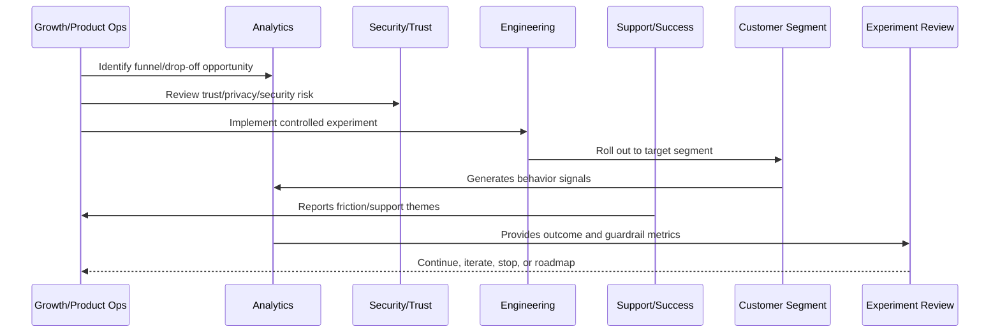

# Growth Risk Management

> *"Defines growth risk management for dark patterns, misleading UX, privacy issues, billing confusion, over-automation, AI mistakes, and long-term trust damage."*

---

# Purpose

Defines growth risk management for dark patterns, misleading UX, privacy issues, billing confusion, over-automation, AI mistakes, and long-term trust damage.

---

# Growth Problem

Growth-at-all-costs behavior can damage brand, compliance posture, support quality, and retention.

---

# Growth Decision

## Decision

CLARA growth should explicitly reject patterns that increase short-term metrics by weakening customer trust or informed consent.

## Status

Accepted.

---

# Growth Experiment Rule

Every CLARA growth experiment should connect:

```text
Customer Problem -> Hypothesis -> Segment -> Metric -> Guardrail -> Rollout -> Analysis -> Decision -> Roadmap/Knowledge Update
```

A growth experiment is not mature if it cannot answer:

```text
what customer behavior should change
why the change should improve customer value
who is included and excluded
what primary metric should move
what guardrail metrics must not get worse
how privacy and trust are protected
how the experiment can be stopped
how results will be interpreted
what decision will be made after review
```

---

# Recommended Growth Experiment Flow



---

# Production-Ready Checklist

- [ ] Customer problem is defined.
- [ ] Hypothesis is written.
- [ ] Target segment is defined.
- [ ] Primary metric is defined.
- [ ] Guardrail metrics are defined.
- [ ] Privacy/security review is completed where needed.
- [ ] Rollout and stop criteria exist.
- [ ] Instrumentation is validated.
- [ ] Support impact is considered.
- [ ] Review date is scheduled.
- [ ] Decision record will be created.

---

# Acceptance Criteria

- [ ] Experiment is measurable.
- [ ] Experiment is reversible.
- [ ] Experiment protects customer trust.
- [ ] Results can be interpreted.
- [ ] Learnings feed roadmap or documentation.
- [ ] AI coding assistants can apply this safely.

---

# Anti-patterns

Avoid:

- Vanity metric experiments.
- Growth changes with no hypothesis.
- Experiments without guardrails.
- Dark patterns.
- Misleading trials or pricing.
- Collecting unnecessary personal data.
- Running experiments on sensitive workflows without review.
- Changing onboarding for all users without measurement.
- Ignoring support burden.
- Declaring victory from weak sample/noisy data.

---

# Related Documents

- ../PART-01-Product-Operations-Foundation/README.md
- ../PART-02-Customer-Onboarding-and-Success/README.md
- ../PART-03-Support-Operations-and-Knowledge-Loop/README.md
- ../../BOOK-06-Security-Governance-and-Compliance/
- ../../BOOK-08-Implementation-Delivery-and-Production-Launch/

---

# Navigation

**Previous:** `44-Growth-Experiment-Review.md`

**Next:** `46-Experiment-to-Roadmap-Loop.md`

---

# Growth Risk Areas

Review risks related to:

```text
dark patterns
misleading onboarding
hidden pricing friction
privacy-invasive tracking
over-automation
AI unsafe suggestion
support burden
integration failure
performance degradation
accessibility regression
customer trust damage
```

---

# Risk Control Actions

Use:

```text
security review
privacy review
UX review
support readiness review
feature flag rollout
kill switch
limited segment test
manual review for AI/automation
clear customer communication
```

---

# Dark Pattern Examples to Avoid

```text
confusing opt-out
hidden cancellation
misleading scarcity
unclear billing change
forcing integrations before value
tricking users into inviting teammates
hiding limitations until after setup
```

---

# Risk Rule

Growth must never depend on confusing or trapping users.
