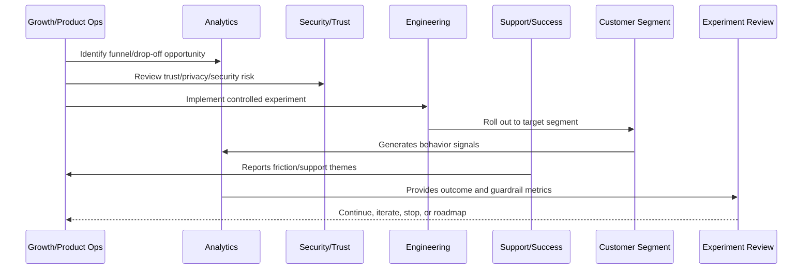
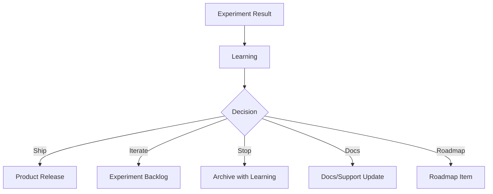

# Experiment to Roadmap Loop

> *"Defines how experiment learnings become roadmap items, product improvements, onboarding changes, support knowledge, documentation updates, and backlog decisions."*

---

# Purpose

Defines how experiment learnings become roadmap items, product improvements, onboarding changes, support knowledge, documentation updates, and backlog decisions.

---

# Growth Problem

Experiment learnings decay quickly when they are not connected to roadmap and documentation.

---

# Growth Decision

## Decision

CLARA should convert experiment outcomes into product roadmap decisions, not just dashboard screenshots.

## Status

Accepted.

---

# Growth Experiment Rule

Every CLARA growth experiment should connect:

```text
Customer Problem -> Hypothesis -> Segment -> Metric -> Guardrail -> Rollout -> Analysis -> Decision -> Roadmap/Knowledge Update
```

A growth experiment is not mature if it cannot answer:

```text
what customer behavior should change
why the change should improve customer value
who is included and excluded
what primary metric should move
what guardrail metrics must not get worse
how privacy and trust are protected
how the experiment can be stopped
how results will be interpreted
what decision will be made after review
```

---

# Recommended Growth Experiment Flow



---

# Production-Ready Checklist

- [ ] Customer problem is defined.
- [ ] Hypothesis is written.
- [ ] Target segment is defined.
- [ ] Primary metric is defined.
- [ ] Guardrail metrics are defined.
- [ ] Privacy/security review is completed where needed.
- [ ] Rollout and stop criteria exist.
- [ ] Instrumentation is validated.
- [ ] Support impact is considered.
- [ ] Review date is scheduled.
- [ ] Decision record will be created.

---

# Acceptance Criteria

- [ ] Experiment is measurable.
- [ ] Experiment is reversible.
- [ ] Experiment protects customer trust.
- [ ] Results can be interpreted.
- [ ] Learnings feed roadmap or documentation.
- [ ] AI coding assistants can apply this safely.

---

# Anti-patterns

Avoid:

- Vanity metric experiments.
- Growth changes with no hypothesis.
- Experiments without guardrails.
- Dark patterns.
- Misleading trials or pricing.
- Collecting unnecessary personal data.
- Running experiments on sensitive workflows without review.
- Changing onboarding for all users without measurement.
- Ignoring support burden.
- Declaring victory from weak sample/noisy data.

---

# Related Documents

- ../PART-01-Product-Operations-Foundation/README.md
- ../PART-02-Customer-Onboarding-and-Success/README.md
- ../PART-03-Support-Operations-and-Knowledge-Loop/README.md
- ../../BOOK-06-Security-Governance-and-Compliance/
- ../../BOOK-08-Implementation-Delivery-and-Production-Launch/

---

# Navigation

**Previous:** `45-Growth-Risk-Management.md`

**Next:** `47-Growth-Anti-Patterns.md`

---

# Roadmap Loop

Experiment outcomes should feed:

```text
product roadmap
onboarding improvements
support macros
knowledge base articles
AI prompt improvements
integration setup improvements
pricing/package changes
security/reliability hardening
analytics instrumentation improvements
```

---

# Loop Flow



---

# Roadmap Item Requirements

Each experiment-derived roadmap item should include:

```text
experiment evidence
customer segment
metric impact
guardrail result
customer/support notes
expected value
risk notes
owner
```

---

# Roadmap Rule

A failed experiment is useful if it changes what the team believes or avoids wasted work.
