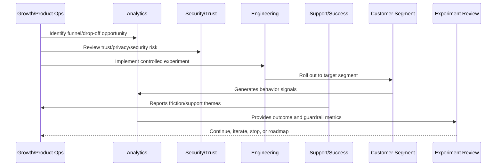

# Growth Anti-Patterns

> *"Defines growth anti-patterns such as vanity metrics, dark patterns, unsafe automation, misleading trials, over-segmentation, experiment sprawl, and ignoring guardrails."*

---

# Purpose

Defines growth anti-patterns such as vanity metrics, dark patterns, unsafe automation, misleading trials, over-segmentation, experiment sprawl, and ignoring guardrails.

---

# Growth Problem

Growth anti-patterns can make the product look successful in dashboards while customers become less successful.

---

# Growth Decision

## Decision

CLARA should actively avoid growth anti-patterns that inflate metrics while reducing trust and long-term value.

## Status

Accepted.

---

# Growth Experiment Rule

Every CLARA growth experiment should connect:

```text
Customer Problem -> Hypothesis -> Segment -> Metric -> Guardrail -> Rollout -> Analysis -> Decision -> Roadmap/Knowledge Update
```

A growth experiment is not mature if it cannot answer:

```text
what customer behavior should change
why the change should improve customer value
who is included and excluded
what primary metric should move
what guardrail metrics must not get worse
how privacy and trust are protected
how the experiment can be stopped
how results will be interpreted
what decision will be made after review
```

---

# Recommended Growth Experiment Flow



---

# Production-Ready Checklist

- [ ] Customer problem is defined.
- [ ] Hypothesis is written.
- [ ] Target segment is defined.
- [ ] Primary metric is defined.
- [ ] Guardrail metrics are defined.
- [ ] Privacy/security review is completed where needed.
- [ ] Rollout and stop criteria exist.
- [ ] Instrumentation is validated.
- [ ] Support impact is considered.
- [ ] Review date is scheduled.
- [ ] Decision record will be created.

---

# Acceptance Criteria

- [ ] Experiment is measurable.
- [ ] Experiment is reversible.
- [ ] Experiment protects customer trust.
- [ ] Results can be interpreted.
- [ ] Learnings feed roadmap or documentation.
- [ ] AI coding assistants can apply this safely.

---

# Anti-patterns

Avoid:

- Vanity metric experiments.
- Growth changes with no hypothesis.
- Experiments without guardrails.
- Dark patterns.
- Misleading trials or pricing.
- Collecting unnecessary personal data.
- Running experiments on sensitive workflows without review.
- Changing onboarding for all users without measurement.
- Ignoring support burden.
- Declaring victory from weak sample/noisy data.

---

# Related Documents

- ../PART-01-Product-Operations-Foundation/README.md
- ../PART-02-Customer-Onboarding-and-Success/README.md
- ../PART-03-Support-Operations-and-Knowledge-Loop/README.md
- ../../BOOK-06-Security-Governance-and-Compliance/
- ../../BOOK-08-Implementation-Delivery-and-Production-Launch/

---

# Navigation

**Previous:** `46-Experiment-to-Roadmap-Loop.md`

**Next:** `48-Part-04-Summary.md`

---

# Growth Anti-Patterns

Avoid:

```text
vanity metric optimization
signup growth with no activation
experiments without hypothesis
permanent experiments
ignoring guardrail metrics
misleading pricing or trial UX
dark patterns
over-segmentation
parallel experiments that contaminate results
support team unaware of active experiments
customer trust harmed for short-term metrics
AI automation expanded without quality evidence
```

---

# Warning Signs

Watch for:

```text
activation improves but retention worsens
support volume spikes after experiment
customer confusion increases
billing complaints increase
security/privacy review skipped
experiment results are cherry-picked
no one can explain why experiment ran
```

---

# Recovery Actions

```text
pause experiment
review guardrails
restore previous variant
communicate with support
create decision record
update roadmap criteria
improve instrumentation
add trust review requirement
```

---

# Anti-Pattern Rule

Growth that creates hidden product debt is not sustainable growth.
