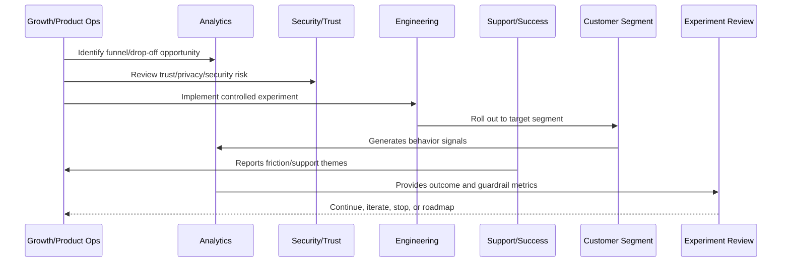

# Part 04 Summary

> *"Summarizes Growth Experiments and Activation and prepares for Book IX Part 05."*

---

# Purpose

Summarizes Growth Experiments and Activation and prepares for Book IX Part 05.

---

# Growth Problem

Billing, Packaging and Monetization Operations comes next because growth and activation must connect to sustainable business value and clear customer packaging.

---

# Growth Decision

## Decision

CLARA should proceed to Billing, Packaging and Monetization Operations after defining growth overview, activation model, hypothesis design, segmentation, guardrails, funnel instrumentation, A/B/cohort analysis, review workflow, risk management, roadmap loop, and anti-patterns.

## Status

Accepted.

---

# Growth Experiment Rule

Every CLARA growth experiment should connect:

```text
Customer Problem -> Hypothesis -> Segment -> Metric -> Guardrail -> Rollout -> Analysis -> Decision -> Roadmap/Knowledge Update
```

A growth experiment is not mature if it cannot answer:

```text
what customer behavior should change
why the change should improve customer value
who is included and excluded
what primary metric should move
what guardrail metrics must not get worse
how privacy and trust are protected
how the experiment can be stopped
how results will be interpreted
what decision will be made after review
```

---

# Recommended Growth Experiment Flow



---

# Production-Ready Checklist

- [ ] Customer problem is defined.
- [ ] Hypothesis is written.
- [ ] Target segment is defined.
- [ ] Primary metric is defined.
- [ ] Guardrail metrics are defined.
- [ ] Privacy/security review is completed where needed.
- [ ] Rollout and stop criteria exist.
- [ ] Instrumentation is validated.
- [ ] Support impact is considered.
- [ ] Review date is scheduled.
- [ ] Decision record will be created.

---

# Acceptance Criteria

- [ ] Experiment is measurable.
- [ ] Experiment is reversible.
- [ ] Experiment protects customer trust.
- [ ] Results can be interpreted.
- [ ] Learnings feed roadmap or documentation.
- [ ] AI coding assistants can apply this safely.

---

# Anti-patterns

Avoid:

- Vanity metric experiments.
- Growth changes with no hypothesis.
- Experiments without guardrails.
- Dark patterns.
- Misleading trials or pricing.
- Collecting unnecessary personal data.
- Running experiments on sensitive workflows without review.
- Changing onboarding for all users without measurement.
- Ignoring support burden.
- Declaring victory from weak sample/noisy data.

---

# Related Documents

- ../PART-01-Product-Operations-Foundation/README.md
- ../PART-02-Customer-Onboarding-and-Success/README.md
- ../PART-03-Support-Operations-and-Knowledge-Loop/README.md
- ../../BOOK-06-Security-Governance-and-Compliance/
- ../../BOOK-08-Implementation-Delivery-and-Production-Launch/

---

# Navigation

**Previous:** `47-Growth-Anti-Patterns.md`

**Next:** `../PART-05-Billing-Packaging-and-Monetization-Operations/README.md`

---

# Part 04 Completion

Part 04 establishes:

- Growth experiments and activation overview.
- Activation growth model.
- Experiment hypothesis and design.
- Segmentation and targeting.
- Experiment guardrails.
- Funnel instrumentation.
- A/B and cohort analysis.
- Growth experiment review.
- Growth risk management.
- Experiment to roadmap loop.
- Growth anti-patterns.

---

# Ready for Part 05

The next part should be:

```text
BOOK IX — PART 05: Billing Packaging and Monetization Operations
```

It should define:

- Billing and monetization overview.
- Packaging strategy.
- Plan and entitlement model.
- Pricing operations.
- Trial and conversion monetization.
- Billing lifecycle.
- Invoice/payment operations.
- Entitlement enforcement.
- Revenue and churn signals.
- Billing support workflow.
- Monetization anti-patterns.
- Part 05 summary.
