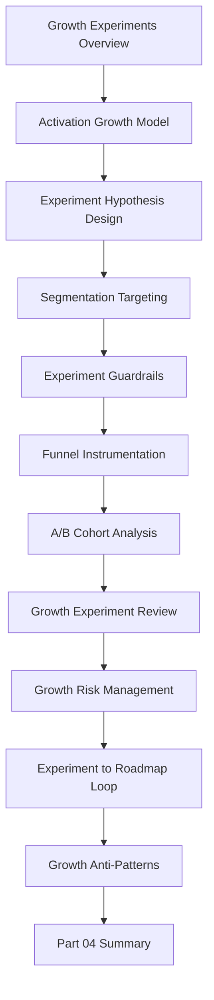

# PART-04 — Growth Experiments and Activation

> *"Healthy growth is not more users doing more clicks. Healthy growth is more customers reaching more value safely."*

---

# Purpose

Part 04 defines CLARA's growth experiments and activation standards.

It covers:

- Growth Experiments and Activation Overview.
- Activation Growth Model.
- Experiment Hypothesis and Design.
- Segmentation and Targeting.
- Experiment Guardrails.
- Funnel Instrumentation.
- A/B and Cohort Analysis.
- Growth Experiment Review.
- Growth Risk Management.
- Experiment to Roadmap Loop.
- Growth Anti-Patterns.
- Part 04 Summary.

---

# Chapter Map

| Chapter | Title |
|---:|---|
| 37 | Growth Experiments and Activation Overview |
| 38 | Activation Growth Model |
| 39 | Experiment Hypothesis and Design |
| 40 | Segmentation and Targeting |
| 41 | Experiment Guardrails |
| 42 | Funnel Instrumentation |
| 43 | A/B and Cohort Analysis |
| 44 | Growth Experiment Review |
| 45 | Growth Risk Management |
| 46 | Experiment to Roadmap Loop |
| 47 | Growth Anti-Patterns |
| 48 | Part 04 Summary |

---

# Growth Experiment Map



---

# Growth Non-Negotiables

CLARA growth experiments must enforce:

```text
clear hypothesis
customer-value metric
guardrail metrics
privacy-safe instrumentation
segment ownership
reversible rollout
stop criteria
security/trust review
support impact review
AI safety review where relevant
evidence-based review
roadmap follow-up
documentation of learning
```

---

# Relationship to Previous Part

Part 03 defines support operations and knowledge loop.

Part 04 uses onboarding evidence, support themes, and product metrics to run safe growth and activation experiments.

---

# Navigation

**Previous:** `../PART-03-Support-Operations-and-Knowledge-Loop/36-Part-03-Summary.md`

**Next:** `37-Growth-Experiments-and-Activation-Overview.md`
