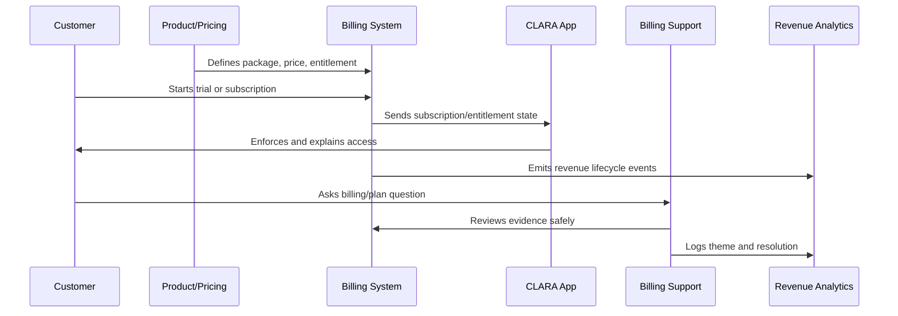

# Billing Packaging and Monetization Overview

> *"Introduces CLARA's billing, packaging, and monetization operations model for turning product value into clear, fair, measurable, and trust-preserving commercial operations."*

---

# Purpose

Introduces CLARA's billing, packaging, and monetization operations model for turning product value into clear, fair, measurable, and trust-preserving commercial operations.

---

# Monetization Problem

A product can create value but lose trust if pricing, packaging, entitlement, billing, or invoices are confusing.

---

# Monetization Decision

## Decision

CLARA monetization should connect customer value, plan packaging, entitlements, billing lifecycle, revenue signals, support operations, and customer trust.

## Status

Accepted.

---

# Monetization Operations Rule

Every CLARA monetization decision should connect:

```text
Customer Value -> Package -> Entitlement -> Price -> Billing Lifecycle -> Support Path -> Revenue Signal -> Trust Review
```

A monetization operation is not mature if it cannot answer:

```text
what value the customer is paying for
what plan/package includes it
what entitlement controls access
how pricing is communicated
how billing lifecycle changes are handled
how support resolves disputes
how revenue/churn impact is measured
what trust/security/privacy risk exists
```

---

# Recommended Monetization Flow



---

# Production-Ready Checklist

- [ ] Plan/package is understandable.
- [ ] Entitlements are explicit.
- [ ] Backend enforces entitlements.
- [ ] Frontend explains limits clearly.
- [ ] Pricing changes are reviewed.
- [ ] Billing lifecycle is documented.
- [ ] Invoice/payment support path exists.
- [ ] Revenue/churn signals are tracked.
- [ ] Support can resolve common billing questions.
- [ ] Trust and legal/compliance risks are reviewed.

---

# Acceptance Criteria

- [ ] Customer can understand what they pay for.
- [ ] System enforces access correctly.
- [ ] Billing events are auditable.
- [ ] Support can explain billing state.
- [ ] Revenue metrics are trustworthy.
- [ ] Monetization does not rely on dark patterns.
- [ ] AI coding assistants can apply this safely.

---

# Anti-patterns

Avoid:

- Hidden fees.
- Confusing plan names.
- Frontend-only entitlement checks.
- Unclear cancellation flow.
- Pricing changes without customer communication.
- Permanent one-off discounts with no owner.
- Entitlements not matching invoices.
- Support unable to explain billing state.
- Revenue dashboards disconnected from product usage.
- Trial conversion based on pressure instead of value.

---

# Related Documents

- ../PART-01-Product-Operations-Foundation/README.md
- ../PART-02-Customer-Onboarding-and-Success/README.md
- ../PART-04-Growth-Experiments-and-Activation/README.md
- ../../BOOK-06-Security-Governance-and-Compliance/
- ../../BOOK-08-Implementation-Delivery-and-Production-Launch/

---

# Navigation

**Previous:** `../PART-04-Growth-Experiments-and-Activation/48-Part-04-Summary.md`

**Next:** `50-Packaging-Strategy.md`

---

# Monetization Scope

CLARA monetization operations covers:

```text
plans and packages
entitlements
pricing and discounts
trial-to-paid conversion
subscriptions
upgrades/downgrades
cancellations
invoices
payments
failed payments
refunds/credits
revenue analytics
billing support
```

---

# Monetization Inputs

Use:

```text
customer value signals
activation metrics
usage data
support themes
churn reasons
conversion rates
sales/customer success feedback
billing disputes
competitive positioning
security/compliance constraints
```

---

# Guiding Question

```text
Can the customer clearly understand what they get, what they pay, and what happens when their plan changes?
```
