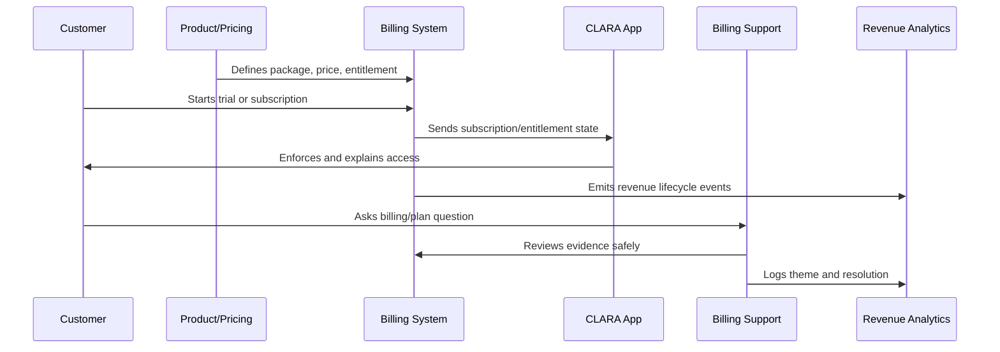

# Packaging Strategy

> *"Defines CLARA's product packaging strategy, plan structure, feature grouping, usage limits, customer segments, and packaging review cadence."*

---

# Purpose

Defines CLARA's product packaging strategy, plan structure, feature grouping, usage limits, customer segments, and packaging review cadence.

---

# Monetization Problem

Bad packaging causes confusion, support burden, under-monetization, and difficult entitlement enforcement.

---

# Monetization Decision

## Decision

CLARA packaging should be simple enough for customers to understand and flexible enough to support different customer needs without creating operational chaos.

## Status

Accepted.

---

# Monetization Operations Rule

Every CLARA monetization decision should connect:

```text
Customer Value -> Package -> Entitlement -> Price -> Billing Lifecycle -> Support Path -> Revenue Signal -> Trust Review
```

A monetization operation is not mature if it cannot answer:

```text
what value the customer is paying for
what plan/package includes it
what entitlement controls access
how pricing is communicated
how billing lifecycle changes are handled
how support resolves disputes
how revenue/churn impact is measured
what trust/security/privacy risk exists
```

---

# Recommended Monetization Flow



---

# Production-Ready Checklist

- [ ] Plan/package is understandable.
- [ ] Entitlements are explicit.
- [ ] Backend enforces entitlements.
- [ ] Frontend explains limits clearly.
- [ ] Pricing changes are reviewed.
- [ ] Billing lifecycle is documented.
- [ ] Invoice/payment support path exists.
- [ ] Revenue/churn signals are tracked.
- [ ] Support can resolve common billing questions.
- [ ] Trust and legal/compliance risks are reviewed.

---

# Acceptance Criteria

- [ ] Customer can understand what they pay for.
- [ ] System enforces access correctly.
- [ ] Billing events are auditable.
- [ ] Support can explain billing state.
- [ ] Revenue metrics are trustworthy.
- [ ] Monetization does not rely on dark patterns.
- [ ] AI coding assistants can apply this safely.

---

# Anti-patterns

Avoid:

- Hidden fees.
- Confusing plan names.
- Frontend-only entitlement checks.
- Unclear cancellation flow.
- Pricing changes without customer communication.
- Permanent one-off discounts with no owner.
- Entitlements not matching invoices.
- Support unable to explain billing state.
- Revenue dashboards disconnected from product usage.
- Trial conversion based on pressure instead of value.

---

# Related Documents

- ../PART-01-Product-Operations-Foundation/README.md
- ../PART-02-Customer-Onboarding-and-Success/README.md
- ../PART-04-Growth-Experiments-and-Activation/README.md
- ../../BOOK-06-Security-Governance-and-Compliance/
- ../../BOOK-08-Implementation-Delivery-and-Production-Launch/

---

# Navigation

**Previous:** `49-Billing-Packaging-and-Monetization-Overview.md`

**Next:** `51-Plan-and-Entitlement-Model.md`

---

# Packaging Dimensions

Package features by:

```text
customer segment
workspace/team size
support volume
channel/integration needs
AI usage needs
automation needs
security/admin needs
analytics/reporting needs
support/success level
```

---

# Packaging Model Example

```text
Starter
  basic inbox
  limited team seats
  limited integrations
  basic analytics

Growth
  more seats
  more integrations
  AI-assisted workflows
  automation rules
  advanced reporting

Business
  higher limits
  admin/security controls
  priority support
  audit/export features
  advanced success support
```

---

# Packaging Review Questions

```text
Is the package easy to explain?
Does the package map to customer value?
Can entitlements enforce it?
Can support explain it?
Can billing represent it?
Does it create upgrade path without trapping users?
```

---

# Packaging Rule

Packaging should be understandable before it is flexible.
