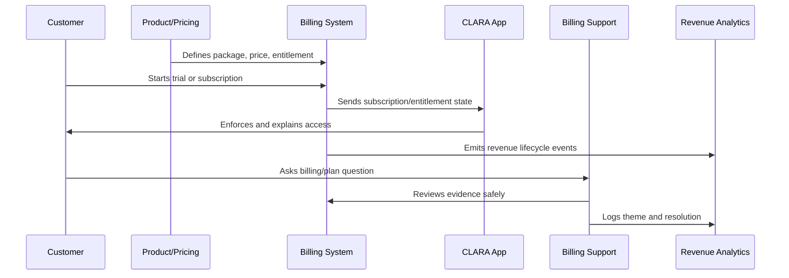

# Pricing Operations

> *"Defines pricing operations for price changes, grandfathering, discounts, coupons, localization, tax notes, approval workflow, and pricing evidence."*

---

# Purpose

Defines pricing operations for price changes, grandfathering, discounts, coupons, localization, tax notes, approval workflow, and pricing evidence.

---

# Monetization Problem

Uncontrolled pricing changes can break trust, revenue reporting, billing correctness, and customer expectations.

---

# Monetization Decision

## Decision

CLARA pricing changes should be controlled, documented, reviewed for customer impact, and implemented with clear communication.

## Status

Accepted.

---

# Monetization Operations Rule

Every CLARA monetization decision should connect:

```text
Customer Value -> Package -> Entitlement -> Price -> Billing Lifecycle -> Support Path -> Revenue Signal -> Trust Review
```

A monetization operation is not mature if it cannot answer:

```text
what value the customer is paying for
what plan/package includes it
what entitlement controls access
how pricing is communicated
how billing lifecycle changes are handled
how support resolves disputes
how revenue/churn impact is measured
what trust/security/privacy risk exists
```

---

# Recommended Monetization Flow



---

# Production-Ready Checklist

- [ ] Plan/package is understandable.
- [ ] Entitlements are explicit.
- [ ] Backend enforces entitlements.
- [ ] Frontend explains limits clearly.
- [ ] Pricing changes are reviewed.
- [ ] Billing lifecycle is documented.
- [ ] Invoice/payment support path exists.
- [ ] Revenue/churn signals are tracked.
- [ ] Support can resolve common billing questions.
- [ ] Trust and legal/compliance risks are reviewed.

---

# Acceptance Criteria

- [ ] Customer can understand what they pay for.
- [ ] System enforces access correctly.
- [ ] Billing events are auditable.
- [ ] Support can explain billing state.
- [ ] Revenue metrics are trustworthy.
- [ ] Monetization does not rely on dark patterns.
- [ ] AI coding assistants can apply this safely.

---

# Anti-patterns

Avoid:

- Hidden fees.
- Confusing plan names.
- Frontend-only entitlement checks.
- Unclear cancellation flow.
- Pricing changes without customer communication.
- Permanent one-off discounts with no owner.
- Entitlements not matching invoices.
- Support unable to explain billing state.
- Revenue dashboards disconnected from product usage.
- Trial conversion based on pressure instead of value.

---

# Related Documents

- ../PART-01-Product-Operations-Foundation/README.md
- ../PART-02-Customer-Onboarding-and-Success/README.md
- ../PART-04-Growth-Experiments-and-Activation/README.md
- ../../BOOK-06-Security-Governance-and-Compliance/
- ../../BOOK-08-Implementation-Delivery-and-Production-Launch/

---

# Navigation

**Previous:** `51-Plan-and-Entitlement-Model.md`

**Next:** `53-Trial-and-Conversion-Monetization.md`

---

# Pricing Change Workflow

Pricing changes should include:

```text
proposal
customer impact assessment
revenue impact assessment
support impact review
security/compliance/legal review where relevant
billing system implementation plan
customer communication plan
effective date
rollback/exception plan
approval evidence
```

---

# Discount Governance

Track:

```text
discount type
customer/segment
amount
duration
approval owner
reason
expiration date
renewal behavior
revenue impact
```

---

# Grandfathering Policy

Define:

```text
who qualifies
what price/package stays
for how long
what happens on upgrade/downgrade
communication plan
support handling
```

---

# Pricing Rule

Pricing changes are product and trust changes, not only finance changes.
