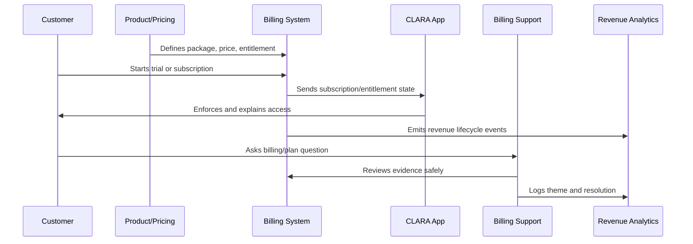
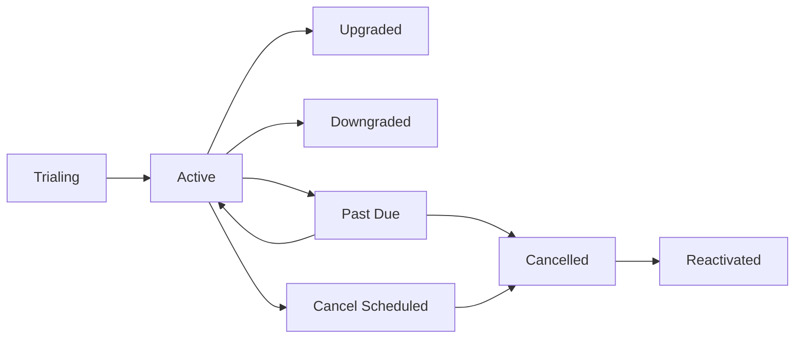

# Billing Lifecycle Operations

> *"Defines billing lifecycle from subscription creation, plan change, renewal, upgrade, downgrade, cancellation, pause, dunning, and reactivation."*

---

# Purpose

Defines billing lifecycle from subscription creation, plan change, renewal, upgrade, downgrade, cancellation, pause, dunning, and reactivation.

---

# Monetization Problem

Billing lifecycle bugs create revenue leakage, customer frustration, and support escalation.

---

# Monetization Decision

## Decision

CLARA billing lifecycle should be predictable, customer-visible, supportable, auditable, and integrated with entitlement changes.

## Status

Accepted.

---

# Monetization Operations Rule

Every CLARA monetization decision should connect:

```text
Customer Value -> Package -> Entitlement -> Price -> Billing Lifecycle -> Support Path -> Revenue Signal -> Trust Review
```

A monetization operation is not mature if it cannot answer:

```text
what value the customer is paying for
what plan/package includes it
what entitlement controls access
how pricing is communicated
how billing lifecycle changes are handled
how support resolves disputes
how revenue/churn impact is measured
what trust/security/privacy risk exists
```

---

# Recommended Monetization Flow



---

# Production-Ready Checklist

- [ ] Plan/package is understandable.
- [ ] Entitlements are explicit.
- [ ] Backend enforces entitlements.
- [ ] Frontend explains limits clearly.
- [ ] Pricing changes are reviewed.
- [ ] Billing lifecycle is documented.
- [ ] Invoice/payment support path exists.
- [ ] Revenue/churn signals are tracked.
- [ ] Support can resolve common billing questions.
- [ ] Trust and legal/compliance risks are reviewed.

---

# Acceptance Criteria

- [ ] Customer can understand what they pay for.
- [ ] System enforces access correctly.
- [ ] Billing events are auditable.
- [ ] Support can explain billing state.
- [ ] Revenue metrics are trustworthy.
- [ ] Monetization does not rely on dark patterns.
- [ ] AI coding assistants can apply this safely.

---

# Anti-patterns

Avoid:

- Hidden fees.
- Confusing plan names.
- Frontend-only entitlement checks.
- Unclear cancellation flow.
- Pricing changes without customer communication.
- Permanent one-off discounts with no owner.
- Entitlements not matching invoices.
- Support unable to explain billing state.
- Revenue dashboards disconnected from product usage.
- Trial conversion based on pressure instead of value.

---

# Related Documents

- ../PART-01-Product-Operations-Foundation/README.md
- ../PART-02-Customer-Onboarding-and-Success/README.md
- ../PART-04-Growth-Experiments-and-Activation/README.md
- ../../BOOK-06-Security-Governance-and-Compliance/
- ../../BOOK-08-Implementation-Delivery-and-Production-Launch/

---

# Navigation

**Previous:** `53-Trial-and-Conversion-Monetization.md`

**Next:** `55-Invoice-and-Payment-Operations.md`

---

# Billing Lifecycle States

Use states such as:

```text
trialing
active
past_due
paused
cancel_scheduled
cancelled
expired
reactivated
downgraded
upgraded
```

---

# Lifecycle Events

Track:

```text
subscription_created
trial_started
trial_ending_soon
subscription_activated
plan_upgraded
plan_downgraded
payment_failed
subscription_past_due
subscription_cancelled
subscription_reactivated
```

---

# Lifecycle Map



---

# Billing Lifecycle Rule

Billing lifecycle changes must sync reliably to entitlement state.
