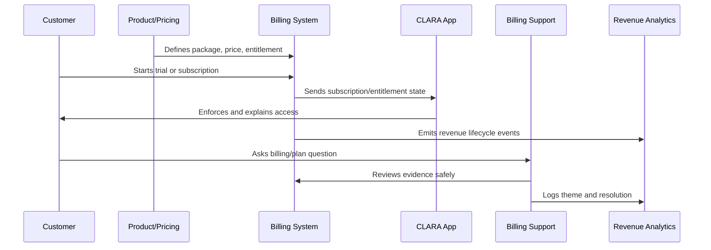

# Invoice and Payment Operations

> *"Defines invoice generation, payment collection, failed payment handling, payment method update, receipt delivery, tax/metadata handling, and reconciliation."*

---

# Purpose

Defines invoice generation, payment collection, failed payment handling, payment method update, receipt delivery, tax/metadata handling, and reconciliation.

---

# Monetization Problem

Payment and invoice issues are high-trust moments because customers associate them directly with business integrity.

---

# Monetization Decision

## Decision

CLARA invoice and payment operations should prioritize accuracy, transparency, security, and customer support readiness.

## Status

Accepted.

---

# Monetization Operations Rule

Every CLARA monetization decision should connect:

```text
Customer Value -> Package -> Entitlement -> Price -> Billing Lifecycle -> Support Path -> Revenue Signal -> Trust Review
```

A monetization operation is not mature if it cannot answer:

```text
what value the customer is paying for
what plan/package includes it
what entitlement controls access
how pricing is communicated
how billing lifecycle changes are handled
how support resolves disputes
how revenue/churn impact is measured
what trust/security/privacy risk exists
```

---

# Recommended Monetization Flow



---

# Production-Ready Checklist

- [ ] Plan/package is understandable.
- [ ] Entitlements are explicit.
- [ ] Backend enforces entitlements.
- [ ] Frontend explains limits clearly.
- [ ] Pricing changes are reviewed.
- [ ] Billing lifecycle is documented.
- [ ] Invoice/payment support path exists.
- [ ] Revenue/churn signals are tracked.
- [ ] Support can resolve common billing questions.
- [ ] Trust and legal/compliance risks are reviewed.

---

# Acceptance Criteria

- [ ] Customer can understand what they pay for.
- [ ] System enforces access correctly.
- [ ] Billing events are auditable.
- [ ] Support can explain billing state.
- [ ] Revenue metrics are trustworthy.
- [ ] Monetization does not rely on dark patterns.
- [ ] AI coding assistants can apply this safely.

---

# Anti-patterns

Avoid:

- Hidden fees.
- Confusing plan names.
- Frontend-only entitlement checks.
- Unclear cancellation flow.
- Pricing changes without customer communication.
- Permanent one-off discounts with no owner.
- Entitlements not matching invoices.
- Support unable to explain billing state.
- Revenue dashboards disconnected from product usage.
- Trial conversion based on pressure instead of value.

---

# Related Documents

- ../PART-01-Product-Operations-Foundation/README.md
- ../PART-02-Customer-Onboarding-and-Success/README.md
- ../PART-04-Growth-Experiments-and-Activation/README.md
- ../../BOOK-06-Security-Governance-and-Compliance/
- ../../BOOK-08-Implementation-Delivery-and-Production-Launch/

---

# Navigation

**Previous:** `54-Billing-Lifecycle-Operations.md`

**Next:** `56-Entitlement-Enforcement-and-Access-Control.md`

---

# Invoice Requirements

Invoices should clearly show:

```text
customer identity
billing period
plan/package
seats/usage where applicable
discounts/credits
taxes/fees where applicable
total amount
payment status
invoice number
support contact
```

---

# Payment Failure Handling

Failed payment handling should include:

```text
customer notification
payment method update link
retry schedule
grace period
entitlement impact
support escalation
final suspension/cancellation behavior
```

---

# Payment Security

Rules:

```text
do not store raw card data unless using compliant provider model
do not expose payment details in logs
do not ask customer for card data in support chat/email
use provider-hosted secure payment flows where possible
```

---

# Invoice Rule

A customer should not need support to understand a normal invoice.
