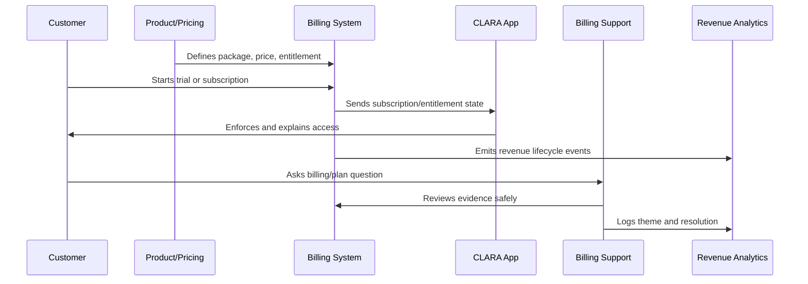

# Entitlement Enforcement and Access Control

> *"Defines entitlement enforcement across backend, frontend, API, AI usage, integrations, seats, workspace limits, rate limits, and audit evidence."*

---

# Purpose

Defines entitlement enforcement across backend, frontend, API, AI usage, integrations, seats, workspace limits, rate limits, and audit evidence.

---

# Monetization Problem

Frontend-only entitlement checks are easy to bypass and create insecure billing enforcement.

---

# Monetization Decision

## Decision

CLARA entitlement enforcement should be server-side, consistent, observable, and friendly to users through clear UI explanations.

## Status

Accepted.

---

# Monetization Operations Rule

Every CLARA monetization decision should connect:

```text
Customer Value -> Package -> Entitlement -> Price -> Billing Lifecycle -> Support Path -> Revenue Signal -> Trust Review
```

A monetization operation is not mature if it cannot answer:

```text
what value the customer is paying for
what plan/package includes it
what entitlement controls access
how pricing is communicated
how billing lifecycle changes are handled
how support resolves disputes
how revenue/churn impact is measured
what trust/security/privacy risk exists
```

---

# Recommended Monetization Flow



---

# Production-Ready Checklist

- [ ] Plan/package is understandable.
- [ ] Entitlements are explicit.
- [ ] Backend enforces entitlements.
- [ ] Frontend explains limits clearly.
- [ ] Pricing changes are reviewed.
- [ ] Billing lifecycle is documented.
- [ ] Invoice/payment support path exists.
- [ ] Revenue/churn signals are tracked.
- [ ] Support can resolve common billing questions.
- [ ] Trust and legal/compliance risks are reviewed.

---

# Acceptance Criteria

- [ ] Customer can understand what they pay for.
- [ ] System enforces access correctly.
- [ ] Billing events are auditable.
- [ ] Support can explain billing state.
- [ ] Revenue metrics are trustworthy.
- [ ] Monetization does not rely on dark patterns.
- [ ] AI coding assistants can apply this safely.

---

# Anti-patterns

Avoid:

- Hidden fees.
- Confusing plan names.
- Frontend-only entitlement checks.
- Unclear cancellation flow.
- Pricing changes without customer communication.
- Permanent one-off discounts with no owner.
- Entitlements not matching invoices.
- Support unable to explain billing state.
- Revenue dashboards disconnected from product usage.
- Trial conversion based on pressure instead of value.

---

# Related Documents

- ../PART-01-Product-Operations-Foundation/README.md
- ../PART-02-Customer-Onboarding-and-Success/README.md
- ../PART-04-Growth-Experiments-and-Activation/README.md
- ../../BOOK-06-Security-Governance-and-Compliance/
- ../../BOOK-08-Implementation-Delivery-and-Production-Launch/

---

# Navigation

**Previous:** `55-Invoice-and-Payment-Operations.md`

**Next:** `57-Revenue-Churn-and-Monetization-Signals.md`

---

# Enforcement Layers

Enforce entitlements in:

```text
backend service
API middleware/policy
domain service
worker/job execution
AI Gateway usage controls
integration creation/usage
storage/export controls
rate limits
```

Frontend should:

```text
explain access
show upgrade prompts
hide unavailable actions when appropriate
show clear limit reached states
```

---

# Enforcement Checkpoints

Check entitlement before:

```text
creating workspace resource above limit
inviting extra seat
connecting integration
generating AI response
running automation
exporting data
accessing premium analytics
using advanced security/admin feature
```

---

# Audit Events

Emit audit events for:

```text
plan changed
entitlement override applied
limit exceeded
feature access denied
billing admin updated
subscription cancelled
```

---

# Enforcement Rule

Never trust the client to enforce paid access or plan limits.
