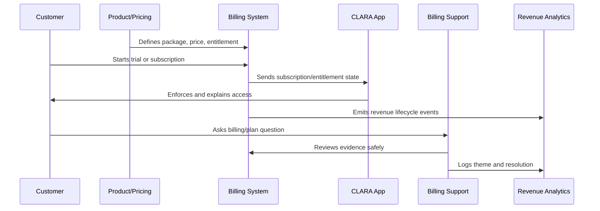
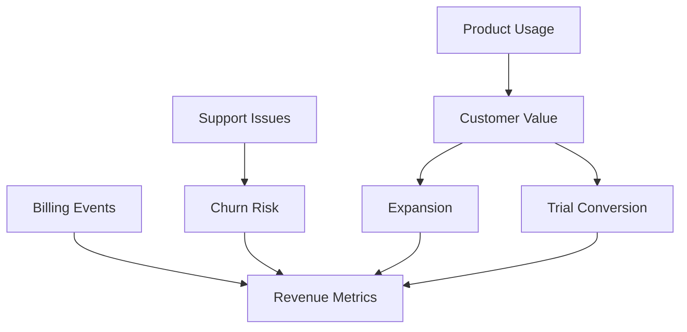

# Revenue Churn and Monetization Signals

> *"Defines monetization analytics including MRR, ARR, ARPA, conversion, expansion, downgrade, churn, failed payment, usage-to-plan fit, and revenue risk signals."*

---

# Purpose

Defines monetization analytics including MRR, ARR, ARPA, conversion, expansion, downgrade, churn, failed payment, usage-to-plan fit, and revenue risk signals.

---

# Monetization Problem

Revenue dashboards become misleading when billing events, customer health, and product usage are disconnected.

---

# Monetization Decision

## Decision

CLARA monetization signals should help product, success, billing, and leadership understand revenue health and customer value alignment.

## Status

Accepted.

---

# Monetization Operations Rule

Every CLARA monetization decision should connect:

```text
Customer Value -> Package -> Entitlement -> Price -> Billing Lifecycle -> Support Path -> Revenue Signal -> Trust Review
```

A monetization operation is not mature if it cannot answer:

```text
what value the customer is paying for
what plan/package includes it
what entitlement controls access
how pricing is communicated
how billing lifecycle changes are handled
how support resolves disputes
how revenue/churn impact is measured
what trust/security/privacy risk exists
```

---

# Recommended Monetization Flow



---

# Production-Ready Checklist

- [ ] Plan/package is understandable.
- [ ] Entitlements are explicit.
- [ ] Backend enforces entitlements.
- [ ] Frontend explains limits clearly.
- [ ] Pricing changes are reviewed.
- [ ] Billing lifecycle is documented.
- [ ] Invoice/payment support path exists.
- [ ] Revenue/churn signals are tracked.
- [ ] Support can resolve common billing questions.
- [ ] Trust and legal/compliance risks are reviewed.

---

# Acceptance Criteria

- [ ] Customer can understand what they pay for.
- [ ] System enforces access correctly.
- [ ] Billing events are auditable.
- [ ] Support can explain billing state.
- [ ] Revenue metrics are trustworthy.
- [ ] Monetization does not rely on dark patterns.
- [ ] AI coding assistants can apply this safely.

---

# Anti-patterns

Avoid:

- Hidden fees.
- Confusing plan names.
- Frontend-only entitlement checks.
- Unclear cancellation flow.
- Pricing changes without customer communication.
- Permanent one-off discounts with no owner.
- Entitlements not matching invoices.
- Support unable to explain billing state.
- Revenue dashboards disconnected from product usage.
- Trial conversion based on pressure instead of value.

---

# Related Documents

- ../PART-01-Product-Operations-Foundation/README.md
- ../PART-02-Customer-Onboarding-and-Success/README.md
- ../PART-04-Growth-Experiments-and-Activation/README.md
- ../../BOOK-06-Security-Governance-and-Compliance/
- ../../BOOK-08-Implementation-Delivery-and-Production-Launch/

---

# Navigation

**Previous:** `56-Entitlement-Enforcement-and-Access-Control.md`

**Next:** `58-Billing-Support-Workflow.md`

---

# Revenue Metrics

Track:

```text
MRR
ARR
ARPA/ARPU
trial conversion rate
activation-to-paid conversion
upgrade rate
downgrade rate
expansion revenue
contraction revenue
churn rate
failed payment rate
refund/credit volume
```

---

# Monetization Health Signals

Connect revenue with:

```text
activation status
customer health score
support issue severity
integration health
AI usage quality
feature adoption
usage-to-plan fit
billing dispute frequency
```

---

# Revenue Signal Map



---

# Revenue Rule

Revenue metrics should be interpreted with product usage and customer health, not in isolation.
