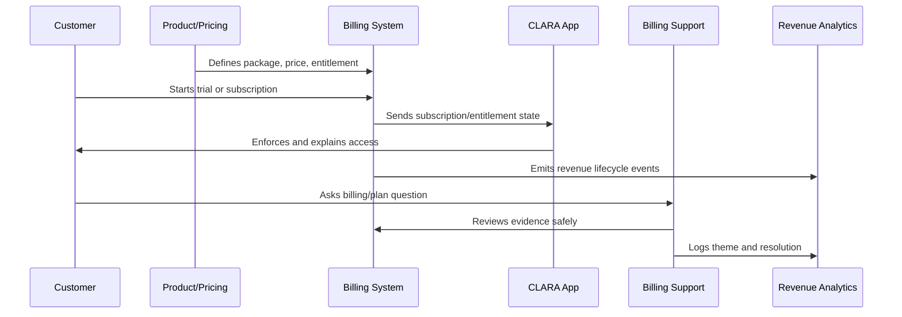

# Billing Support Workflow

> *"Defines support workflow for billing questions, invoice disputes, payment failures, plan changes, cancellation requests, refund handling, and entitlement confusion."*

---

# Purpose

Defines support workflow for billing questions, invoice disputes, payment failures, plan changes, cancellation requests, refund handling, and entitlement confusion.

---

# Monetization Problem

Billing support failures quickly become trust failures.

---

# Monetization Decision

## Decision

CLARA billing support should be accurate, empathetic, privacy-safe, escalation-ready, and connected to billing evidence.

## Status

Accepted.

---

# Monetization Operations Rule

Every CLARA monetization decision should connect:

```text
Customer Value -> Package -> Entitlement -> Price -> Billing Lifecycle -> Support Path -> Revenue Signal -> Trust Review
```

A monetization operation is not mature if it cannot answer:

```text
what value the customer is paying for
what plan/package includes it
what entitlement controls access
how pricing is communicated
how billing lifecycle changes are handled
how support resolves disputes
how revenue/churn impact is measured
what trust/security/privacy risk exists
```

---

# Recommended Monetization Flow



---

# Production-Ready Checklist

- [ ] Plan/package is understandable.
- [ ] Entitlements are explicit.
- [ ] Backend enforces entitlements.
- [ ] Frontend explains limits clearly.
- [ ] Pricing changes are reviewed.
- [ ] Billing lifecycle is documented.
- [ ] Invoice/payment support path exists.
- [ ] Revenue/churn signals are tracked.
- [ ] Support can resolve common billing questions.
- [ ] Trust and legal/compliance risks are reviewed.

---

# Acceptance Criteria

- [ ] Customer can understand what they pay for.
- [ ] System enforces access correctly.
- [ ] Billing events are auditable.
- [ ] Support can explain billing state.
- [ ] Revenue metrics are trustworthy.
- [ ] Monetization does not rely on dark patterns.
- [ ] AI coding assistants can apply this safely.

---

# Anti-patterns

Avoid:

- Hidden fees.
- Confusing plan names.
- Frontend-only entitlement checks.
- Unclear cancellation flow.
- Pricing changes without customer communication.
- Permanent one-off discounts with no owner.
- Entitlements not matching invoices.
- Support unable to explain billing state.
- Revenue dashboards disconnected from product usage.
- Trial conversion based on pressure instead of value.

---

# Related Documents

- ../PART-01-Product-Operations-Foundation/README.md
- ../PART-02-Customer-Onboarding-and-Success/README.md
- ../PART-04-Growth-Experiments-and-Activation/README.md
- ../../BOOK-06-Security-Governance-and-Compliance/
- ../../BOOK-08-Implementation-Delivery-and-Production-Launch/

---

# Navigation

**Previous:** `57-Revenue-Churn-and-Monetization-Signals.md`

**Next:** `59-Monetization-Anti-Patterns.md`

---

# Billing Support Categories

Support should handle:

```text
plan explanation
invoice question
payment failure
refund/credit request
upgrade/downgrade request
cancellation question
trial expiration
discount/coupon question
entitlement mismatch
billing admin access
```

---

# Billing Support Evidence

Support should be able to safely view:

```text
current plan
billing status
invoice status
subscription lifecycle state
entitlement state
payment failure reason category
recent billing events
support-safe customer notes
```

Avoid exposing:

```text
full payment card details
raw provider tokens
unnecessary personal data
unredacted sensitive metadata
```

---

# Escalation Targets

Escalate to:

```text
billing owner
product owner
engineering owner
security/privacy owner
customer success owner
finance/revenue operations owner
```

---

# Billing Support Rule

Billing support should be factual, evidence-backed, and careful with promises or exceptions.
