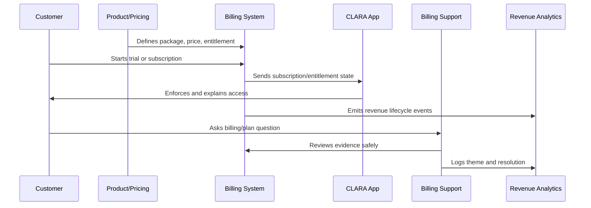

# Monetization Anti-Patterns

> *"Defines monetization anti-patterns such as confusing plans, hidden fees, dark-pattern cancellation, frontend-only entitlements, discount chaos, and unclear invoices."*

---

# Purpose

Defines monetization anti-patterns such as confusing plans, hidden fees, dark-pattern cancellation, frontend-only entitlements, discount chaos, and unclear invoices.

---

# Monetization Problem

Monetization anti-patterns can make a useful product feel exploitative.

---

# Monetization Decision

## Decision

CLARA should actively avoid monetization patterns that trade short-term revenue for long-term distrust.

## Status

Accepted.

---

# Monetization Operations Rule

Every CLARA monetization decision should connect:

```text
Customer Value -> Package -> Entitlement -> Price -> Billing Lifecycle -> Support Path -> Revenue Signal -> Trust Review
```

A monetization operation is not mature if it cannot answer:

```text
what value the customer is paying for
what plan/package includes it
what entitlement controls access
how pricing is communicated
how billing lifecycle changes are handled
how support resolves disputes
how revenue/churn impact is measured
what trust/security/privacy risk exists
```

---

# Recommended Monetization Flow



---

# Production-Ready Checklist

- [ ] Plan/package is understandable.
- [ ] Entitlements are explicit.
- [ ] Backend enforces entitlements.
- [ ] Frontend explains limits clearly.
- [ ] Pricing changes are reviewed.
- [ ] Billing lifecycle is documented.
- [ ] Invoice/payment support path exists.
- [ ] Revenue/churn signals are tracked.
- [ ] Support can resolve common billing questions.
- [ ] Trust and legal/compliance risks are reviewed.

---

# Acceptance Criteria

- [ ] Customer can understand what they pay for.
- [ ] System enforces access correctly.
- [ ] Billing events are auditable.
- [ ] Support can explain billing state.
- [ ] Revenue metrics are trustworthy.
- [ ] Monetization does not rely on dark patterns.
- [ ] AI coding assistants can apply this safely.

---

# Anti-patterns

Avoid:

- Hidden fees.
- Confusing plan names.
- Frontend-only entitlement checks.
- Unclear cancellation flow.
- Pricing changes without customer communication.
- Permanent one-off discounts with no owner.
- Entitlements not matching invoices.
- Support unable to explain billing state.
- Revenue dashboards disconnected from product usage.
- Trial conversion based on pressure instead of value.

---

# Related Documents

- ../PART-01-Product-Operations-Foundation/README.md
- ../PART-02-Customer-Onboarding-and-Success/README.md
- ../PART-04-Growth-Experiments-and-Activation/README.md
- ../../BOOK-06-Security-Governance-and-Compliance/
- ../../BOOK-08-Implementation-Delivery-and-Production-Launch/

---

# Navigation

**Previous:** `58-Billing-Support-Workflow.md`

**Next:** `60-Part-05-Summary.md`

---

# Monetization Anti-Patterns

Avoid:

```text
hidden fees
confusing packaging
dark-pattern cancellation
trial limitations hidden until too late
frontend-only entitlements
manual entitlement overrides with no audit
permanent discounts with no owner
unclear invoices
billing state not syncing to app access
support cannot explain customer plan
pricing experiments without trust review
```

---

# Warning Signs

Watch for:

```text
many billing support tickets
customers surprised by invoice amount
high failed payment confusion
high downgrade after upgrade
frequent entitlement mismatch
support manually fixing access often
revenue reports disagree with product usage
```

---

# Recovery Actions

```text
simplify packaging
clarify pricing page
improve invoice explanation
fix entitlement sync
add billing audit events
create support macros
review discount policy
improve cancellation UX
reconcile revenue/product data
```

---

# Anti-Pattern Rule

Monetization debt becomes trust debt.
