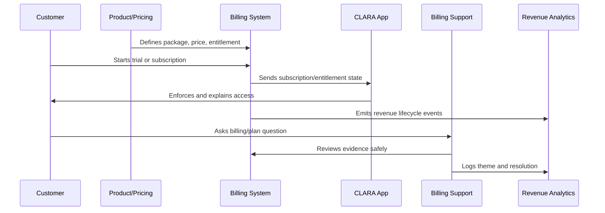

# Part 05 Summary

> *"Summarizes Billing, Packaging and Monetization Operations and prepares for Book IX Part 06."*

---

# Purpose

Summarizes Billing, Packaging and Monetization Operations and prepares for Book IX Part 06.

---

# Monetization Problem

Analytics and Product Insights comes next because monetization, activation, support, and product operations require trustworthy data to drive decisions.

---

# Monetization Decision

## Decision

CLARA should proceed to Analytics and Product Insights after defining monetization overview, packaging, entitlements, pricing, trial conversion, billing lifecycle, invoice/payment operations, entitlement enforcement, revenue/churn signals, billing support, and anti-patterns.

## Status

Accepted.

---

# Monetization Operations Rule

Every CLARA monetization decision should connect:

```text
Customer Value -> Package -> Entitlement -> Price -> Billing Lifecycle -> Support Path -> Revenue Signal -> Trust Review
```

A monetization operation is not mature if it cannot answer:

```text
what value the customer is paying for
what plan/package includes it
what entitlement controls access
how pricing is communicated
how billing lifecycle changes are handled
how support resolves disputes
how revenue/churn impact is measured
what trust/security/privacy risk exists
```

---

# Recommended Monetization Flow



---

# Production-Ready Checklist

- [ ] Plan/package is understandable.
- [ ] Entitlements are explicit.
- [ ] Backend enforces entitlements.
- [ ] Frontend explains limits clearly.
- [ ] Pricing changes are reviewed.
- [ ] Billing lifecycle is documented.
- [ ] Invoice/payment support path exists.
- [ ] Revenue/churn signals are tracked.
- [ ] Support can resolve common billing questions.
- [ ] Trust and legal/compliance risks are reviewed.

---

# Acceptance Criteria

- [ ] Customer can understand what they pay for.
- [ ] System enforces access correctly.
- [ ] Billing events are auditable.
- [ ] Support can explain billing state.
- [ ] Revenue metrics are trustworthy.
- [ ] Monetization does not rely on dark patterns.
- [ ] AI coding assistants can apply this safely.

---

# Anti-patterns

Avoid:

- Hidden fees.
- Confusing plan names.
- Frontend-only entitlement checks.
- Unclear cancellation flow.
- Pricing changes without customer communication.
- Permanent one-off discounts with no owner.
- Entitlements not matching invoices.
- Support unable to explain billing state.
- Revenue dashboards disconnected from product usage.
- Trial conversion based on pressure instead of value.

---

# Related Documents

- ../PART-01-Product-Operations-Foundation/README.md
- ../PART-02-Customer-Onboarding-and-Success/README.md
- ../PART-04-Growth-Experiments-and-Activation/README.md
- ../../BOOK-06-Security-Governance-and-Compliance/
- ../../BOOK-08-Implementation-Delivery-and-Production-Launch/

---

# Navigation

**Previous:** `59-Monetization-Anti-Patterns.md`

**Next:** `../PART-06-Analytics-and-Product-Insights/README.md`

---

# Part 05 Completion

Part 05 establishes:

- Billing, packaging and monetization overview.
- Packaging strategy.
- Plan and entitlement model.
- Pricing operations.
- Trial and conversion monetization.
- Billing lifecycle operations.
- Invoice and payment operations.
- Entitlement enforcement and access control.
- Revenue, churn and monetization signals.
- Billing support workflow.
- Monetization anti-patterns.

---

# Ready for Part 06

The next part should be:

```text
BOOK IX — PART 06: Analytics and Product Insights
```

It should define:

- Analytics and product insights overview.
- Product event taxonomy.
- Metric definitions and governance.
- Dashboard strategy.
- Funnel and retention analysis.
- Customer health analytics.
- Support and product quality analytics.
- AI and automation analytics.
- Revenue and monetization analytics.
- Insight-to-decision workflow.
- Analytics anti-patterns.
- Part 06 summary.
