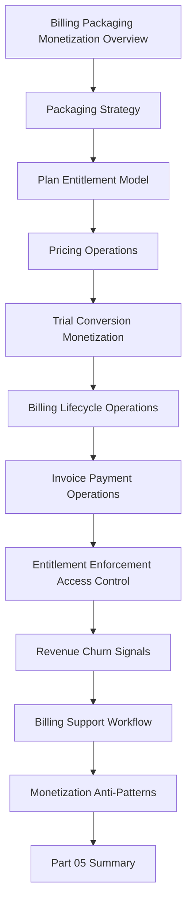

# PART-05 — Billing, Packaging and Monetization Operations

> *"Monetization is not only charging money. Monetization is how product value, customer trust, and business sustainability meet."*

---

# Purpose

Part 05 defines CLARA's billing, packaging, and monetization operations standards.

It covers:

- Billing, Packaging and Monetization Overview.
- Packaging Strategy.
- Plan and Entitlement Model.
- Pricing Operations.
- Trial and Conversion Monetization.
- Billing Lifecycle Operations.
- Invoice and Payment Operations.
- Entitlement Enforcement and Access Control.
- Revenue, Churn and Monetization Signals.
- Billing Support Workflow.
- Monetization Anti-Patterns.
- Part 05 Summary.

---

# Chapter Map

| Chapter | Title |
|---:|---|
| 49 | Billing Packaging and Monetization Overview |
| 50 | Packaging Strategy |
| 51 | Plan and Entitlement Model |
| 52 | Pricing Operations |
| 53 | Trial and Conversion Monetization |
| 54 | Billing Lifecycle Operations |
| 55 | Invoice and Payment Operations |
| 56 | Entitlement Enforcement and Access Control |
| 57 | Revenue Churn and Monetization Signals |
| 58 | Billing Support Workflow |
| 59 | Monetization Anti-Patterns |
| 60 | Part 05 Summary |

---

# Monetization Operations Map



---

# Monetization Non-Negotiables

CLARA monetization operations must enforce:

```text
clear plan packaging
explicit entitlements
server-side entitlement enforcement
customer-visible limits
billing lifecycle ownership
pricing change review
invoice/payment accuracy
privacy-safe billing support
audit trail for billing changes
revenue and churn analytics
ethical trial conversion
clear cancellation path
no hidden fees
no dark patterns
```

---

# Relationship to Previous Part

Part 04 defines growth experiments and activation.

Part 05 connects growth and activation to sustainable revenue operations, packaging clarity, billing trust, and monetization feedback.

---

# Navigation

**Previous:** `../PART-04-Growth-Experiments-and-Activation/48-Part-04-Summary.md`

**Next:** `49-Billing-Packaging-and-Monetization-Overview.md`
