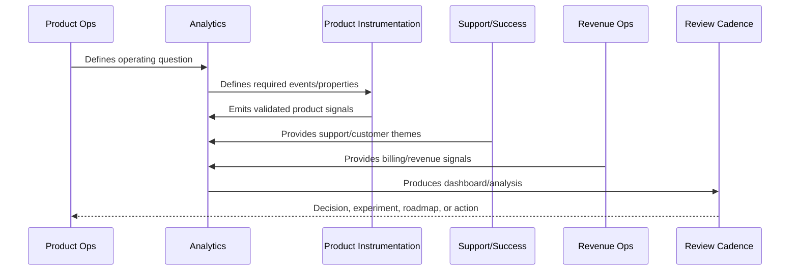
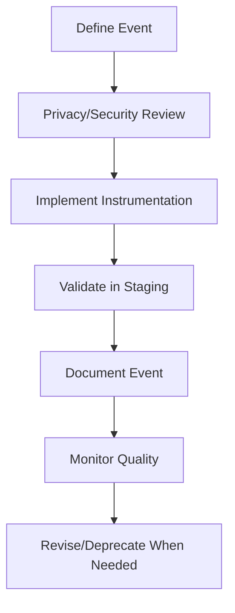

# Product Event Taxonomy

> *"Defines product event taxonomy, event naming, event properties, identity strategy, workspace scoping, lifecycle stages, and ownership."*

---

# Purpose

Defines product event taxonomy, event naming, event properties, identity strategy, workspace scoping, lifecycle stages, and ownership.

---

# Analytics Problem

Inconsistent event naming and missing context make product analytics unreliable.

---

# Analytics Decision

## Decision

CLARA product events should follow a documented taxonomy so analytics remains consistent, trustworthy, and privacy-safe.

## Status

Accepted.

---

# Analytics Rule

Every CLARA analytics initiative should connect:

```text
Business/Product Question -> Event/Metric Definition -> Data Quality Check -> Dashboard/Analysis -> Insight -> Decision -> Owner -> Follow-Up Validation
```

An analytics artifact is not mature if it cannot answer:

```text
what question it answers
what events/metrics it uses
who owns the definition
how data quality is checked
what decision it supports
what action should happen when it changes
what privacy/security constraints apply
how results are documented
```

---

# Recommended Analytics Flow



---

# Production-Ready Checklist

- [ ] Analytics question is defined.
- [ ] Event taxonomy is documented.
- [ ] Metric owner is assigned.
- [ ] Data source is known.
- [ ] Privacy/security review is considered.
- [ ] Data quality checks exist.
- [ ] Dashboard has audience and owner.
- [ ] Insight maps to action.
- [ ] Decision record is created where needed.
- [ ] Follow-up validation is scheduled.

---

# Acceptance Criteria

- [ ] Analytics supports real decisions.
- [ ] Metrics have consistent definitions.
- [ ] Dashboards have owners.
- [ ] Data quality is reviewed.
- [ ] Privacy is preserved.
- [ ] Customer value and trust are included.
- [ ] AI coding assistants can apply this safely.

---

# Anti-patterns

Avoid:

- Vanity metrics.
- Event sprawl.
- Dashboards with no audience.
- Metrics with no owner.
- Different teams using different definitions for the same metric.
- Collecting raw sensitive data unnecessarily.
- Drawing conclusions from tiny or biased cohorts.
- Treating correlation as causation.
- Ignoring support/customer qualitative evidence.
- Insight reports that create no decision.

---

# Related Documents

- ../PART-01-Product-Operations-Foundation/README.md
- ../PART-03-Support-Operations-and-Knowledge-Loop/README.md
- ../PART-04-Growth-Experiments-and-Activation/README.md
- ../PART-05-Billing-Packaging-and-Monetization-Operations/README.md
- ../../BOOK-06-Security-Governance-and-Compliance/
- ../../BOOK-07-Operations-Observability-and-Reliability/
- ../../BOOK-08-Implementation-Delivery-and-Production-Launch/

---

# Navigation

**Previous:** `61-Analytics-and-Product-Insights-Overview.md`

**Next:** `63-Metric-Definitions-and-Governance.md`

---

# Event Naming Standards

Use clear event names:

```text
workspace_created
team_invite_sent
team_invite_accepted
integration_connected
conversation_imported
ticket_created
ai_draft_generated
ai_draft_approved
reply_sent
activation_completed
subscription_started
subscription_cancelled
support_ticket_created
```

---

# Event Property Standards

Recommended properties:

```text
event_id
occurred_at
actor_role
organization_id_hash
workspace_id_hash
plan_type
feature_flag_state
integration_type
result
error_code
source_surface
```

Do not include:

```text
passwords
API keys
tokens
raw customer message body unless explicitly approved
full sensitive personal data
payment card data
unredacted secrets
```

---

# Event Lifecycle



---

# Event Rule

Every product event should have a documented purpose and owner.
