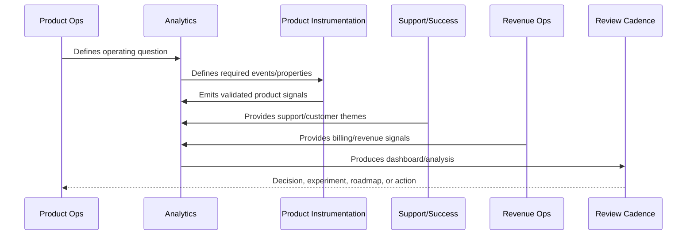
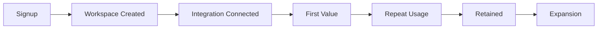

# Funnel and Retention Analysis

> *"Defines funnel analysis, activation drop-off, cohort retention, conversion paths, repeat usage, lifecycle progress, and interpretation rules."*

---

# Purpose

Defines funnel analysis, activation drop-off, cohort retention, conversion paths, repeat usage, lifecycle progress, and interpretation rules.

---

# Analytics Problem

Growth metrics are incomplete if they only measure signup and ignore activation and retention.

---

# Analytics Decision

## Decision

CLARA funnel and retention analysis should identify where customers fail to reach or sustain value.

## Status

Accepted.

---

# Analytics Rule

Every CLARA analytics initiative should connect:

```text
Business/Product Question -> Event/Metric Definition -> Data Quality Check -> Dashboard/Analysis -> Insight -> Decision -> Owner -> Follow-Up Validation
```

An analytics artifact is not mature if it cannot answer:

```text
what question it answers
what events/metrics it uses
who owns the definition
how data quality is checked
what decision it supports
what action should happen when it changes
what privacy/security constraints apply
how results are documented
```

---

# Recommended Analytics Flow



---

# Production-Ready Checklist

- [ ] Analytics question is defined.
- [ ] Event taxonomy is documented.
- [ ] Metric owner is assigned.
- [ ] Data source is known.
- [ ] Privacy/security review is considered.
- [ ] Data quality checks exist.
- [ ] Dashboard has audience and owner.
- [ ] Insight maps to action.
- [ ] Decision record is created where needed.
- [ ] Follow-up validation is scheduled.

---

# Acceptance Criteria

- [ ] Analytics supports real decisions.
- [ ] Metrics have consistent definitions.
- [ ] Dashboards have owners.
- [ ] Data quality is reviewed.
- [ ] Privacy is preserved.
- [ ] Customer value and trust are included.
- [ ] AI coding assistants can apply this safely.

---

# Anti-patterns

Avoid:

- Vanity metrics.
- Event sprawl.
- Dashboards with no audience.
- Metrics with no owner.
- Different teams using different definitions for the same metric.
- Collecting raw sensitive data unnecessarily.
- Drawing conclusions from tiny or biased cohorts.
- Treating correlation as causation.
- Ignoring support/customer qualitative evidence.
- Insight reports that create no decision.

---

# Related Documents

- ../PART-01-Product-Operations-Foundation/README.md
- ../PART-03-Support-Operations-and-Knowledge-Loop/README.md
- ../PART-04-Growth-Experiments-and-Activation/README.md
- ../PART-05-Billing-Packaging-and-Monetization-Operations/README.md
- ../../BOOK-06-Security-Governance-and-Compliance/
- ../../BOOK-07-Operations-Observability-and-Reliability/
- ../../BOOK-08-Implementation-Delivery-and-Production-Launch/

---

# Navigation

**Previous:** `64-Dashboard-Strategy.md`

**Next:** `66-Customer-Health-Analytics.md`

---

# Funnel Types

Analyze:

```text
signup to workspace creation
workspace creation to team invite
team invite to integration connection
integration connection to first value
first value to repeat usage
trial to paid
paid to retained
```

---

# Retention Cohorts

Track cohorts by:

```text
signup week/month
activation date
plan type
customer segment
integration type
AI enabled status
onboarding version
acquisition source
```

---

# Funnel Map



---

# Funnel Rule

A funnel drop-off should trigger investigation into product friction, support themes, reliability, trust, or customer fit.
