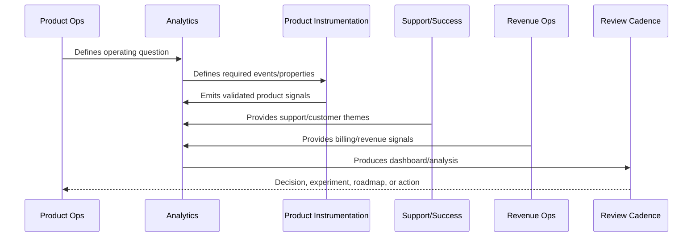

# AI and Automation Analytics

> *"Defines analytics for AI quality, prompt performance, RAG outcomes, safety blocks, human review, automation success, cost, and customer impact."*

---

# Purpose

Defines analytics for AI quality, prompt performance, RAG outcomes, safety blocks, human review, automation success, cost, and customer impact.

---

# Analytics Problem

AI features can look active while producing low-quality, expensive, or risky outcomes.

---

# Analytics Decision

## Decision

CLARA AI and automation analytics should measure safety, usefulness, cost, review outcomes, and workflow impact after launch.

## Status

Accepted.

---

# Analytics Rule

Every CLARA analytics initiative should connect:

```text
Business/Product Question -> Event/Metric Definition -> Data Quality Check -> Dashboard/Analysis -> Insight -> Decision -> Owner -> Follow-Up Validation
```

An analytics artifact is not mature if it cannot answer:

```text
what question it answers
what events/metrics it uses
who owns the definition
how data quality is checked
what decision it supports
what action should happen when it changes
what privacy/security constraints apply
how results are documented
```

---

# Recommended Analytics Flow



---

# Production-Ready Checklist

- [ ] Analytics question is defined.
- [ ] Event taxonomy is documented.
- [ ] Metric owner is assigned.
- [ ] Data source is known.
- [ ] Privacy/security review is considered.
- [ ] Data quality checks exist.
- [ ] Dashboard has audience and owner.
- [ ] Insight maps to action.
- [ ] Decision record is created where needed.
- [ ] Follow-up validation is scheduled.

---

# Acceptance Criteria

- [ ] Analytics supports real decisions.
- [ ] Metrics have consistent definitions.
- [ ] Dashboards have owners.
- [ ] Data quality is reviewed.
- [ ] Privacy is preserved.
- [ ] Customer value and trust are included.
- [ ] AI coding assistants can apply this safely.

---

# Anti-patterns

Avoid:

- Vanity metrics.
- Event sprawl.
- Dashboards with no audience.
- Metrics with no owner.
- Different teams using different definitions for the same metric.
- Collecting raw sensitive data unnecessarily.
- Drawing conclusions from tiny or biased cohorts.
- Treating correlation as causation.
- Ignoring support/customer qualitative evidence.
- Insight reports that create no decision.

---

# Related Documents

- ../PART-01-Product-Operations-Foundation/README.md
- ../PART-03-Support-Operations-and-Knowledge-Loop/README.md
- ../PART-04-Growth-Experiments-and-Activation/README.md
- ../PART-05-Billing-Packaging-and-Monetization-Operations/README.md
- ../../BOOK-06-Security-Governance-and-Compliance/
- ../../BOOK-07-Operations-Observability-and-Reliability/
- ../../BOOK-08-Implementation-Delivery-and-Production-Launch/

---

# Navigation

**Previous:** `67-Support-and-Product-Quality-Analytics.md`

**Next:** `69-Revenue-and-Monetization-Analytics.md`

---

# AI Analytics Metrics

Track:

```text
ai_request_count
ai_success_rate
ai_error_rate
latency
token usage
estimated cost
prompt version usage
output schema validity
safety block rate
human review approval rate
human review edit rate
hallucination report rate
fallback/kill switch usage
```

---

# Automation Analytics

Track:

```text
automation_trigger_count
automation_success_rate
automation_failure_rate
automation_retry_count
automation_manual_review_rate
automation_rollback_count
automation_customer_impact
automation_support_escalation
```

---

# AI Insight Questions

```text
Which prompts perform well?
Which workflows need more human review?
Where does RAG retrieve poor context?
Which automations fail or need rollback?
Is cost increasing faster than customer value?
Are safety blocks increasing?
```

---

# AI Analytics Rule

AI analytics must measure safety and usefulness, not just usage volume.
