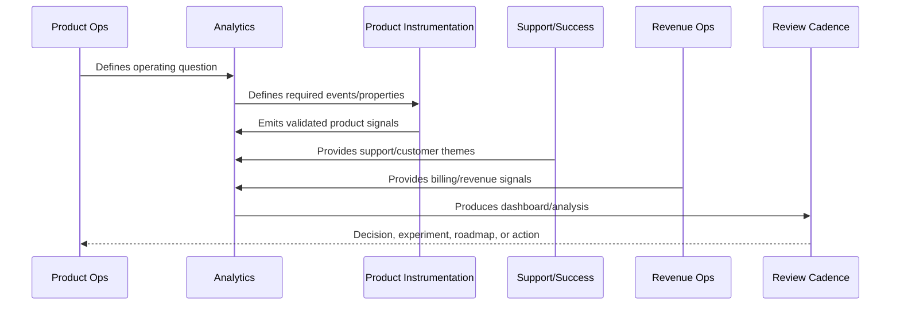
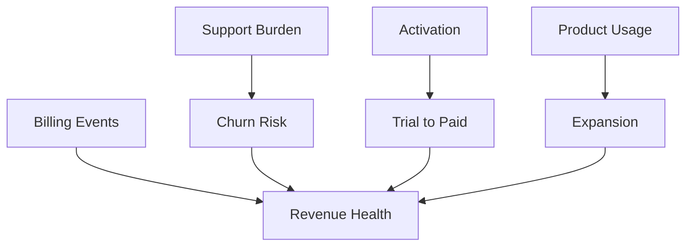

# Revenue and Monetization Analytics

> *"Defines analytics for MRR, ARR, conversion, expansion, churn, downgrade, failed payment, usage-to-plan fit, and monetization health."*

---

# Purpose

Defines analytics for MRR, ARR, conversion, expansion, churn, downgrade, failed payment, usage-to-plan fit, and monetization health.

---

# Analytics Problem

Revenue metrics become misleading when disconnected from customer value and product behavior.

---

# Analytics Decision

## Decision

CLARA revenue analytics should connect billing outcomes with product usage, customer health, support friction, and value realization.

## Status

Accepted.

---

# Analytics Rule

Every CLARA analytics initiative should connect:

```text
Business/Product Question -> Event/Metric Definition -> Data Quality Check -> Dashboard/Analysis -> Insight -> Decision -> Owner -> Follow-Up Validation
```

An analytics artifact is not mature if it cannot answer:

```text
what question it answers
what events/metrics it uses
who owns the definition
how data quality is checked
what decision it supports
what action should happen when it changes
what privacy/security constraints apply
how results are documented
```

---

# Recommended Analytics Flow



---

# Production-Ready Checklist

- [ ] Analytics question is defined.
- [ ] Event taxonomy is documented.
- [ ] Metric owner is assigned.
- [ ] Data source is known.
- [ ] Privacy/security review is considered.
- [ ] Data quality checks exist.
- [ ] Dashboard has audience and owner.
- [ ] Insight maps to action.
- [ ] Decision record is created where needed.
- [ ] Follow-up validation is scheduled.

---

# Acceptance Criteria

- [ ] Analytics supports real decisions.
- [ ] Metrics have consistent definitions.
- [ ] Dashboards have owners.
- [ ] Data quality is reviewed.
- [ ] Privacy is preserved.
- [ ] Customer value and trust are included.
- [ ] AI coding assistants can apply this safely.

---

# Anti-patterns

Avoid:

- Vanity metrics.
- Event sprawl.
- Dashboards with no audience.
- Metrics with no owner.
- Different teams using different definitions for the same metric.
- Collecting raw sensitive data unnecessarily.
- Drawing conclusions from tiny or biased cohorts.
- Treating correlation as causation.
- Ignoring support/customer qualitative evidence.
- Insight reports that create no decision.

---

# Related Documents

- ../PART-01-Product-Operations-Foundation/README.md
- ../PART-03-Support-Operations-and-Knowledge-Loop/README.md
- ../PART-04-Growth-Experiments-and-Activation/README.md
- ../PART-05-Billing-Packaging-and-Monetization-Operations/README.md
- ../../BOOK-06-Security-Governance-and-Compliance/
- ../../BOOK-07-Operations-Observability-and-Reliability/
- ../../BOOK-08-Implementation-Delivery-and-Production-Launch/

---

# Navigation

**Previous:** `68-AI-and-Automation-Analytics.md`

**Next:** `70-Insight-to-Decision-Workflow.md`

---

# Revenue Metrics

Track:

```text
MRR
ARR
ARPA/ARPU
trial conversion rate
activation-to-paid conversion
upgrade rate
downgrade rate
expansion revenue
contraction revenue
churn rate
failed payment rate
refund/credit volume
```

---

# Usage-to-Revenue Analysis

Connect:

```text
feature adoption to conversion
activation to paid conversion
support burden to churn
integration success to retention
AI usage to expansion
billing confusion to cancellation
customer health to renewal risk
```

---

# Revenue Health Map



---

# Revenue Rule

Revenue analytics should explain why revenue changes, not only report that it changed.
