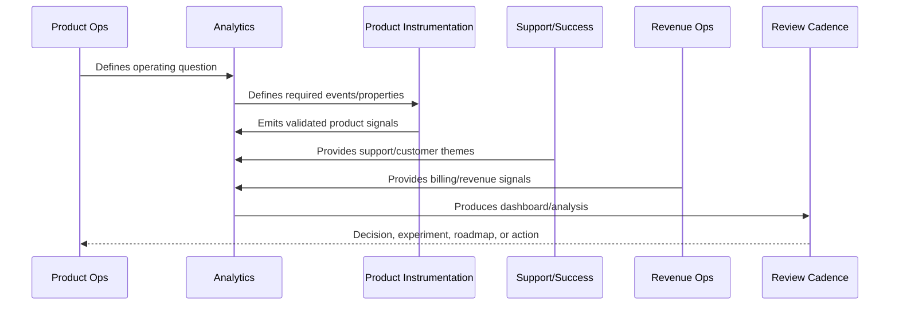
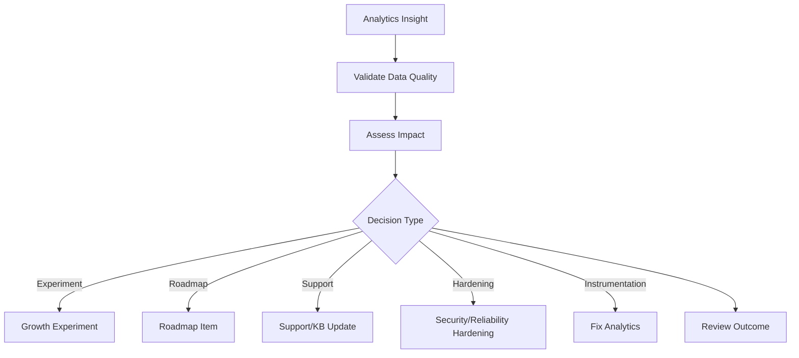

# Insight to Decision Workflow

> *"Defines how analytics insights become decisions, experiments, roadmap items, support updates, security/reliability work, or business review actions."*

---

# Purpose

Defines how analytics insights become decisions, experiments, roadmap items, support updates, security/reliability work, or business review actions.

---

# Analytics Problem

Insights that never become decisions are dashboard decoration.

---

# Analytics Decision

## Decision

CLARA insights should move through a structured workflow from observation to evidence, decision, owner, action, validation, and documentation.

## Status

Accepted.

---

# Analytics Rule

Every CLARA analytics initiative should connect:

```text
Business/Product Question -> Event/Metric Definition -> Data Quality Check -> Dashboard/Analysis -> Insight -> Decision -> Owner -> Follow-Up Validation
```

An analytics artifact is not mature if it cannot answer:

```text
what question it answers
what events/metrics it uses
who owns the definition
how data quality is checked
what decision it supports
what action should happen when it changes
what privacy/security constraints apply
how results are documented
```

---

# Recommended Analytics Flow



---

# Production-Ready Checklist

- [ ] Analytics question is defined.
- [ ] Event taxonomy is documented.
- [ ] Metric owner is assigned.
- [ ] Data source is known.
- [ ] Privacy/security review is considered.
- [ ] Data quality checks exist.
- [ ] Dashboard has audience and owner.
- [ ] Insight maps to action.
- [ ] Decision record is created where needed.
- [ ] Follow-up validation is scheduled.

---

# Acceptance Criteria

- [ ] Analytics supports real decisions.
- [ ] Metrics have consistent definitions.
- [ ] Dashboards have owners.
- [ ] Data quality is reviewed.
- [ ] Privacy is preserved.
- [ ] Customer value and trust are included.
- [ ] AI coding assistants can apply this safely.

---

# Anti-patterns

Avoid:

- Vanity metrics.
- Event sprawl.
- Dashboards with no audience.
- Metrics with no owner.
- Different teams using different definitions for the same metric.
- Collecting raw sensitive data unnecessarily.
- Drawing conclusions from tiny or biased cohorts.
- Treating correlation as causation.
- Ignoring support/customer qualitative evidence.
- Insight reports that create no decision.

---

# Related Documents

- ../PART-01-Product-Operations-Foundation/README.md
- ../PART-03-Support-Operations-and-Knowledge-Loop/README.md
- ../PART-04-Growth-Experiments-and-Activation/README.md
- ../PART-05-Billing-Packaging-and-Monetization-Operations/README.md
- ../../BOOK-06-Security-Governance-and-Compliance/
- ../../BOOK-07-Operations-Observability-and-Reliability/
- ../../BOOK-08-Implementation-Delivery-and-Production-Launch/

---

# Navigation

**Previous:** `69-Revenue-and-Monetization-Analytics.md`

**Next:** `71-Analytics-Anti-Patterns.md`

---

# Insight Workflow

Use this workflow:

```text
observation
evidence validation
impact assessment
possible explanation
decision options
owner assignment
action selection
validation metric
documentation
review date
```

---

# Insight Decision Types

Insights can become:

```text
product roadmap item
growth experiment
support macro/article
security hardening item
reliability hardening item
AI prompt/guardrail improvement
billing/package change
customer success playbook update
instrumentation fix
```

---

# Insight-to-Decision Map



---

# Insight Rule

An insight without owner, decision, or follow-up is not operationalized.
