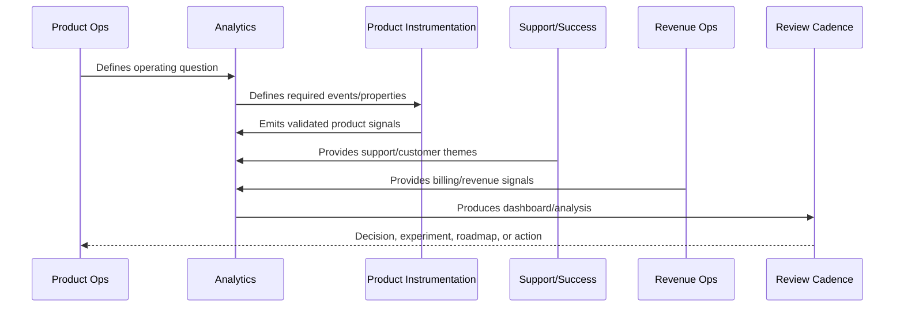

# Analytics Anti-Patterns

> *"Defines analytics anti-patterns such as vanity metrics, event sprawl, dashboard graveyards, biased cohorts, privacy-invasive tracking, and metric gaming."*

---

# Purpose

Defines analytics anti-patterns such as vanity metrics, event sprawl, dashboard graveyards, biased cohorts, privacy-invasive tracking, and metric gaming.

---

# Analytics Problem

Bad analytics can make a product team confidently wrong.

---

# Analytics Decision

## Decision

CLARA should actively avoid analytics patterns that create false confidence, privacy risk, and poor product decisions.

## Status

Accepted.

---

# Analytics Rule

Every CLARA analytics initiative should connect:

```text
Business/Product Question -> Event/Metric Definition -> Data Quality Check -> Dashboard/Analysis -> Insight -> Decision -> Owner -> Follow-Up Validation
```

An analytics artifact is not mature if it cannot answer:

```text
what question it answers
what events/metrics it uses
who owns the definition
how data quality is checked
what decision it supports
what action should happen when it changes
what privacy/security constraints apply
how results are documented
```

---

# Recommended Analytics Flow



---

# Production-Ready Checklist

- [ ] Analytics question is defined.
- [ ] Event taxonomy is documented.
- [ ] Metric owner is assigned.
- [ ] Data source is known.
- [ ] Privacy/security review is considered.
- [ ] Data quality checks exist.
- [ ] Dashboard has audience and owner.
- [ ] Insight maps to action.
- [ ] Decision record is created where needed.
- [ ] Follow-up validation is scheduled.

---

# Acceptance Criteria

- [ ] Analytics supports real decisions.
- [ ] Metrics have consistent definitions.
- [ ] Dashboards have owners.
- [ ] Data quality is reviewed.
- [ ] Privacy is preserved.
- [ ] Customer value and trust are included.
- [ ] AI coding assistants can apply this safely.

---

# Anti-patterns

Avoid:

- Vanity metrics.
- Event sprawl.
- Dashboards with no audience.
- Metrics with no owner.
- Different teams using different definitions for the same metric.
- Collecting raw sensitive data unnecessarily.
- Drawing conclusions from tiny or biased cohorts.
- Treating correlation as causation.
- Ignoring support/customer qualitative evidence.
- Insight reports that create no decision.

---

# Related Documents

- ../PART-01-Product-Operations-Foundation/README.md
- ../PART-03-Support-Operations-and-Knowledge-Loop/README.md
- ../PART-04-Growth-Experiments-and-Activation/README.md
- ../PART-05-Billing-Packaging-and-Monetization-Operations/README.md
- ../../BOOK-06-Security-Governance-and-Compliance/
- ../../BOOK-07-Operations-Observability-and-Reliability/
- ../../BOOK-08-Implementation-Delivery-and-Production-Launch/

---

# Navigation

**Previous:** `70-Insight-to-Decision-Workflow.md`

**Next:** `72-Part-06-Summary.md`

---

# Analytics Anti-Patterns

Avoid:

```text
vanity metrics
event sprawl
dashboard graveyards
metric definition fights
unowned dashboards
privacy-invasive tracking
raw sensitive data collection
overfitting to small cohorts
cherry-picked experiment results
ignoring qualitative feedback
confusing correlation with causation
metric gaming
```

---

# Warning Signs

Watch for:

```text
many dashboards but few decisions
teams debate numbers instead of actions
same metric has multiple values
events are added without documentation
support feedback contradicts dashboard narrative
growth improves but retention worsens
customer trust signals are not measured
```

---

# Recovery Actions

```text
create metric dictionary
retire unused dashboards
audit event taxonomy
define dashboard owners
review privacy constraints
connect insights to decisions
add guardrail metrics
combine quantitative and qualitative evidence
```

---

# Anti-Pattern Rule

Bad analytics can make poor decisions look scientific.
