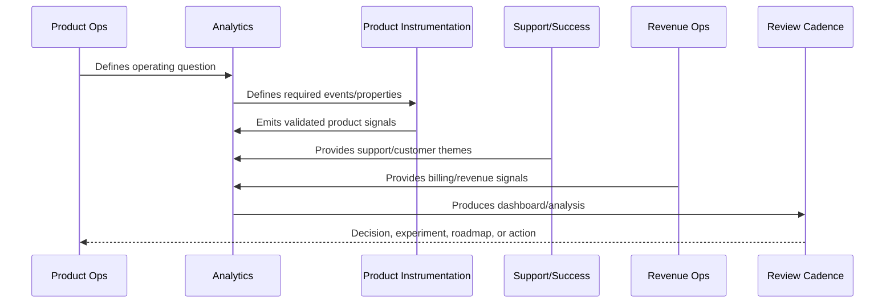

# Part 06 Summary

> *"Summarizes Analytics and Product Insights and prepares for Book IX Part 07."*

---

# Purpose

Summarizes Analytics and Product Insights and prepares for Book IX Part 07.

---

# Analytics Problem

Feedback Prioritization and Roadmap Operations comes next because analytics and customer evidence must become roadmap decisions.

---

# Analytics Decision

## Decision

CLARA should proceed to Feedback Prioritization and Roadmap Operations after defining analytics overview, event taxonomy, metric governance, dashboard strategy, funnel/retention, customer health, support/product quality, AI/automation, revenue analytics, insight workflow, and anti-patterns.

## Status

Accepted.

---

# Analytics Rule

Every CLARA analytics initiative should connect:

```text
Business/Product Question -> Event/Metric Definition -> Data Quality Check -> Dashboard/Analysis -> Insight -> Decision -> Owner -> Follow-Up Validation
```

An analytics artifact is not mature if it cannot answer:

```text
what question it answers
what events/metrics it uses
who owns the definition
how data quality is checked
what decision it supports
what action should happen when it changes
what privacy/security constraints apply
how results are documented
```

---

# Recommended Analytics Flow



---

# Production-Ready Checklist

- [ ] Analytics question is defined.
- [ ] Event taxonomy is documented.
- [ ] Metric owner is assigned.
- [ ] Data source is known.
- [ ] Privacy/security review is considered.
- [ ] Data quality checks exist.
- [ ] Dashboard has audience and owner.
- [ ] Insight maps to action.
- [ ] Decision record is created where needed.
- [ ] Follow-up validation is scheduled.

---

# Acceptance Criteria

- [ ] Analytics supports real decisions.
- [ ] Metrics have consistent definitions.
- [ ] Dashboards have owners.
- [ ] Data quality is reviewed.
- [ ] Privacy is preserved.
- [ ] Customer value and trust are included.
- [ ] AI coding assistants can apply this safely.

---

# Anti-patterns

Avoid:

- Vanity metrics.
- Event sprawl.
- Dashboards with no audience.
- Metrics with no owner.
- Different teams using different definitions for the same metric.
- Collecting raw sensitive data unnecessarily.
- Drawing conclusions from tiny or biased cohorts.
- Treating correlation as causation.
- Ignoring support/customer qualitative evidence.
- Insight reports that create no decision.

---

# Related Documents

- ../PART-01-Product-Operations-Foundation/README.md
- ../PART-03-Support-Operations-and-Knowledge-Loop/README.md
- ../PART-04-Growth-Experiments-and-Activation/README.md
- ../PART-05-Billing-Packaging-and-Monetization-Operations/README.md
- ../../BOOK-06-Security-Governance-and-Compliance/
- ../../BOOK-07-Operations-Observability-and-Reliability/
- ../../BOOK-08-Implementation-Delivery-and-Production-Launch/

---

# Navigation

**Previous:** `71-Analytics-Anti-Patterns.md`

**Next:** `../PART-07-Feedback-Prioritization-and-Roadmap-Operations/README.md`

---

# Part 06 Completion

Part 06 establishes:

- Analytics and product insights overview.
- Product event taxonomy.
- Metric definitions and governance.
- Dashboard strategy.
- Funnel and retention analysis.
- Customer health analytics.
- Support and product quality analytics.
- AI and automation analytics.
- Revenue and monetization analytics.
- Insight to decision workflow.
- Analytics anti-patterns.

---

# Ready for Part 07

The next part should be:

```text
BOOK IX — PART 07: Feedback Prioritization and Roadmap Operations
```

It should define:

- Feedback and roadmap operations overview.
- Feedback intake taxonomy.
- Evidence scoring model.
- Roadmap prioritization framework.
- Customer impact and business impact scoring.
- Risk and trust prioritization.
- Roadmap planning cadence.
- Product decision records.
- Backlog hygiene and lifecycle.
- Roadmap communication.
- Roadmap anti-patterns.
- Part 07 summary.
