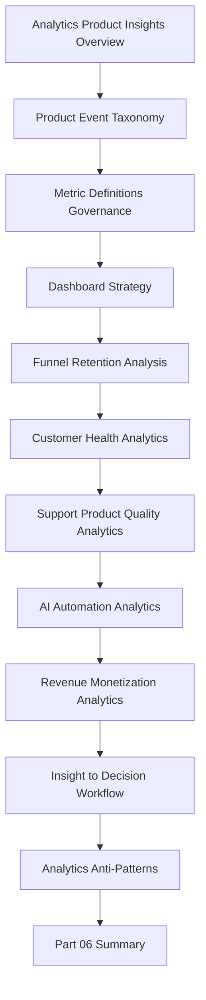

# PART-06 — Analytics and Product Insights

> *"Analytics is not about having more charts. Analytics is about making better product decisions with trustworthy evidence."*

---

# Purpose

Part 06 defines CLARA's analytics and product insights standards.

It covers:

- Analytics and Product Insights Overview.
- Product Event Taxonomy.
- Metric Definitions and Governance.
- Dashboard Strategy.
- Funnel and Retention Analysis.
- Customer Health Analytics.
- Support and Product Quality Analytics.
- AI and Automation Analytics.
- Revenue and Monetization Analytics.
- Insight to Decision Workflow.
- Analytics Anti-Patterns.
- Part 06 Summary.

---

# Chapter Map

| Chapter | Title |
|---:|---|
| 61 | Analytics and Product Insights Overview |
| 62 | Product Event Taxonomy |
| 63 | Metric Definitions and Governance |
| 64 | Dashboard Strategy |
| 65 | Funnel and Retention Analysis |
| 66 | Customer Health Analytics |
| 67 | Support and Product Quality Analytics |
| 68 | AI and Automation Analytics |
| 69 | Revenue and Monetization Analytics |
| 70 | Insight to Decision Workflow |
| 71 | Analytics Anti-Patterns |
| 72 | Part 06 Summary |

---

# Analytics and Insights Map



---

# Analytics Non-Negotiables

CLARA analytics must enforce:

```text
documented event taxonomy
privacy-safe event collection
clear metric definitions
metric ownership
dashboard ownership
source-of-truth clarity
funnel and retention analysis
customer health analytics
support/product quality analytics
AI quality and cost analytics
revenue analytics connected to usage
insight-to-decision workflow
data quality checks
anti-vanity-metric discipline
```

---

# Relationship to Previous Part

Part 05 defines billing, packaging, and monetization operations.

Part 06 defines the analytics system that connects product, support, growth, monetization, AI, reliability, and customer success decisions.

---

# Navigation

**Previous:** `../PART-05-Billing-Packaging-and-Monetization-Operations/60-Part-05-Summary.md`

**Next:** `61-Analytics-and-Product-Insights-Overview.md`
