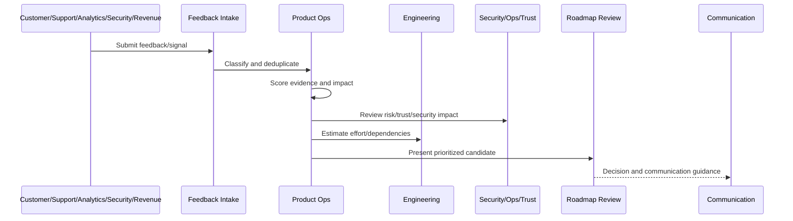

# Feedback Intake Taxonomy

> *"Defines feedback intake categories, sources, metadata, classification, deduplication, and routing rules."*

---

# Purpose

Defines feedback intake categories, sources, metadata, classification, deduplication, and routing rules.

---

# Roadmap Operations Problem

Unstructured feedback creates duplicate work, hidden patterns, and biased roadmap decisions.

---

# Roadmap Operations Decision

## Decision

CLARA feedback intake should classify all customer, support, product, engineering, security, reliability, revenue, and AI signals into a consistent taxonomy.

## Status

Accepted.

---

# Roadmap Operations Rule

Every CLARA roadmap decision should connect:

```text
Feedback/Signal -> Evidence Score -> Impact Score -> Risk/Trust Score -> Effort/Dependency Review -> Decision -> Owner -> Roadmap/Backlog State -> Communication
```

A roadmap decision is not mature if it cannot answer:

```text
what evidence supports it
what customer segment is affected
what business outcome it supports
what trust/security/reliability risk exists
what trade-off is being made
who owns the decision
what was rejected or deferred
how success will be measured
how stakeholders will be informed
```

---

# Recommended Roadmap Flow



---

# Production-Ready Checklist

- [ ] Feedback source is captured.
- [ ] Feedback category is assigned.
- [ ] Evidence quality is scored.
- [ ] Customer impact is scored.
- [ ] Business impact is scored.
- [ ] Risk/trust impact is scored.
- [ ] Effort/dependencies are reviewed.
- [ ] Decision owner is assigned.
- [ ] Roadmap/backlog state is updated.
- [ ] Communication plan exists where needed.
- [ ] Decision record is created for material decisions.

---

# Acceptance Criteria

- [ ] Feedback is not lost.
- [ ] Roadmap decisions are evidence-backed.
- [ ] Security and reliability work can be prioritized.
- [ ] Backlog stays actionable.
- [ ] Stakeholders understand decisions.
- [ ] AI coding assistants can apply this safely.

---

# Anti-patterns

Avoid:

- Roadmap by loudest voice.
- Sales-only prioritization.
- Engineering-only prioritization.
- Security/reliability always deferred.
- Feedback with no taxonomy.
- Backlog items with no owner.
- Decisions not documented.
- Overpromising roadmap dates.
- Ignoring support themes.
- Roadmap changing weekly without evidence.

---

# Related Documents

- ../PART-01-Product-Operations-Foundation/README.md
- ../PART-03-Support-Operations-and-Knowledge-Loop/README.md
- ../PART-06-Analytics-and-Product-Insights/README.md
- ../../BOOK-05-Engineering-Execution-Plan/
- ../../BOOK-06-Security-Governance-and-Compliance/
- ../../BOOK-07-Operations-Observability-and-Reliability/

---

# Navigation

**Previous:** `73-Feedback-Prioritization-and-Roadmap-Operations-Overview.md`

**Next:** `75-Evidence-Scoring-Model.md`

---

# Feedback Categories

Use categories:

```text
bug
feature_request
ux_friction
onboarding_blocker
support_burden
integration_issue
AI_quality_issue
security_privacy_concern
reliability_performance_issue
billing_packaging_issue
analytics_gap
documentation_gap
strategic_opportunity
```

---

# Required Feedback Metadata

Capture:

```text
source
customer/workspace segment
date
category
summary
evidence link
frequency
severity
customer impact
business impact
risk/trust impact
owner
status
```

---

# Deduplication Rules

Deduplicate by:

```text
same customer problem
same workflow affected
same root cause when known
same requested outcome
same support theme
```

---

# Intake Rule

Feedback should be captured in a system, not left in chat or memory.
