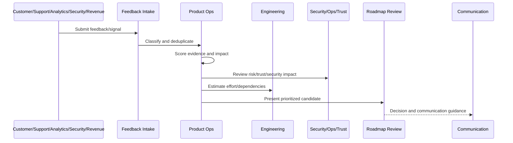

# Roadmap Prioritization Framework

> *"Defines roadmap prioritization using customer value, business impact, strategic fit, risk reduction, effort, confidence, dependencies, and timing."*

---

# Purpose

Defines roadmap prioritization using customer value, business impact, strategic fit, risk reduction, effort, confidence, dependencies, and timing.

---

# Roadmap Operations Problem

Prioritization fails when teams rank only by customer requests or only by engineering convenience.

---

# Roadmap Operations Decision

## Decision

CLARA roadmap prioritization should balance customer value, trust, business sustainability, engineering effort, and operational risk.

## Status

Accepted.

---

# Roadmap Operations Rule

Every CLARA roadmap decision should connect:

```text
Feedback/Signal -> Evidence Score -> Impact Score -> Risk/Trust Score -> Effort/Dependency Review -> Decision -> Owner -> Roadmap/Backlog State -> Communication
```

A roadmap decision is not mature if it cannot answer:

```text
what evidence supports it
what customer segment is affected
what business outcome it supports
what trust/security/reliability risk exists
what trade-off is being made
who owns the decision
what was rejected or deferred
how success will be measured
how stakeholders will be informed
```

---

# Recommended Roadmap Flow



---

# Production-Ready Checklist

- [ ] Feedback source is captured.
- [ ] Feedback category is assigned.
- [ ] Evidence quality is scored.
- [ ] Customer impact is scored.
- [ ] Business impact is scored.
- [ ] Risk/trust impact is scored.
- [ ] Effort/dependencies are reviewed.
- [ ] Decision owner is assigned.
- [ ] Roadmap/backlog state is updated.
- [ ] Communication plan exists where needed.
- [ ] Decision record is created for material decisions.

---

# Acceptance Criteria

- [ ] Feedback is not lost.
- [ ] Roadmap decisions are evidence-backed.
- [ ] Security and reliability work can be prioritized.
- [ ] Backlog stays actionable.
- [ ] Stakeholders understand decisions.
- [ ] AI coding assistants can apply this safely.

---

# Anti-patterns

Avoid:

- Roadmap by loudest voice.
- Sales-only prioritization.
- Engineering-only prioritization.
- Security/reliability always deferred.
- Feedback with no taxonomy.
- Backlog items with no owner.
- Decisions not documented.
- Overpromising roadmap dates.
- Ignoring support themes.
- Roadmap changing weekly without evidence.

---

# Related Documents

- ../PART-01-Product-Operations-Foundation/README.md
- ../PART-03-Support-Operations-and-Knowledge-Loop/README.md
- ../PART-06-Analytics-and-Product-Insights/README.md
- ../../BOOK-05-Engineering-Execution-Plan/
- ../../BOOK-06-Security-Governance-and-Compliance/
- ../../BOOK-07-Operations-Observability-and-Reliability/

---

# Navigation

**Previous:** `75-Evidence-Scoring-Model.md`

**Next:** `77-Customer-Impact-and-Business-Impact-Scoring.md`

---

# Prioritization Dimensions

Evaluate roadmap candidates by:

```text
customer value
business value
risk reduction
strategic fit
confidence
effort
dependency complexity
time sensitivity
support burden reduction
operational impact
```

---

# Prioritization Methods

Possible methods:

```text
RICE
ICE
WSJF
risk-adjusted scoring
customer segment scoring
hybrid product trust scoring
```

CLARA should use a practical hybrid model rather than blindly following one formula.

---

# Hybrid Score

Example:

```text
priority = customer_impact + business_impact + risk_reduction + strategic_fit + confidence - effort_complexity
```

---

# Prioritization Rule

Use scoring to structure discussion, not to replace judgment.
